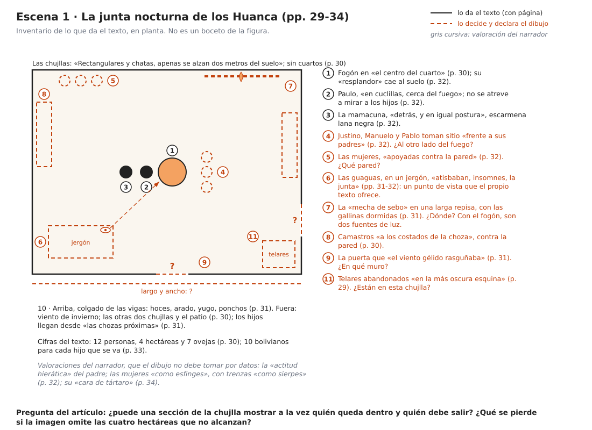
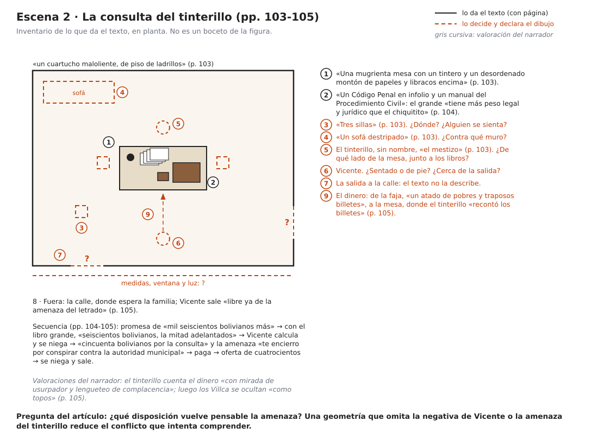
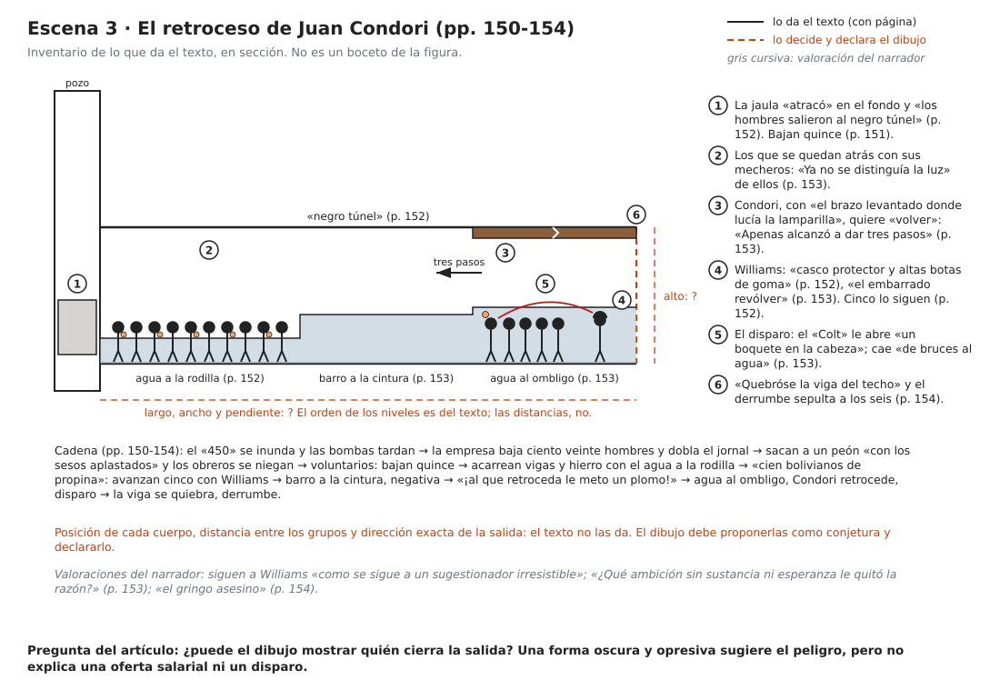

# 5. Guía de la exploración gráfica: tres escenas y su registro

Esta guía reemplaza la de los seis pasteles. Aplica la depuración recibida y el estado real del trabajo:

- **Los pasteles del artículo todavía no existen.** Las cuatro imágenes de la primera ronda eran referencias visuales (`referencias_visuales/`). La depuración habla de «seis imágenes existentes» en un PDF de dibujos; según lo que indicaste, las imágenes que compartiste eran solo referencias. Si alguna imagen previa es tuya y quieres usarla como punto de partida, preséntala como tal en el registro. Si no es tuya, no puede figurar como resultado.
- **La unidad de trabajo es una escena, no un lugar.** «La mina» es demasiado amplia; «el intento de Condori de retroceder ante la inundación» permite identificar quién decide, qué obstaculiza la salida y qué información aporta cada medio.
- **Dos o tres figuras, elegidas por lo que rinden en el análisis**, no para ilustrar todos los lugares de la novela.
- **Cada figura va con un registro escrito** de lo que realmente se hizo. Sin registro, el artículo solo puede presentar una exploración interpretativa de alcance acotado, no resultados de una investigación práctica.
- **El artículo no anuncia figuras numeradas que no existen.** Por eso la versión actual no tiene marcadores de figura.

Las seis fichas y los seis esquemas de la versión anterior (`esquemas/fig1…fig6`) quedan como material de reserva (§5.10).

## 5.1. Qué puede y qué no puede hacer el dibujo

| Puede | No puede |
|---|---|
| Obligar a decidir lo que el texto no dice (dónde está la puerta, a qué distancia están los cuerpos) y hacer visible esa decisión | Reproducir la experiencia de los personajes: la mano de quien dibuja y las manos representadas en la novela pertenecen a niveles distintos |
| Comparar disposiciones alternativas de una misma escena y preguntar cuál vuelve pensable una amenaza, una salida o una exclusión | Explicar por sí solo una oferta salarial, una orden escrita o un disparo: una forma oscura y opresiva sugiere el peligro, pero no dice quién cierra la salida |
| Producir una pregunta nueva al volver al pasaje | Dejar ver su propio proceso: una imagen no muestra el orden de las capas ni las decisiones descartadas |
| Mostrar sus límites y declararlos | Confirmar una hipótesis por el solo hecho de haberse hecho |

Dos reglas prácticas:

1. **Distingue siempre tres cosas:** lo que da el texto (con página), lo que el dibujo decide (y lo declara como conjetura) y lo que es valoración del narrador (que no se dibuja como si fuera un dato).
2. **No conviertas el procedimiento en mímesis.** Empastar no es «amontonar piedras como los comunarios», ni esgrafiar es «extraer la luz como el minero». Las técnicas organizan decisiones del dibujo; no imitan el trabajo de los personajes.

## 5.2. Materiales

| Qué | Recomendación | Para qué |
|---|---|---|
| Pastel al óleo | Una gama blanda (tipo Sennelier) para empastes y fundidos, más una media o de estudiante (Neopastel, Pentel, Mungyo) para capas de fondo | Los blandos cubren y se esgrafían bien; los duros dan línea |
| Soporte | Papel de acuarela de 300 g/m², grano fino o medio, o cartón gris con gesso | Resiste el solvente y admite muchas capas |
| Formato | A3 (29,7 × 42 cm) o A4. Usa el mismo en las tres escenas | Una escala común hace comparables los estudios |
| Solvente | Aguarrás sin olor (tipo Gamsol), pincel plano, bastoncillos de algodón. Alternativa: aceite de bebé | Veladuras: agua, humo, barro |
| Herramientas de extracción | Cúter o bisturí, espátula de paleta, punzón, mondadientes | Esgrafiado e incisión |
| Para las miniaturas | Cuaderno, lápiz blando o carbonilla, rotulador fino naranja o rojo | Disección y ensamblaje; el rotulador marca las conjeturas |
| Registro | Móvil para fotografiar cada etapa, cuaderno o archivo de texto, reloj | Fecha, duración y decisiones de cada paso |
| Otros | Cinta de papel, trapo, papel cristal (*glassine*) | Bordes limpios y protección |

El pastel al óleo **no seca nunca del todo**. Guarda cada dibujo con papel cristal encima y escanéalo pronto.

## 5.3. Técnicas al servicio de las operaciones

| Técnica | Cómo se hace | Operación en la que sirve | Dónde puede servir |
|---|---|---|---|
| **Miniatura analítica** | Lápiz o carbonilla, 5 × 7 cm, 3 a 5 minutos cada una | Disección y ensamblaje | Las tres escenas |
| **Marca de conjetura** | Trazo discontinuo o de otro color, con «?» | Disección: separar lo que da el texto de lo que decide el dibujo | Las tres escenas |
| **Reserva** | Dejar el papel sin tocar | Disección: dejar en blanco lo que el texto no dice | La puerta (escenas 1 y 2); la salida (escena 3) |
| **Esgrafiado** | Capa clara debajo y oscura encima; raspar con punta o cúter | Inmersión: luz que sale de la oscuridad | La mecha y el fogón (escena 1); las lamparillas (escena 3) |
| **Empaste** | Capas gruesas con presión, sin fundir | Inmersión: masa, peso | El libro grande (escena 2); el barro (escena 3) |
| **Incisión** | Líneas finas con punzón sobre la cera | Disección dentro del pastel: posiciones, líneas de mirada, niveles | Los niveles del agua (escena 3); la mirada de las guaguas (escena 1) |
| **Fundido con el dedo** | Mezclar y arrastrar con la yema | Inmersión: humo, penumbra | Escena 1 |
| **Veladura con solvente** | Pincel con aguarrás sobre el pastel; disuelve y chorrea | Inmersión: agua y lodo | Escena 3 |

## 5.4. Ciclo por escena y registro

Es el ciclo de Lundberg adaptado a la lectura (Cuadro 1 del artículo), más el retorno al pasaje. Por escena, en este orden:

1. **Observación (20 min).** Lee el pasaje completo con su página y separa en tres columnas: descripción (lo que hay), acción (lo que pasa) y valoración del narrador (adjetivos, metáforas). Escribe la pregunta espacial de la escena. El inventario de §5.5 te da un punto de partida; compruébalo con el libro.
2. **Disección (20-30 min).** Tres o cuatro miniaturas, cada una sobre **una** relación (cuerpo y soporte, entrada y salida, suelo y agua, quién mira a quién). Traza con línea continua lo que da el texto y con línea discontinua lo que decides.
3. **Ensamblaje (20-30 min).** Dos o tres disposiciones alternativas de la escena. Elige una y anota por qué.
4. **Inmersión (1 a 3 h).** El pastel: profundidad, textura, luz y punto de vista.
5. **Retorno al pasaje (20 min).** Relee la escena con el dibujo delante. Anota qué confirma, qué contradice, qué límite muestra o qué pregunta nueva abre. No basta con confirmar.

**Registro.** Fotografía cada etapa (también las miniaturas descartadas) y anota fecha, duración y materiales. Al terminar, completa esta plantilla solo con lo que realmente ocurrió:

> La imagen inicial me hizo suponer ⟦X⟧; al modificar ⟦Y⟧ apareció ⟦Z⟧; al releer el pasaje (p. ⟦N⟧) confirmé ⟦A⟧ y descarté ⟦B⟧.

Si una etapa no se hizo, el registro lo dice. Si el dibujo desmiente lo que esperabas, eso también es un resultado.

## 5.5. Las tres escenas

En los inventarios, el trazo continuo es lo que da el texto (con página), el discontinuo naranja es lo que el dibujo tiene que decidir y declarar, y la cursiva gris son valoraciones del narrador. **No son bocetos de las figuras**: son la observación y parte de la disección ya hechas, para que no empieces de cero.

### Escena 1. La junta nocturna de los Huanca (pp. 29-34)



- **Pregunta del artículo.** ¿Puede una sección de la chujlla mostrar a la vez quién queda dentro y quién debe salir? ¿Qué pierde la imagen si omite lo que el texto dice con números: las cuatro hectáreas que no alcanzan?
- **Lo que el texto da.**
  - La chujlla: tres en torno a un patio; «Rectangulares y chatas, apenas se alzan dos metros del suelo»; sin cuartos; paredes «renegridas por el hollín»; brasero en «el centro del cuarto»; camastros «a los costados de la choza», a la altura de un adobe; de las vigas cuelgan hoces, arado, yugo y ponchos (pp. 30-31).
  - La escena: una noche de invierno, Paulo llama a gritos a Justino, Manuelo y Pablo, que están en las chozas próximas (p. 31). La «mecha de sebo» en una larga repisa con las gallinas dormidas; las guaguas en un jergón, que «atisbaban, insomnes, la junta»; Paulo «en cuclillas, cerca del fuego»; la mamacuna «detrás, y en igual postura»; los hijos toman sitio «frente a sus padres»; las mujeres «apoyadas contra la pared» (pp. 31-32).
  - Lo que se dice: «la escasez de tierras me tiene preocupado. ¿Qué voy a darles como patrimonio? No tengo nada» (p. 32); podrán volver y «pedir a los Villca que les vendan unas cuantas hectáreas» (p. 33).
  - Después: dos días más tarde, Paulo los mira irse «desde el portal de su chujlla», entra y sale «con la madera del arado en un hombro y las correas del yugo en las manos» (p. 34).
- **Lo que el texto no da.** Medidas; dónde está la puerta que «el viento gélido rasguñaba»; dónde están la repisa, el jergón y las mujeres; si los hijos están al otro lado del fuego; si los telares abandonados (p. 29) están en esta chujlla.
- **Valoraciones del narrador.** La «actitud hierática» del padre, las mujeres «como esfinges», trenzas «como sierpes» (p. 32), la «cara de tártaro» (p. 34), los «sueños paganos» y «revolcones amorosos» de los camastros (p. 31).
- **Disecciones posibles.** (a) Quién mira a quién: el padre no se atreve a mirar a sus hijos; las guaguas miran la junta. (b) Dentro y fuera: la puerta, el viento, las chozas de donde llegan los hijos. (c) Casa y tierra: ¿cabe en la hoja la parcela de cuatro hectáreas, aunque sea como franja o recuadro? (d) Las herramientas colgadas: el arado que el padre descuelga cuando los hijos se van.
- **Ensamblajes para comparar.** (1) Sección transversal a la altura de los ojos de las guaguas: es un punto de vista que el propio texto ofrece. (2) Planta con las posiciones y la puerta marcada como conjetura. (3) Dos momentos en una hoja: la junta y el portal, dos días después.
- **Riesgos.** Una «armonía originaria» o, al revés, una madriguera primitiva: el texto describe un deterioro (p. 31). Tampoco hay que dibujar los «sueños paganos» que el narrador proyecta.

### Escena 2. La consulta del tinterillo (pp. 103-105)



- **Pregunta del artículo.** ¿Qué disposición vuelve pensable la amenaza? Una geometría que omita la negativa de Vicente o la amenaza del tinterillo reduce el conflicto.
- **Lo que el texto da.**
  - El lugar: «Un cuartucho maloliente, de piso de ladrillos; una mugrienta mesa con un tintero y un desordenado montón de papeles y libracos encima; tres sillas y un sofá destripado» (p. 103).
  - Los objetos que argumentan: «un Código Penal en infolio y un manual del Procedimiento Civil»; el grande «tiene más peso legal y jurídico que el chiquitito» (p. 104).
  - La secuencia: promesa de «mil seiscientos bolivianos más»; con el libro grande, «seiscientos bolivianos, la mitad adelantados»; Vicente calcula y se niega; «cincuenta bolivianos por la consulta» y la amenaza «te encierro por conspirar contra la autoridad municipal»; Vicente paga con «un atado de pobres y traposos billetes» que deja sobre la mesa; oferta de cuatrocientos; nueva negativa; sale a la calle, «libre ya de la amenaza del letrado», donde lo espera la familia (pp. 104-105).
- **Lo que el texto no da.** Medidas, ventana, luz; dónde está la puerta; quién se sienta y dónde; el tamaño real de los libros (el texto solo dice «infolio», grande y «chiquitito»).
- **Valoraciones del narrador.** El tinterillo recuenta los billetes «con mirada de usurpador y lengueteo de complacencia»; después, los Villca se ocultan «como topos» (p. 105).
- **Disecciones posibles.** (a) La mesa como frontera: qué hay de cada lado. (b) Los dos libros y su diferencia de tamaño. (c) El recorrido del dinero: de la faja a la mesa y a las manos del tinterillo. (d) El recorrido de la salida: de la mesa a la calle.
- **Ensamblajes para comparar.** (1) La mesa entre ambos, los libros del lado del letrado y la salida a espaldas de Vicente (la disposición que propone el artículo). (2) Vicente de pie junto a la puerta, sin sentarse. (3) La escena vista desde la calle, con la puerta como marco.
- **Manuaje burocrático.** El artículo lo define en §4.1: el letrado no escribe, sino que señala los libros, compara su tamaño y cuenta billetes. Una disección posible es dibujar solo las manos y los objetos que tocan: el infolio, el manual, la faja, los billetes sobre la mesa.
- **Riesgos.** Convertir el libro en una «masa» que aplasta a un indio pasivo: Vicente desconfía, calcula y se niega dos veces. Confundir al tinterillo con el alcalde Margarito Mendoza.

### Escena 3. El retroceso de Juan Condori (pp. 150-154)



- **Pregunta del artículo.** ¿Puede el dibujo mostrar quién cierra la salida? La oscuridad, por sí sola, no explica una oferta salarial ni un disparo.
- **Lo que el texto da.**
  - La cadena: el «450» se inunda y las bombas tardan; la empresa baja ciento veinte hombres y dobla el jornal; sacan a un peón «con los sesos aplastados» y los obreros se niegan; la empresa pide voluntarios (pp. 150-151).
  - El 15 de mayo bajan quince, Condori entre ellos, con Williams, que lleva «casco protector y altas botas de goma» (pp. 151-152). La jaula atraca y salen «al negro túnel»; acarrean vigas y hierro hasta donde el agua llega a la rodilla (p. 152).
  - Williams ofrece «cien bolivianos de propina»: se desprenden cinco (p. 152). El barro llega a la cintura; se niegan; Williams desenfunda «el embarrado revólver»: «¡al que retroceda le meto un plomo!». El agua llega al ombligo. Condori, con «el brazo levantado donde lucía la lamparilla», quiere «volver»: «Apenas alcanzó a dar tres pasos». El «Colt» le abre «un boquete en la cabeza» y cae «de bruces al agua» (p. 153).
  - «Quebróse la viga del techo» y el derrumbe sepulta a los seis (p. 154).
  - Del resto de la mina: callapos, agua a los tobillos, «mezquinas lamparillas» (p. 145); siete hombres «apeñuscados contra la rejilla» de la jaula (p. 143).
- **Lo que el texto no da.** Alto, ancho, largo y pendiente de la galería; distancia entre los que avanzan y los que se quedan; posición de cada cuerpo; dirección exacta de la salida.
- **Valoraciones del narrador.** Siguen a Williams «como se sigue a un sugestionador irresistible»; «¿Qué ambición sin sustancia ni esperanza le quitó la razón?» (p. 153); «el gringo asesino» (p. 154).
- **Disecciones posibles.** (a) Los niveles: rodilla, cintura, ombligo, en el orden del texto. (b) La luz: la de los mecheros que se quedan atrás deja de verse (p. 153); el grupo queda aislado. (c) La línea de retroceso y la línea de fuego. (d) La viga sobre el grupo.
- **Ensamblajes para comparar.** (1) Sección longitudinal de la galería con los niveles y las luces que se pierden. (2) El punto de vista de Condori al volverse. (3) Una secuencia de tres viñetas —la oferta, la amenaza, el disparo—, que quizá represente mejor la cadena que el artículo identifica.
- **Unidades del texto.** La novela mide la galería con el cuerpo: agua a la rodilla, barro a la cintura, agua al ombligo, luces que dejan de verse; en la jaula, «como si faltase suelo bajo sus pies» (p. 143). El artículo nombra esas unidades con el término «háptico» de Garrington (§4.3). El dibujo puede usarlas como escala en lugar de metros, sin pretender reproducir la experiencia de Condori.
- **Riesgos.** Sustituir la cadena social por una atmósfera (Martin sirve para preguntar quién opera y quién decide, no para importar la estética de *Eraserhead*); hacer del disparo o de la sangre un espectáculo.

## 5.6. Elegir dos o tres figuras

- **Criterio.** Elige por rendimiento analítico: qué estudio produjo un hallazgo, una contradicción, un límite o una pregunta nueva al volver al pasaje. No elijas para cubrir todos los lugares.
- **Si solo llegas a dos,** deja que decidan los resultados. Si el tiempo decide, las escenas 2 y 3 son las que más sostienen el argumento: la depuración señala Umacachi y la mina como las escenas decisivas para la relación entre objetos y autoridad.
- **Cada figura puede ser compuesta:** el pastel final y, al lado, una o dos miniaturas de la disección que muestren la decisión que cambió la lectura.
- **Los títulos de trabajo** se deciden y justifican ahora. No los presentes como si hubieran sido la intención original de imágenes anteriores.

## 5.7. Del registro al artículo

1. **Dónde va cada figura.** Junto al análisis que la necesita: después del párrafo «Para el dibujo, el pasaje ofrece…» de cada escena (§3, §4.1 y §4.3 del artículo). Menciónala en el texto («Figura 1») y añade un párrafo de resultados a partir del registro: qué decidió el dibujo, qué mostró y qué confirmó o descartó el retorno al pasaje.
2. **Pie de figura (modelo).**

   > **Figura 1.** ⟦Título de trabajo⟧. ⟦Nombre⟧, pastel al óleo sobre ⟦soporte⟧, ⟦medidas⟧, ⟦fecha⟧. Escena: junta nocturna de los Huanca (Botelho Gosálvez, 1982 [1945]: 31-34). Operación: ⟦ensamblaje / inmersión⟧. Imagen especulativa: la ubicación de la puerta y las distancias son conjeturas del dibujo. Fuente: elaboración propia.

3. **Frases que habrá que actualizar** cuando haya figuras:
   - Resumen y abstract: «Una exploración gráfica al pastel al óleo, aún en curso, acompaña la lectura».
   - §1, último párrafo: «la exploración gráfica, en curso, por lo que el artículo presenta sus unidades y criterios, no sus resultados».
   - §2, último párrafo: «cada pastel irá acompañado…».
   - §6, segundo párrafo: «La exploración gráfica está en curso… Sus resultados, su registro y sus límites se expondrán en la versión final».
4. **Extensión.** Cada figura con su pie y su párrafo de resultados suma unos 800-1.200 caracteres. Con tres figuras el artículo quedaría cerca de 39.000, dentro del límite de 50.000. Comprueba siempre con `python3 articulo/generar_docx.py`.

## 5.8. Fotografiar e insertar las figuras

1. **Captura.** Escanea a 300 ppp como mínimo o fotografía con luz de día difusa, sin flash, con el móvil paralelo a la hoja. Pon al lado un papel blanco para corregir el balance.
2. **Edición.** Recorta al borde del dibujo, corrige la perspectiva y exporta en JPG de alta calidad, de 2.000 a 3.000 px de lado mayor.
3. **Archivo.** `articulo/figuras/figura_1.jpg`, `figura_2.jpg`…
4. **Inserción en `articulo/articulo_altiplano.md`:**

   ```markdown
   ::: {custom-style="Figura"}
   {width=14cm}
   :::

   ::: {custom-style="Pie de figura"}
   **Figura 1.** Título de trabajo. Nombre, pastel al óleo sobre papel, 29,7 × 42 cm, 2026. …
   :::
   ```

   Para una figura vertical usa `{height=18cm}`.
5. **Regenerar.** `python3 articulo/generar_docx.py`.

## 5.9. El plazo

La convocatoria cierra hoy, 25 de septiembre de 2026. Hay dos caminos, y la decisión es tuya:

- **Enviar hoy la versión actual** como investigación en desarrollo, sin figuras. El artículo declara que la exploración gráfica está en curso y presenta sus unidades y criterios, sin anunciar resultados.
- **Escribir hoy a ieb.fhce@umsa.bo** para preguntar si pueden incorporarse las figuras en la etapa de revisión o si conceden unos días más.

Si mandas la versión sin figuras, no hagas los pasteles con prisa para adjuntarlos sin registro: un estudio sin registro no sostiene ningún resultado.

## 5.10. Material de reserva

Las fichas y los esquemas de la versión anterior (`esquemas/fig1_craneo_nido.svg` … `fig6_castillete.svg`) organizaban seis figuras por lugar. Quedan como reserva, con estas cautelas de la depuración:

- `fig1` (sección de la chujlla) puede servir de antecedente para la escena 1, pero su «perfil de cráneo» es una metáfora del dibujante, no un dato del texto.
- `fig2` (Signo Escalonado frente al mapa) y `fig4` (pelvis telúrica) trabajaban sobre las imágenes del narrador; si se retoman, deben presentarse como lectura crítica de esas imágenes, no como hallazgos sobre el ayllu.
- `fig3` (apacheta) oponía la puna seca al yunga húmedo. Si se retoma, no debe sugerir el rechazo telúrico que la depuración descarta: en los Yungas la trama muestra esfuerzo, insolación y paludismo, no una incompatibilidad del cuerpo puneño.
- `fig6` (castillete y plano «450») trata el «450» como un nivel minero, que es lo correcto; puede servir de antecedente para la escena 3.
