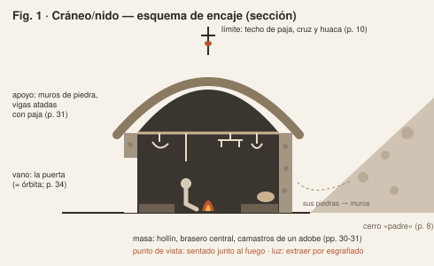
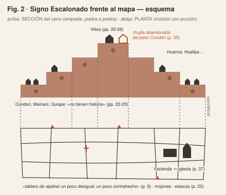
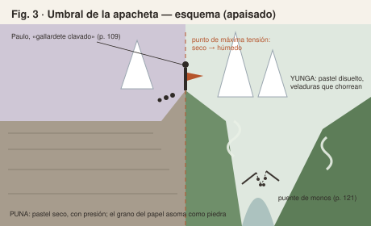
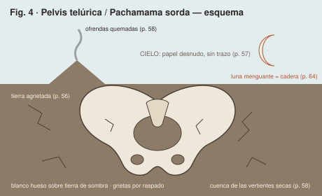
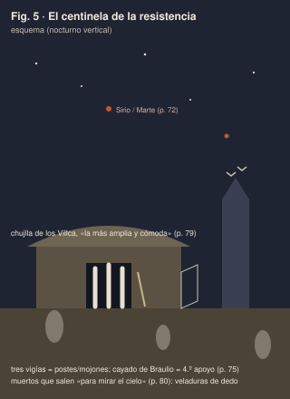
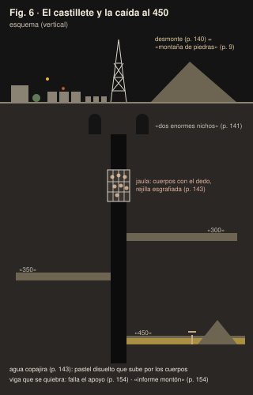

# 5b. Guía para realizar los seis pasteles

> **Nota para el artículo definitivo (25/9/2026).** Esta guía se escribió para la versión 2, cuando los pasteles estaban por hacer, y se recupera del historial como protocolo de referencia y modelo de registro de cada pieza. Tres cambios:
>
> - **Numeración.** En el artículo definitivo las figuras siguen el orden de aparición. La Figura 4 de esta guía (Pelvis) es la **5** del artículo; la 5 (Centinela), la **6**; la 6 (Castillete), la **4**. Las Figuras 1 a 3 no cambian.
> - **Plano (3).** El artículo ya no lo formula como hipótesis: lo llama *Hallazgo* y lo apoya en el texto y en el esquema de encaje. Si un pastel terminado muestra otra cosa, reescribe ese plano con lo que hizo el pastel.
> - **Inserción de fotografías.** Las §§5.5 y 5.6 describen el procedimiento de aquella versión (marcadores «en ejecución»), que ya no existen. Para el artículo definitivo sigue `articulo/figuras/LEEME.md`.

Las cuatro imágenes que acompañaron el encargo eran **referencias visuales**, no los dibujos del artículo (quedan en `analisis/referencias_visuales/`). Los seis pasteles están por hacer. Esta guía los deriva del texto de la novela con el mismo método del artículo, para que no partas de cero:

- **Observación** y **disección** ya están hechas en el artículo: los pasajes con página (Cuadro 1 y `06_fichero_de_pasajes.md`) y la tabla de apoyo, vano, masa y límite.
- **Ensamblaje** e **inmersión** te tocan a ti. Aquí van una propuesta de composición, una paleta sacada de los colores que nombra la novela y una secuencia técnica para cada figura.

Nada de esto es un modelo que haya que copiar. Con Pareyson, el dibujo «inventa *in situ* el modo de formar»: si al dibujar aparece otra cosa, síguela y anótala, porque ese desvío es el hallazgo que pide el plano (3) del artículo (véase §5.5).

## 5.1. Materiales

| Qué | Recomendación | Para qué |
|---|---|---|
| Pastel al óleo | Una gama blanda (tipo Sennelier) para empastes y fundidos, más una media o de estudiante (Neopastel, Pentel, Mungyo) para capas de fondo | Los blandos cubren y se esgrafían bien; los duros dan línea |
| Soporte | Papel de acuarela de 300 g/m², grano fino o medio, o cartón gris con gesso. **Para la Figura 4, papel celeste o gris azulado** | El papel de acuarela resiste el solvente. El gesso da diente para muchas capas |
| Formato | A3 (29,7 × 42 cm) si tienes tiempo; A4 si vas con prisa. Mantén el mismo formato en toda la serie | Una escala común hace legible la serie |
| Solvente | Aguarrás sin olor (tipo Gamsol), pincel plano y bastoncillos de algodón. Alternativa: aceite de bebé | Veladuras (Figs. 3, 5, 6) |
| Herramientas de extracción | Cúter o bisturí, espátula de paleta, clavo o punzón, mondadientes, aguja de tejer | Esgrafiado e incisión (Figs. 1, 2, 4, 6) |
| Piedras reales | Tres o cuatro piedras planas con textura y papel fino para frotado | Frotado de las piedras del cerro (Figs. 1, 2) |
| Otros | Cinta de papel para enmarcar el borde, trapo, papel cristal (*glassine*) para proteger, cuaderno de bocetos y lápiz o carbonilla | Bordes limpios, protección, miniaturas previas |

El pastel al óleo **no seca nunca del todo**. Guarda cada dibujo con papel cristal encima y no lo apiles sin protección. Hay fijadores específicos para pastel al óleo (por ejemplo, el de Sennelier), pero no son imprescindibles si escaneas pronto.

## 5.2. Siete operaciones y lo que significan en el método

El artículo sostiene que leer con la mano es **repetir operaciones**, no ilustrar escenas. Cada técnica corresponde a una operación de la novela:

| Técnica | Cómo se hace | Operación de la novela que repite | Figuras |
|---|---|---|---|
| **Empaste** | Capas gruesas con presión, sin fundir, piedra a piedra | Amontonar: la cosecha de piedras (p. 9), las pircas | 1, 2, 6 |
| **Esgrafiado** | Capa clara debajo y oscura encima; raspar con punta o cúter para que aparezca la clara | Despejar, extraer: sacar la luz de la masa como se saca la piedra de la tierra | 1, 6 |
| **Incisión** | Trazar líneas finas con un punzón sobre la cera | Escribir: la manugrafía del catastro, el mojón, la estaca | 2, 6 |
| **Fundido con el dedo** | Mezclar y arrastrar con la yema. Sin línea previa | El «manchón» de las rodillas (p. 60) y de la sangre (p. 154); manuaje «en sentido fuerte», de baja escrituralidad | 3, 5, 6 |
| **Veladura con solvente** | Pintar sobre el pastel con pincel mojado en aguarrás; se disuelve y chorrea | Derretirse, deshilarse: el cuerpo de Paulo «como muñeco de cera» (p. 123); el agua de la mina | 3, 6 |
| **Reserva** | Dejar el papel desnudo, sin tocar | La sequía como ausencia: «Ni una pincelada enturbió el papel celeste» (p. 57) | 4 |
| **Frotado** | Papel fino sobre una piedra real; frotar con el pastel de canto; recortar y pegar, o frotar directamente sobre el soporte si es delgado | Hacer muros con las piedras del cerro-padre (p. 8): la textura la pone la piedra, no la mano que imita | 1, 2 |

## 5.3. Ciclo de trabajo por figura

Es el ciclo de Lundberg adaptado. Para cada figura, en este orden:

1. **Relectura (10 min).** Lee los pasajes de la ficha (§5.4) y subraya materiales, colores, luz y medidas.
2. **Disección (15 min).** Haz tres o cuatro miniaturas de 5 × 7 cm con lápiz o carbonilla, cada una sobre una relación: dónde están el apoyo, el vano, la masa y el límite. Lundberg las hace como «bocetos rápidos y dibujos analíticos».
3. **Ensamblaje (15 min).** Haz una miniatura de composición que junte los elementos de la ficha: el *capriccio*. Parte del esquema de encaje si te sirve, o descártalo.
4. **Inmersión (1 a 3 h).** Haz el pastel definitivo. Empieza por la capa de fondo y guarda para el final los puntos de luz y las incisiones.
5. **Registro (10 min).** Fotografía cada etapa con el móvil y anota en el cuaderno qué decidiste, qué no salió como esperabas y qué descubriste. De esas notas sale el plano (3) del artículo.

## 5.4. Las seis fichas

### Figura 1. *Cráneo/nido*: sección de la chujlla

- **Pasajes.**
  - p. 8: el cerro «padre», con cuyas piedras «han hecho los cimientos y paredes de las chujllas».
  - p. 10: las chozas como «verrugas en la piel sarmentosa del altiplano»; el techo de paja «plomiza por el humo», con cruz y «una pequeña huaca de barro cocido».
  - pp. 29-32: los telares abandonados; la chujlla de dos metros, paredes «renegridas por el hollín», brasero central, camastros «apenas la altura de un adobe», herramental colgado de las vigas, charango de caparazón de quirquincho; la «mecha de sebo»; la «cinta bermeja del resplandor del fogón»; el «aire pesado, oloroso a boñiga quemada».
  - p. 34: el portal de la despedida.
- **Disección.**
  - Apoyo: muros de piedra y vigas atadas con paja.
  - Vano: la puerta, el único.
  - Masa: el hollín, el brasero y los camastros.
  - Límite: el techo de paja, con la cruz y la huaca.
- **Ensamblaje.** Un corte transversal visto desde la altura de una persona sentada junto al fuego. El contorno del corte toma el perfil de un cráneo: la bóveda de paja como calota, la puerta como órbita, el fuego en el lugar del pensamiento. Fuera, a un lado, la ladera del cerro de donde salen las piedras de los muros.
- **Formato.** Apaisado o cuadrado.
- **Paleta.**
  - Negro humo y siena tostada para el hollín.
  - Ocre y tierra para el adobe y la piedra.
  - Gris plomizo para la paja.
  - Rojo bermellón y amarillo para el fuego.
  - Un toque de rojo y oro de kantuta en el umbral (p. 10).
- **Luz.** De noche, con una sola fuente cálida y baja: el brasero y la mecha de sebo. Todo lo demás, sombra.
- **Secuencia técnica.**
  1. Fondo general de ocre claro y amarillo, que será la luz escondida.
  2. Encima, una capa gruesa de negro y siena en todo el interior.
  3. Esgrafiado: las vigas, las hoces, el yugo, el arado y el caparazón aparecen raspando la capa oscura.
  4. Los muros, en empaste o con frotado de piedras reales.
  5. El humo, con el dedo.
  6. El fuego, al final, en empaste puro.
- **Qué observar.** ¿Desde dentro, la chujlla sigue pareciendo la «madriguera» del narrador o aparece como caja de herramientas y lugar de ensueño? ¿El perfil de cráneo se impone o sale forzado?
- **Qué evitar.** Dibujar «los sueños paganos» o los «revolcones» que el narrador proyecta. El artículo dice que el dibujo **no** entra en el secreto de los comunarios (p. 65).

### Figura 2. *Signo Escalonado frente al mapa*

- **Pasajes.**
  - p. 6: las chujllas de las familias antiguas «han trepado en los riscos del cerro»; la «rojiza peñería»; la «llanura amarillosa, parda»; los «kollis verdinegros».
  - p. 9: el «tablero de ajedrez un poco desigual, un poco contrahecho»; los mojones.
  - pp. 20-23: Pedro Villca «empotró en el suelo del ayllu las estacas de propiedad»; la jerarquía de familias y de historias.
  - p. 35: el peón Condori recibe «una chujlla que estaba abandonada cerro arriba».
  - pp. 36-38: Kero-Pata: títulos, papel sellado, casa de hacienda frente a la iglesia; «las generaciones del Signo Escalonado».
  - p. 163: «Signo sagrado de Tiwanaco».
- **Disección.**
  - Apoyo: los peones que sostienen a los Villca (p. 21).
  - Vano: el salto entre escalones, donde quedan los que «no tienen historia».
  - Masa: la tierra acumulada.
  - Límite: estacas, mojones y títulos.
- **Ensamblaje.** Dos proyecciones del mismo cerro en una sola hoja, como en el sistema diédrico:
  - arriba, la **sección** escalonada con las chujllas en sus escalones;
  - abajo, la **planta**: el tablero contrahecho, los mojones, las estacas y, en un borde, la hacienda frente a la iglesia;
  - entre ambas, líneas de proyección finas.

  La chujlla abandonada del peón va en un escalón alto, marcada con otro color. Es el dato que rompe el esquema del narrador.
- **Formato.** Vertical.
- **Paleta.**
  - Rojizos y sienas para la peñería.
  - Amarillo pardo para la llanura.
  - Verde negro para los kollis.
  - Para la planta, un color frío (gris o azul pizarra) que la separe de la sección.
- **Luz.** De día y cenital, casi sin sombras: la luz del plano.
- **Secuencia técnica.**
  1. Fondo claro en la mitad inferior y cálido en la superior.
  2. La sección por **empaste**, bloque a bloque, como quien apila piedras (el frotado sirve aquí).
  3. La planta cubierta con una capa uniforme y luego **incidida** con punzón: la cuadrícula, los mojones, las estacas.
  4. Las líneas de proyección, incididas también.
- **Qué observar.** ¿La escalera social cabe en la pendiente o se rompe? ¿Qué pasa en la hoja cuando mito (la sección) y mapa (la planta) se hacen con el mismo pastel y la misma mano?
- **Qué evitar.** Una pirámide limpia y simétrica que confirme el diagrama de clases del narrador. La hipótesis es que no encaja.

### Figura 3. *Umbral de la apacheta*

- **Pasajes.**
  - p. 33: la bendición: «que en las apachetas no les detenga el Supaya».
  - p. 108: «la muralla que condena el horizonte»; el horizonte «estrangulado».
  - p. 109: Paulo «como un gallardete clavado en la ceja de la apacheta»; la familia de rodillas; la «fauce del yunga» que deglute «una muselina de vapor fragante, como espumosa baba»; las cumbres «semejantes a fantásticas construcciones góticas»; el «confín violeta del atardecer»; las cinco de la tarde.
  - pp. 110-111: el «angosto pretil ceñido a la roca»; la «ligera pincelada amarilla».
  - p. 121: el puente de monos.
  - p. 160: glosario: «abra de las cordilleras y cumbre de los caminos».
- **Disección.**
  - Apoyo: el cuerpo de Paulo como poste.
  - Vano: la fauce del abismo.
  - Masa: las cumbres y la niebla.
  - Límite: la cresta, la muralla del horizonte.
- **Ensamblaje.** La hoja se parte por la cresta:
  - a un lado, la puna, seca, gris y violeta, con un horizonte recto;
  - al otro, el yunga, húmedo y verde, con dos paredes que convergen como una boca;
  - en la cresta, Paulo como un trazo vertical con el poncho al viento, y la familia arrodillada;
  - abajo, en el río del yunga, la cadena de monos como único puente.

  Recuerda que la novela **no** pone piedras en su apacheta; si decides añadirlas, es tu proyección y conviene decirlo en el pie o en el texto.
- **Formato.** Apaisado.
- **Paleta.**
  - Puna: gris polvo, violeta de atardecer y ocre pálido.
  - Yunga: verdes húmedos, blanco de vapor y un toque de amarillo.
  - Cumbres: blanco con azul frío.
- **Luz.** Las cinco de la tarde, rasante, desde el lado de la puna.
- **Secuencia técnica.**
  1. Lado de la puna en **seco**: pastel de canto y con presión sobre papel de grano, para que el grano blanco asome como piedra. No fundas nada.
  2. Lado del yunga con capas de verde fundidas.
  3. Veladura con **solvente**: pincel con aguarrás que disuelva y haga chorrear el pastel, sin miedo a que corra.
  4. En la cresta, el cruce de las dos maneras: ese es el punto de máxima tensión.
  5. Paulo, al final, en empaste oscuro.
- **Qué observar.** ¿El paso de lo seco a lo húmedo se lee como otro paisaje o como un cambio de estado de la materia? ¿El puente de monos pesa en la composición o queda como anécdota?
- **Qué evitar.** El paisaje de postal de los Yungas. El narrador lo ve con «histeria de bosques vírgenes» (p. 108), y el dibujo no tiene por qué heredar ese exotismo.

### Figura 4. *Pelvis telúrica / Pachamama sorda*

- **Pasajes.**
  - p. 56: las sementeras «se agrietan como paredes envejecidas».
  - p. 57: «Ni una pincelada enturbió el papel celeste y deslumbrador del cielo»; el crepúsculo como «dantesco brasero».
  - p. 58: las vertientes secas, «un arenoso y blanquecino cauce, tachonado de pedrisca»; las ofrendas quemadas en el cerro; «La tierra está vieja, y como toda vieja, es sorda».
  - p. 63: la luna «hinchada como una nube de fuego blanco».
  - p. 64: las vacas famélicas, con «las nalgas abiertas a la manera de una luna menguante».
  - p. 66: «La Pacha Mama, sorda, vieja, extenuada».
  - p. 72: la luna menguante «tenía sangre».
- **Disección.**
  - Apoyo: la cadera ósea, la estructura que carga.
  - Vano: la abertura pélvica, que es el cauce seco.
  - Masa: la tierra agrietada.
  - Límite: el cielo sin trazo.
- **Ensamblaje.** La cuenca de las vertientes secas vista desde arriba o en escorzo, dibujada como una pelvis de ganado, con dos alas y una abertura central. En el cielo, una luna menguante que repite la curva de la cadera. Al fondo, el cerro pequeño con un hilo de humo de las ofrendas.
- **Formato.** Apaisado.
- **Paleta.**
  - Cielo: **no se toca**. Es el papel celeste o gris azulado, que literaliza la metáfora de la p. 57.
  - Tierra: sombra, siena y «plomizo y mineral» (p. 66).
  - Hueso: blanco roto y marfil.
  - Un solo acento rojo en la luna o en el borde del cielo («tenía sangre», p. 72).
- **Luz.** Mediodía blanco o luna llena de «fuego blanco». Luz dura y sin sombra que proteja.
- **Secuencia técnica.**
  1. Enmascara el cielo con cinta y no lo toques.
  2. Tierra de sombra en capas.
  3. La pelvis en blanco hueso, en empaste.
  4. Las grietas por **raspado** hasta que aparezca el papel.
  5. La luna, como la pelvis, por reserva o con muy poco material.
- **Qué observar.** ¿La pelvis se lee como estructura que carga (tectónica) o vuelve a leerse como sexo (el tropo del narrador)? Si pasa lo segundo, anótalo: también es un hallazgo.
- **Qué evitar.** Cualquier cuerpo femenino. La operación consiste justamente en desplazar la metáfora sexual hacia la estructura.

### Figura 5. *El centinela de la resistencia*

- **Pasajes.**
  - pp. 23-24: el bastón de keñua de Pedro Villca; la vara de Jilakata.
  - p. 72: el cerro como «Achachila»; Sirio y Marte «semejantes a coágulos de aquella sangre estelar».
  - p. 73: Paulo sube al estrado de adobes con la vara.
  - p. 75: Braulio Choquehuanca y su cayado; los «tres vigilantes al cuidado del ayllu».
  - p. 79: el ayllu vacío, con puertas zarandeadas y polvo en los rincones; los tres vigías en la chujlla de los Villca, «celadores y enfermeros de un solar histérico, infecundo y trágico»; los buitres en el campanario, «aquella atalaya»; el sol «como una ascua».
  - p. 80: los muertos que «en las noches salían de la tierra para mirar el cielo»; «cancerberos», «muertos en vida».
- **Disección.**
  - Apoyo: los cuerpos-poste y el cayado.
  - Vano: la puerta de la chujlla vacía.
  - Masa: la casa de los Villca.
  - Límite: la mirada sobre la inmensidad.
- **Ensamblaje.** Un nocturno con tres figuras verticales en el vano de la casa más grande del ayllu vacío, tratadas como postes o mojones (apoyos, no héroes). A un lado, un cayado apoyado. Al fondo, el campanario con los buitres, una contravigía. Del suelo suben formas pálidas: los muertos que salen a mirar el cielo. Horizonte bajo, cielo enorme.
- **Formato.** Vertical.
- **Paleta.**
  - Azul noche y negro.
  - Ocre polvo para el suelo.
  - Dos estrellas rojas (Sirio y Marte).
  - Blancos veladísimos para los muertos.
- **Luz.** Nocturna, sin luna o con muy poca. Las figuras se leen por silueta.
- **Secuencia técnica.**
  1. Cielo en capas de azul y negro fundidas con el dedo.
  2. La casa y el suelo en empaste pardo.
  3. Las tres figuras como trazos verticales gruesos y firmes.
  4. Los muertos con **el dedo apenas cargado de blanco**, en veladura. El solvente también sirve.
  5. Las estrellas, al final, en punto de empaste.
- **Qué observar.** ¿Los vigías se leen como resistencia (cuidado, permanencia) o como ruina (los «cancerberos» del narrador)? ¿Hacia dónde miran? El final de la novela tiene una «atalaya de la esperanza» que se niega a mirar hacia abajo (p. 157).
- **Qué evitar.** El heroísmo: nada de puños alzados ni de poses épicas. El discurso de Braulio, de hecho, fracasa.

### Figura 6. *El castillete y la caída al plano 450*

- **Pasajes.**
  - p. 134: el cerro «jorobado»; «el encaje de acero de la torre de un andarivel»; las luces «semejante a un prendedor de topacios y rubíes»; la máquina «de tres pesados y anchos martillos».
  - p. 135: el campamento escalonado: chalets, casas en fila, cuchitriles.
  - p. 136: «la noche del subsuelo es eterna»; el agua «sulfurosa y amarillenta»; la gruta de la Virgen junto a la pila.
  - p. 140: el desmonte; las impresiones digitales.
  - pp. 141-145: los «dos enormes nichos»; las jaulas; los siete hombres «apeñuscados contra la rejilla»; la caída; «montones de cascotes»; el «boquete»; las «costillas zafadas como surcos».
  - pp. 151-154: «rieles, maderos, dinamita, hombres»; el agua a la rodilla, a la cintura y al ombligo; el disparo; la viga que se quiebra; el «informe montón de rocas, lodo y maderos astillados».
- **Disección.**
  - Apoyo: los callapos y la viga del techo, que se quiebra.
  - Vano: el pique, los nichos, la jaula y el boquete.
  - Masa: el agua, los cascotes y el montón.
  - Límite: la rejilla y la línea del agua sobre el cuerpo.
- **Ensamblaje.** Un corte vertical en tres partes:
  - arriba, la torre como encaje contra la noche y, junto a ella, el desmonte, que es la «montaña de piedras» que los comunarios soñaban (p. 9) cumplida como escombro;
  - en la superficie, el campamento escalonado;
  - debajo, el pique con los niveles «300», «350» y «450» como pisos de un edificio al revés, la jaula con siete cuerpos y, en el fondo, la galería inundada con el derrumbe.
- **Formato.** Vertical y alargado; puedes usar una tira de 20 × 60 cm.
- **Paleta.**
  - Negros y sombra.
  - Óxido de los rieles.
  - Amarillo azufre del agua copajira.
  - Puntos de topacio y rubí para las luces.
  - Carne apagada para los cuerpos.
- **Luz.** Puntos pequeños y duros (lámparas de carburo, bombillas) y todo lo demás a oscuras.
- **Secuencia técnica.**
  1. Fondo claro (ocre o amarillo) y encima negro en toda la roca.
  2. La torre **incidida** como encaje.
  3. Los cuerpos de la jaula **con el dedo**, sin línea.
  4. La rejilla **esgrafiada encima** de los cuerpos (el marco que aísla).
  5. En el fondo, una banda de amarillo azufre disuelta con **solvente** que suba por las figuras.
  6. El montón, en empaste grueso, al final.
- **Qué observar.** ¿La mina se lee como lo contrario del ayllu o como su doble invertido? ¿El desmonte en lo alto se reconoce como la montaña de piedras del principio?
- **Qué evitar.** Dibujar el disparo o el cadáver. La violencia está en la estructura: la jaula, el agua, la viga.

## 5.5. De la hipótesis al hallazgo: cómo reescribir el plano (3)

Cuando termines cada pastel, reescribe en el artículo el párrafo «(3) *Contraste (hipótesis)*» de esa figura. Ponle «(3) *Hallazgo*» y cuenta lo que el dibujo mostró, no lo que se esperaba. Una plantilla posible:

> (3) *Hallazgo*. Al [operación: esgrafiar las vigas, disolver el yunga, incidir el catastro...], apareció [lo que viste], que el texto [no dice / dice de otro modo / contradice en la p. X]. La hipótesis [se confirma / se matiza / no se sostiene]: [consecuencia para la lectura de la novela].

Si un pastel desmiente la hipótesis, **no lo escondas**. La formatividad lo prevé, y un desmentido honesto vale más en el arbitraje que una confirmación forzada. Reescribe también la frase de la sección 1 («los seis pasteles están en ejecución…») y el segundo párrafo de las conclusiones, y vuelve a pasar `python3 articulo/generar_docx.py` para comprobar que no superas los 50.000 caracteres.

## 5.6. Fotografiar e insertar las figuras

1. **Captura.** Escanea a 300 ppp como mínimo o fotografía con luz de día difusa, sin flash, con el móvil paralelo a la hoja. Si puedes, pon al lado una carta de color o un papel blanco para corregir el balance.
2. **Edición.** Recorta al borde del dibujo, corrige la perspectiva y exporta en JPG de alta calidad, de 2.000 a 3.000 px de lado mayor.
3. **Archivo.** Guarda las imágenes como `articulo/figuras/figura_1.jpg` … `figura_6.jpg`.
4. **Inserción.** En `articulo/articulo_cosecha_de_piedras.md`, dentro de cada bloque `::: {custom-style="Figura"}`, sustituye la línea `⟦Figura N: pastel al óleo en ejecución⟧` por `{width=14cm}`. Para las figuras verticales usa `{height=18cm}`.
5. **Pie.** Completa `⟦soporte, medidas, año⟧`, por ejemplo: «Pastel al óleo sobre papel, 29,7 × 42 cm, 2026».
6. **Regenerar.** Ejecuta `python3 articulo/generar_docx.py`.

## 5.7. Si el tiempo apremia

- **Serie exprés (un día).** Seis pasteles A4 de unos 60 a 75 minutos cada uno, con 20 minutos previos de miniaturas por figura. Unas 8 horas en total. Es una escala coherente con Lundberg, que dibujaba de 30 a 60 minutos por imagen.
- **Prioridad.** Si no llegan las seis, las que más sostienen el argumento son la 2 (el signo frente al mapa), la 6 (la mina como doble del ayllu) y la 1 (la chujlla). Con cuatro figuras habría que ajustar el esquema del artículo y el Cuadro 1.
- **Plazo.** La convocatoria cierra el 25 de septiembre de 2026. Si los dibujos no estarán a tiempo, consulta a ieb.fhce@umsa.bo si puedes enviar el texto como investigación en desarrollo con las figuras marcadas «en ejecución» o si conceden unos días más. La decisión es tuya y de la revista.
