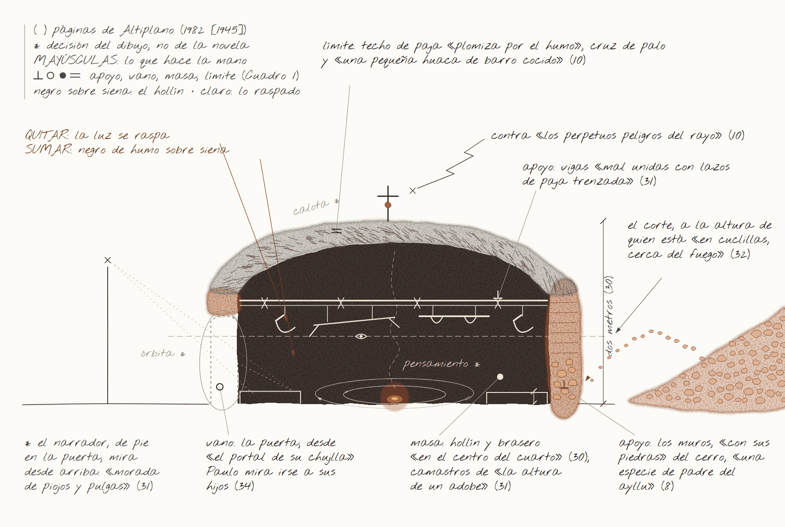
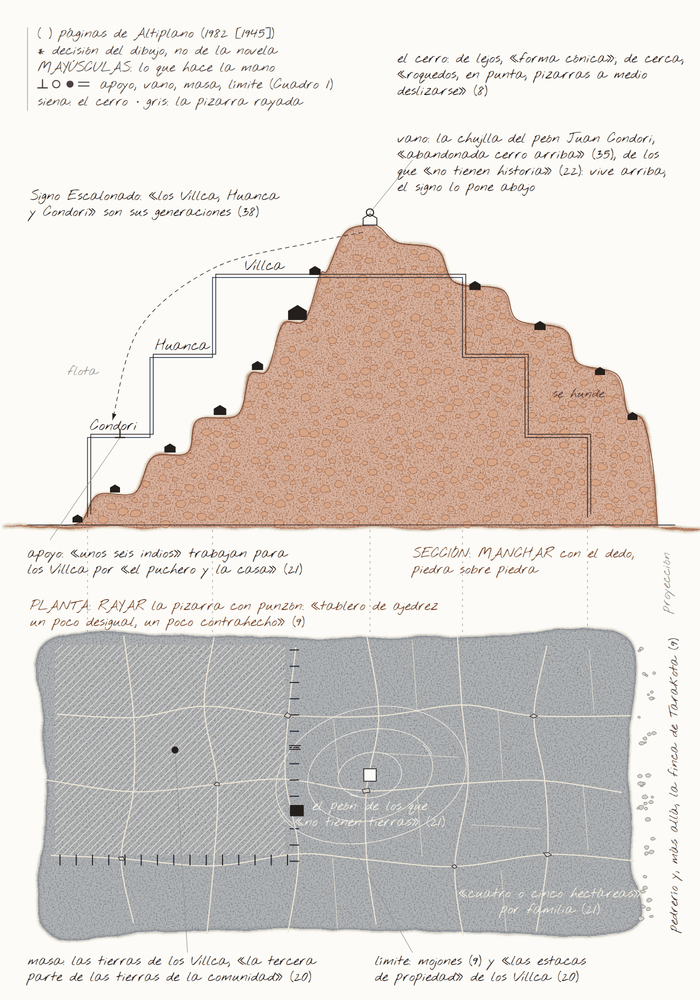
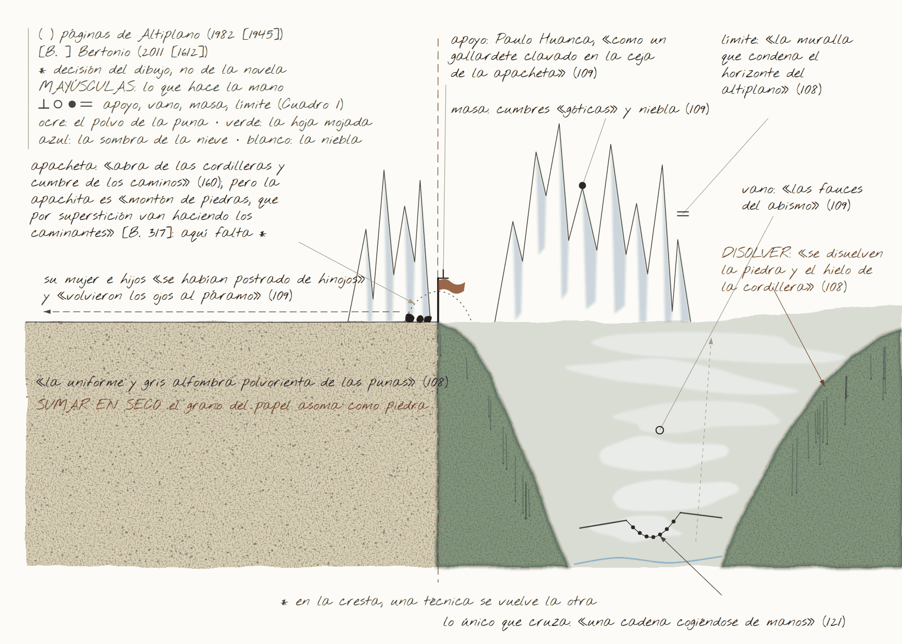
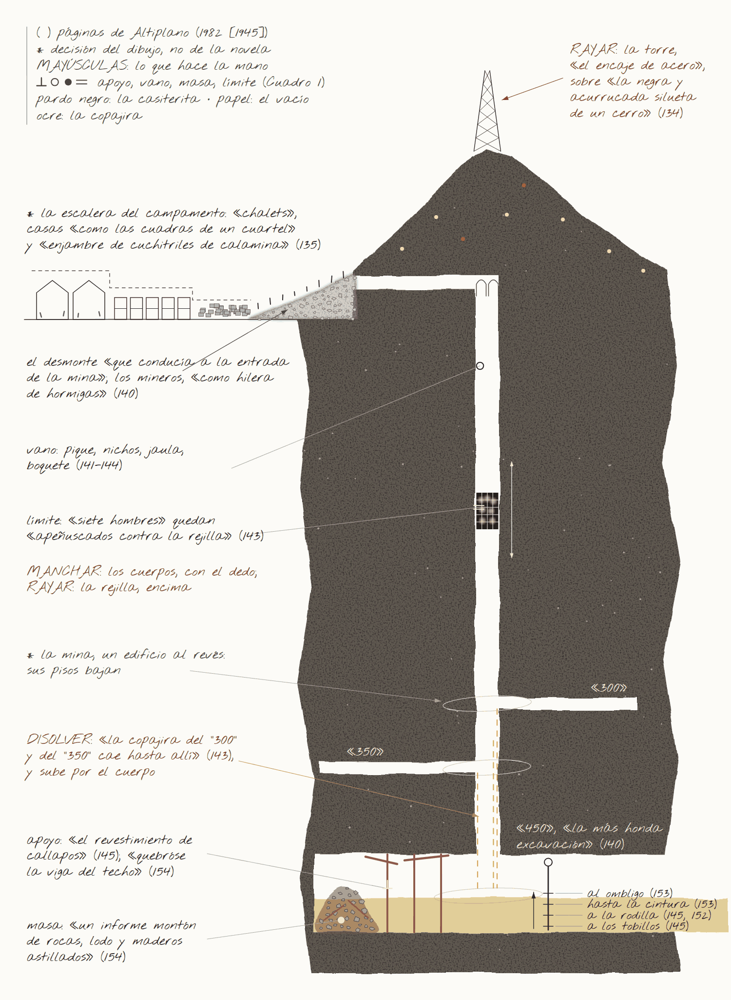
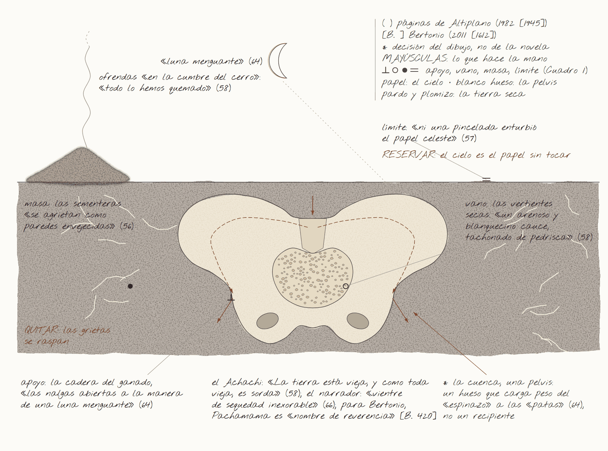
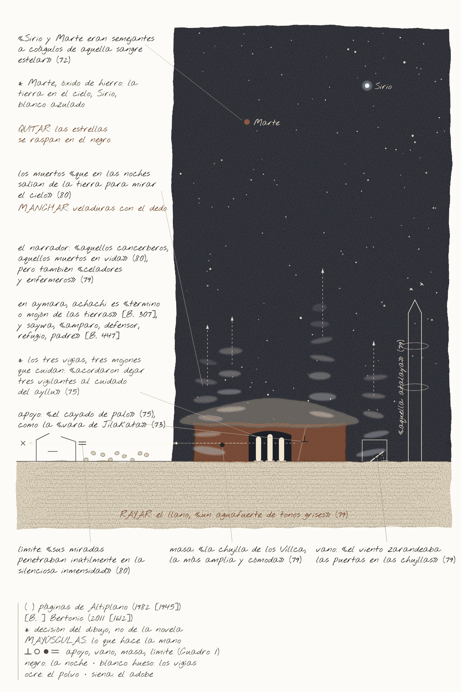

# La cosecha de piedras: dibujar el habitar en *Altiplano* de Botelho Gosálvez

**The Harvest of Stones: Drawing Dwelling in Botelho Gosálvez's *Altiplano***

Joaquin Max Cuevas Ventura[^autor]

[^autor]: Joaquin Max Cuevas Ventura es licenciado en Arquitectura por la Universidad Mayor de San Andrés (UMSA) y técnico superior en Diseño Gráfico por el Instituto Técnico Atenea. Ha cursado estudios de postgrado en Gestión BIM en la Universidad Católica Boliviana «San Pablo» y fue coordinador de Arquicinema (FAADU-UMSA). Actualmente se desempeña como diseñador de comunicación visual. Sus áreas de trabajo articulan la espacialidad arquitectónica, la cultura material y la investigación a través del dibujo. Correo electrónico: JoACKo333@gmail.com. La Paz, Bolivia.

**Resumen**

El artículo lee *Altiplano* (1945), de Raúl Botelho Gosálvez, desde la arquitectura y el dibujo, siguiendo sus piedras. La crítica ya mostró que el narrador indigenista convierte la historia india en naturaleza; aquí se estudia lo que la novela registra a espaldas de su narrador: cómo funciona, materialmente, el despojo. Con el vocabulario aymara colonial, la historia andina y seis pasteles al óleo como herramienta de lectura, se sostiene que la novela marca la posesión con piedras (mojón, pirca, montón), narra su pérdida ante papeles y máquinas, calla el uso aymara de la escritura y recuerda de manera selectiva.

**Palabras clave:** Botelho Gosálvez; ayllu; despojo; manuaje; dibujo como investigación.

**Abstract**

This article reads *Altiplano* (1945), by Raúl Botelho Gosálvez, from the standpoint of architecture and drawing, following its stones. Criticism has shown that the indigenista narrator turns Indian history into nature; this study examines what the novel records behind its narrator's back: how dispossession works, materially. Drawing on colonial Aymara vocabulary, Andean history and six oil pastels used as reading tools, it argues that the novel marks possession with stones (boundary marker, dry wall, heap), narrates its loss to papers and machines, silences Aymara uses of writing, and remembers selectively.

**Keywords:** Botelho Gosálvez; ayllu; dispossession; manuage; drawing as research.

::: {custom-style="Epígrafe"}
«Mirando al pasado para caminar por el presente y el futuro (*qhip nayr uñtasis sarnaqapxañani*)».

Lema del Taller de Historia Oral Andina (Rivera Cusicanqui, 2010 [1984]: 17)
:::

## 1. Introducción: una cosecha de piedras

En Jatun-Kolla, el ayllu aymara que Raúl Botelho Gosálvez sitúa «en la planta de una alta y rojiza peñería» (Botelho Gosálvez, 1982 [1945]: 6), la tierra de labranza no pasa de cien hectáreas; el resto es «erial de piedras». Los comunarios lo limpian año tras año, sin fortuna:

> A medida que extraen piedras y las amontonan, brotan más y más, como paridas por la tierra. ¡Piedras! El trabajo más duro, más reñido y tenaz en Jatun-Kolla, rinde cosecha de piedras. Pero no importa: quizá un día la montaña de piedras sobrepase la altura del cerro; entonces será buena la tierra rescatada (ibid.: 9).

La escena encierra una paradoja: lo que se cosecha es el obstáculo, y la tierra *pare* justamente lo que impide sembrar. Esas piedras cambian de oficio. Con ellas se hicieron «los cimientos y paredes de las chujllas» (ibid.: 8), las chozas del ayllu. Con ellas cubre Juan Condori a su compañera muerta: «amontonó piedras sobre el cadáver» (ibid.: 35). Y a Condori, asesinado en la mina, lo sepulta «un informe montón de rocas, lodo y maderos astillados» (ibid.: 154). Pirca, casa, tumba, escombro: el montón de piedras es la arquitectura mínima de *Altiplano*, aquella en la que habitar y enterrar casi no se distinguen. Como observa Tim Ingold, el montón «no se construye: crece» (Ingold, 2013: 78)[^trad]; en Jatun-Kolla, crece con cada cosecha.

[^trad]: Las traducciones de las citas en inglés, francés y portugués son nuestras.

El aymara colonial tenía palabras para todo esto. El vocabulario que el jesuita Ludovico Bertonio publicó en 1612 registra un verbo para la faena, *wanqathapiña*, «amontonar piedras sacándolas» (Bertonio, 2011 [1612]: 77), y un solo nombre, *chhaxwa*, para las piedras «que amontonan limpiando las chácaras» y para la piedra «hincada en la pared para atar en ella los palos del techo» (ibid.: 330). La misma palabra nombra la piedra que se saca del campo y la que sujeta el techo. Un arquitecto reconoce aquí dos maneras de construir. Kenneth Frampton distingue la masa formada por «apilamiento repetitivo de elementos pesados», «ya sea piedra o adobe», del armazón que ensambla «componentes ligeros y lineales» (Frampton, 1995: 5): la estereotomía y la tectónica. El montón es masa sin edificio, y *chhaxwa* nombra el punto exacto donde la masa y el armazón se tocan. Esa tensión entre la piedra que pesa y la madera que ata recorre la novela, de la chujlla a la mina.

Este artículo hace dos preguntas. ¿Qué sabe *Altiplano* sobre el habitar cuando se la lee siguiendo sus piedras? ¿Y qué añade a esa lectura un dibujo hecho con una materia, el pastel al óleo, que trabaja como el comunario, sumando y quitando?[^pastel] Nuestra respuesta es que la novela registra, a espaldas de su narrador, la mecánica material del despojo: cómo se pierde la tierra, con qué objetos y con qué gestos. El argumento cabe en tres materiales. El ayllu marca su tierra con piedras: despeja, amontona, cerca y amojona. La aldea la reescribe con papeles: títulos, expedientes, ordenanzas. La mina convierte el mismo gesto en mercancía con máquinas. Entre la piedra y el papel el intercambio no es parejo: ante la ley, un mojón no vale lo que un título. El dibujo, al repetir las operaciones de la novela con otra materia, obliga a decidir lo que el texto deja abierto y deja ver lo que el narrador impone.

[^pastel]: El pastel al óleo es pigmento unido con cera y aceite. A diferencia de la tinta, que fija la línea al secar, no llega a secar del todo: se puede empastar, arrastrar con el dedo, raspar con una punta hasta descubrir la capa de abajo (esgrafiado) o disolver con solvente. Por eso se trabaja sumando y quitando materia, como se modela un barro o se limpia un campo, más que trazando líneas.

El narrador, además, no es inocente. La novela se publicó en Buenos Aires en 1945 y se cita aquí por una reedición paceña de 1982, cuya nota editorial asegura que el autor «ama al indio», que enseñó en la Escuela Indigenal de Warisata y que Jatun-Kolla «es, en realidad, Warisata» (Botelho Gosálvez, 1982 [1945]: 5). Esa nota invita a leer la novela como documento y como redención; aquí no se sigue ninguna de las dos lecturas. Antonio Cornejo Polar mostró que el narrador indigenista, «ajeno al mundo indio aunque se solidarice con él», imagina esa vida «más en términos de naturaleza que de historia» (Cornejo Polar, 2003 [1994]: 180). El de *Altiplano* no es la excepción. Denuncia el despojo, pero trata a los comunarios como animales, como cuerpos sexuales o como piedras: las chozas son «verrugas en la piel sarmentosa del altiplano» (Botelho Gosálvez, 1982 [1945]: 10), y un minero muestra sus «pobres costillas zafadas como surcos» (ibid.: 145). No se trata de repetir esa crítica, sino de buscar la historia que el texto guarda en sus cosas mientras el narrador la convierte en paisaje.

La lectura se hace desde la arquitectura y el dibujo, con las herramientas de ese oficio: la planta, el corte, el peso de los materiales, la mano que dibuja. Hay tres razones para hacerlo así. Primero, en *Altiplano* el saber sobre el espacio es material: piedra, adobe, paja y papel. Segundo, el dibujo, que obliga a decidir punto de vista, escala y límite, deja a la vista las categorías que el lector proyecta. Tercero, si dibujar es, como propone Mauricio Cárcamo Pino, un *manuaje*, una manera de pensar y de decir con las manos (Cárcamo Pino, 2025b: 244), dibujar una novela es leerla con otro órgano. El recorrido cambia de escala: la casa y el ayllu (sección 3), la aldea (4), el éxodo (5), el cuerpo (6) y el retorno (7). En ese recorrido se sitúan los seis pasteles de la serie, de los que se reproduce el esquema de encaje, el trazado que fija la composición (figuras 1-6). Se trata de una investigación en desarrollo.

## 2. Cómo leer: el espacio, las manos y el dibujo (marco teórico y método)

Fernando Vázquez Ramos y sus colegas recuerdan que el espacio es un tema «esencialmente moderno y, como tal, movedizo y, sobre todo, abstracto», que «no habla sobre la arquitectura, sino sobre nosotros» (Vázquez Ramos et al., 2023: 4). Citan también a Edward T. Hall, que advertía contra quienes «proyectan sobre el mundo visual del pasado las estructuras del mundo visual del presente» (Hall, 1973: 133, cit. en ibid.: 3). La advertencia vale para nosotros: no hay que atribuir al ayllu una idea de espacio que la novela no formula, porque sus categorías son otras: la piedra, la pirca, el mojón, el título. Y vale para el narrador, que mira Jatun-Kolla con la sociología de la ciudad: los Villca «son la burguesía usurpadora»; los Condori, Mamani y Quispe, «el proletariado campesino» (Botelho Gosálvez, 1982 [1945]: 22).

En Bolivia, René Zavaleta Mercado opuso «dos concepciones que son ambas espacialistas»: la andina, un «archipiélago» en el que «este espacio no puede concebirse sin otro espacio», y la señorial, que concibe «el dominio final del suelo como atribución ligada a una estirpe» (Zavaleta Mercado, 1986: 29-30). Dicho de manera simple: para la primera, la tierra es un conjunto de lugares a distintas alturas que se trabajan juntos, como la puna y el valle; para la segunda, un terreno cercado que se hereda por apellido. *Altiplano* muestra las dos, y cómo la segunda gana terreno.

Tampoco la piedra andina es la piedra del narrador. En el aymara de Bertonio, *wanqa* es solo «piedra muy grande» (Bertonio, 2011 [1612]: 506). Pero Pierre Duviols advierte que los diccionarios callan el «contenido religioso» que dejan ver los juicios coloniales contra la idolatría. Allí, el *huanca* era «el doble mineral del cadáver sagrado» (Duviols, 1979: 8), una piedra que recordaba «al Huari que primero amojonó tal campo, al que lo cercó, al que lo desbrozó» (ibid.: 13). *Huanca*, grafía colonial de *wank'a*, era también nombre de varón (Dean, 2010: 44, 202, n. 86), como el apellido de Paulo Huanca y su familia. La novela no lo desarrolla, pero lo registra: «mojones que han sido puestos allí desde tiempos antiguos» señalan las pertenencias del ayllu (Botelho Gosálvez, 1982 [1945]: 9), y los Huanca viven «en los linderos» (ibid.: 30). En cambio, cuando Paulo Huanca baja a los Yungas, su «organismo de piedra del Kollasuyo» termina «despedazado» (ibid.: 133). La *wank'a* es una piedra con dueño y con lugar; la del narrador, una abstracción.

¿Con qué leer, entonces? Con las manos, pero sin oponerlas al papel. Cárcamo Pino llama *manuaje* a lo que hacen las manos cuando piensan, expresan o comunican: un «neologismo homólogo al lenguaje, pero con las manos» (Cárcamo Pino, 2019: 1412, cit. en Cárcamo Pino, 2025b: 244). Escribir es una de esas acciones, y cada oficio tiene su *manoaje*, «un subgrupo contextual de acciones manuales» (Cárcamo Pino, 2025b: 259). Cárcamo Pino recuerda además que la misma mano hace dos agarres: el de fuerza, como al tomar un martillo, y el de precisión, como al «sujetar un papel con dos yemas dactilares» (Cárcamo Pino, 2025a: 10). *Altiplano* pone los dos a la vista. Paulo Huanca sale de su chujlla «con la madera del arado en un hombro y las correas del yugo en las manos» (Botelho Gosálvez, 1982 [1945]: 34); el doctor Mendoza firma la ordenanza que dejará sin ganado a los Villca (ibid.: 96). No es una mano frente a un papel, sino dos manos con dos agarres.

La oposición entre la mano que ara y el papel que despoja la enuncia el poder. En Umacachi, los vecinos niegan la escuela a los indios: «Que tiren palotes con el arado», dicen, porque esa es «la más recomendable caligrafía para los indios» (Botelho Gosálvez, 1982 [1945]: 87). Repetirla sería repetir su lógica, y la novela la repite por omisión: el ayllu que «es, en realidad, Warisata» (ibid.: 5) no tiene escuela, cuando allí funcionaba desde 1931 la escuela-ayllu del maestro indio Avelino Siñani y de Elizardo Pérez (Rivera Cusicanqui, 2010 [1984]: 105, 113), y los *kuraka* de Achacachi sostenían escuelas propias ya en 1929 (Barnadas, 1978 [1975]: 84). La pregunta no es si la mano o el papel, sino qué prácticas se autorizan y cuáles quedaron «minusvaloradas, invisibilizadas» por el «monopolio de la escritura y el lenguaje» (Cárcamo Pino, 2025b: 259).

Falta decir qué dibujo se usa, porque no todo dibujo descubre algo. Javier Seguí de la Riva distingue el dibujo que puede «servir como ilustración de un texto narrativo previo» del que deja a la mano encontrar lo que no se sabía (Seguí de la Riva, 2010: 93). Tim Ingold separa los dibujos que cuentan de los que «especifican» (Ingold, 2013: 125), como los planos de arquitectos e ingenieros. Los esquemas de encaje que aquí se reproducen pertenecen al dibujo que ilustra y especifica: no descubren nada, pero obligan a decidir.

El método sigue los cuatro pasos que Simon Lundberg propone para explorar la imagen arquitectónica: observación, disección, ensamblaje e inmersión (Lundberg, 2019: 3). La *observación* reúne los datos del texto (lugar, materia, medida, luz, color) en una «biblioteca de observaciones» (ibid.: 15); aquí, un fichero de pasajes con su página. La *disección* separa las partes y las ordena según cuatro funciones constructivas: apoyo, vano, masa y límite (Cuadro 1). El *ensamblaje* las vuelve a juntar, como el *capriccio* de Canaletto, que reunía edificios de ciudades distintas en una ciudad «completamente imaginaria» (ibid.: 3); sus decisiones, un perfil o una analogía, son del dibujante y no cuentan como hallazgos. La *inmersión* da atmósfera, sin confundirse «con el realismo visual» (ibid.: 21). Los dos primeros pasos se hacen sobre el texto; los dos últimos, en el pastel.

El pastel conviene a esta novela porque su prosa mide el espacio con el cuerpo. En la jaula de la mina, Condori siente, «como si faltase suelo bajo sus pies», «la vertiginosa caída» (Botelho Gosálvez, 1982 [1945]: 143). Abbie Garrington llama *háptico* a ese registro: lo que se sabe por el tacto, el movimiento, la posición del cuerpo y el equilibrio (Garrington, 2013: 16). A una prosa del tacto le corresponde un dibujo hecho con los dedos. Cada figura se examina en tres planos: (1) *Texto*, lo que describe la novela; (2) *Operación*, lo que hace el pastel con la materia; (3) *Contraste*, lo que el esquema obliga a decidir y el texto deja abierto o contradice, comparado, cuando se puede, con fuentes andinas.

**Cuadro 1.** *Disección tectónica de las seis figuras*

| Figura | Apoyo | Vano | Masa | Límite |
|---|---|---|---|---|
| 1. Cráneo/nido | Muros de piedra del cerro (8); vigas atadas con paja (31) | La puerta; el portal de la despedida (34) | Hollín, brasero, camastros de un adobe (30-31) | Techo de paja con cruz y huaca (10) |
| 2. Signo Escalonado | Peones que sostienen a los Villca (21) | Quienes «no tienen historia» (22) | Tierras de los Villca (20) | Estacas, mojones, títulos (9, 20, 36-37) |
| 3. Apacheta | Paulo, «gallardete clavado» (109) | «Fauces del abismo» (109) | Cumbres «góticas», niebla (109) | «Muralla que condena el horizonte» (108) |
| 4. Castillete | Callapos; viga que se quiebra (145, 154) | Pique, nichos, jaula, boquete (141-144) | Agua, cascotes, montón (144, 154) | Rejilla; agua sobre el cuerpo (143-153) |
| 5. Pelvis telúrica | Cadera del ganado (64) | Vertientes secas (58) | Tierra agrietada (56) | Cielo sin pincelada (57) |
| 6. Centinela | Cayado; vara de Jilakata (73, 75) | Puertas batidas (79) | Chujlla de los Villca (79) | Mirada sobre la inmensidad (80) |

Fuente: elaboración propia a partir de Botelho Gosálvez (1982 [1945]); entre paréntesis, páginas de la novela.

## 3. La chujlla: una casa a la medida del cuerpo

El narrador presenta el ayllu desde lo alto, como en un plano de situación: en la falda del cerro, «las chujllas de las familias más antiguas han trepado en los riscos del cerro y desde allí parecen ocupar un sitio de preeminencia sobre el resto de chozas» (Botelho Gosálvez, 1982 [1945]: 6). La palabra clave es *parecen*: la jerarquía es una lectura del narrador sobre la pendiente, no un dato de la pendiente.

La chujlla de los Huanca permite medir la casa. Tiene dos metros de alto, paredes «renegridas por el hollín» y camastros de «apenas la altura de un adobe»; de las vigas, «mal unidas con lazos de paja trenzada», cuelgan «las hoces, el arado, el yugo de madera» (ibid.: 30-31). Junta las dos maneras de construir de Frampton: muros de piedra y adobe que pesan, y un armazón atado como una cestería (Frampton, 1995: 5). Se mide con el cuerpo y guarda las herramientas de las manos. Es una caja de herramientas, y para Cárcamo Pino una caja de herramientas es a las manos lo que un idioma es a la lengua (Cárcamo Pino, 2025a: 12). El narrador, en cambio, entra como un intruso que no habita, sino que escribe: los camastros son «morada de piojos y pulgas» (Botelho Gosálvez, 1982 [1945]: 31). Para Gaston Bachelard, el nido, «una cosa precaria», hace soñar con la seguridad (Bachelard, 1994 [1958]: 102, cit. en Martin, 2014: 71). Para el narrador, la chujlla es una madriguera. Su umbral es el «portal de su chujlla» desde el que Paulo Huanca ve partir a los hijos que la escasez expulsa (Botelho Gosálvez, 1982 [1945]: 34).

**Figura 1. *Cráneo/nido*.** (1) *Texto*. Muros de piedra de dos metros de alto, fuego al centro, herramientas colgadas de las vigas (ibid.: 8, 30-31) y, en el techo, un crucifijo con «una pequeña huaca de barro cocido» (ibid.: 10). (2) *Operación*. Un corte a la altura de una persona sentada junto al brasero. La hoja se cubre de negro y siena, el color del hollín, y la luz se saca quitando materia: el esgrafiado abre en la masa oscura las vigas, las hoces y el yugo, como el comunario abre la tierra quitándole piedras. El perfil de cráneo (la bóveda de paja como calota, la puerta como órbita, el fuego en el lugar del pensamiento) es una decisión de ensamblaje tomada de Bachelard, no un hallazgo. (3) *Contraste*. El esquema tiene que decidir desde dónde se mira, y el texto ofrece dos lugares: el del narrador, intruso en la puerta, y el del cuerpo que habita, al que remiten el hollín, los camastros y las herramientas. El corte elige el segundo y se detiene donde se detiene el narrador: en el alma de los comunarios, porque «en su secreto, nadie podía entrar» (Botelho Gosálvez, 1982 [1945]: 65).

::: {custom-style="Figura"}
{width=14cm}
:::

::: {custom-style="Pie de figura"}
**Figura 1.** *Cráneo/nido: sección de la chujlla de los Huanca*. Esquema de encaje del pastel al óleo. Fuente: elaboración propia con asistencia de IA.
:::

La jerarquía no viene solo de fuera. El antepasado de los Villca llega tras la sublevación de Tupaj Katari, y su hijo Pedro «empotró en el suelo del ayllu las estacas de propiedad y empezó a dominar» (Botelho Gosálvez, 1982 [1945]: 20). La primera estaca la clava una mano aymara, y con ella entra en el ayllu la idea señorial del suelo. Los Villca inventan genealogías imperiales porque «necesitaban aquel blasón para sustentar su orgullo y su riqueza» (ibid.: 28): el mito hace de título de propiedad. Hasta la memoria tiene pisos. La de los Villca es «edificante y fantástica»; los peones «no tienen historia», salvo tres palabras: «¡hambre, persecución y muerte!» (ibid.: 22-23). El capítulo cierra con una fórmula: «Así los Villca, Huanca y Condori, son las generaciones del Signo Escalonado» (ibid.: 38). El glosario define el término como «Signo sagrado de Tiwanaco» (ibid.: 163). El narrador convierte un signo sagrado en un diagrama de clases, justo lo que advertía Hall.

El mismo capítulo cuenta cómo se perdió Kero-Pata, el ayllu de origen de Juan Condori. Sus comunarios habían estado «amparados por las Cédulas Reales», hasta que, con la República, «los doctores alto-peruanos les birlaron la tierra» (ibid.: 36). El papel protegió y el papel despojó, a través de una cadena de personas. Una hectárea pagada al cura por unos responsos pasa a un doctor; tras «una gran cuestión de títulos, papel sellado y pago de impuestos», el doctor ya tiene veinte hectáreas, porque «así lo declaraban los papeles del Gobierno». Frente a la iglesia levanta su hacienda: «La religión y la propiedad quedaron frente a frente, guiñándose con sus ventanucos empolvados» (ibid.: 36-37). Hasta los edificios son cómplices. Lo que la novela calla es un tercer uso del papel: después de la Ley de Exvinculación de 1874, las comunidades empezaron «a desenterrar antiguos títulos de propiedad» coloniales, «una pieza clave en la lucha legal» (Rivera Cusicanqui, 2010 [1984]: 99). Y dos años después de publicada la novela, la piedra tuvo también un uso político: en el ciclo rebelde de 1947, en el Altiplano, el asedio a las haciendas incluía la «destrucción simbólica de mojones o linderos», fogatas y pututus (ibid.: 125).

**Figura 2. *Signo Escalonado frente al mapa*.** (1) *Texto*. En alzado, el orden de las chujllas y de las familias (Botelho Gosálvez, 1982 [1945]: 6, 20-23, 38), contradicho por un dato: al peón Juan Condori le dan «una chujlla que estaba abandonada cerro arriba» (ibid.: 35). En planta, el «tablero de ajedrez un poco desigual, un poco contrahecho» de los barbechos (ibid.: 9), con sus mojones, estacas y títulos. (2) *Operación*. Dos vistas en una sola hoja: el cerro en corte, escalonado con capas de empaste, y el catastro en planta, rayado con un punzón en la cera. La mancha del dedo es lo que Cárcamo Pino llama manuaje «en sentido fuerte», el que menos se parece a la escritura (Cárcamo Pino, 2025b: 259); la incisión, en cambio, se parece a escribir. Entre el signo y el mapa cambia la operación de la mano, no la mano. (3) *Contraste*. El dato está en el texto; el esquema no lo descubre, pero lo vuelve imposible de ignorar: dibujado en la misma hoja, el signo no encaja en la pendiente, porque el peón vive en un escalón alto y los Villca terminarán en el pesebre de la aldea. La escalera se rehace en el cocal y en la mina (Botelho Gosálvez, 1982 [1945]: 112, 135). El signo no es una jerarquía fija, sino un mecanismo que vuelve a escalonar a la gente en cada lugar; y el mito y el mapa no se oponen, porque los dos escalonan.

::: {custom-style="Figura"}
{width=13cm}
:::

::: {custom-style="Pie de figura"}
**Figura 2.** *Signo Escalonado frente al mapa: el cerro de Jatun-Kolla en sección y en planta*. Esquema de encaje del pastel al óleo. Fuente: elaboración propia con asistencia de IA.
:::

## 4. Umacachi: la trampa de los papeles

Umacachi, la aldea, está hecha de ocupaciones sucesivas: un tambo incaico, una iglesia y un fuerte coloniales y, con la República, la decisión de «situar la Sub-prefectura, el Municipio y la Policía donde antes aposentaba la reducida guarnición hispana» (Botelho Gosálvez, 1982 [1945]: 83). Cada poder se instala en la cáscara del anterior. Es el espacio de los papeles en su versión de pueblo.

Allí manda el Alcalde vitalicio, el doctor Margarito Mendoza, que anda «con el fajo de expedientes bajo el brazo» y sabe «tejer obscuras mallas de términos seudo jurídicos»; los tinterillos «urden pleitos por nada» (ibid.: 86). *Urdir* significa a la vez preparar los hilos del telar y tramar un engaño. La novela usa las mismas palabras para las tejedoras Huanca, que pasan la lanzadera «a través de la delicada malla», y para los varones, que hacen «bonita urdimbre de surcos» (ibid.: 29). Escribir, tejer y arar comparten el vocabulario de la mano. Y el despojo no tiene un solo villano. Corregidor, alcalde, intendente y cura son «cuatro patas de la bestia opresora del puneño» (ibid.: 13), y son «cinco gendarmes indios» los que arrastran a Vicente Villca al patio donde lo azotan (ibid.: 101).

Los Villca llegan a la aldea con treinta y cuatro ovejas, y la chola Encarnación, por cincuenta bolivianos, les cede el corral: «Tu familia puede acomodarse en el pesebre» (ibid.: 92). Entonces llega la letra: «Todos los animales de carneo que existen dentro del radio urbano serán requisados [...] (Fdo.) Dr. Margarito Mendoza» (ibid.: 96). El radio urbano funciona como un corral invisible: un círculo trazado en un papel encierra a todos los animales que quedan dentro, y lo cierra una firma. James C. Scott observa que un mapa catastral «no se limita a describir un sistema de tenencia de la tierra; lo crea», porque da a sus categorías «la fuerza de la ley» (Scott, 2020 [1998]: 3). El radio hace lo mismo con el ganado, y no trata a todos igual: a los mestizos «no les alcanzaba la Ordenanza» (Botelho Gosálvez, 1982 [1945]: 102). En una sociedad «de dudosa cuantificación como Bolivia» (Zavaleta Mercado, 1986: 21, n. 1), el poder cuenta a ojo: los animales de los indios, tasados «a ojo de buen cubero», terminan en las fincas del Alcalde. La novela encuentra la imagen exacta: por aquel «embudo» entraron los animales «hasta esfumarse» (Botelho Gosálvez, 1982 [1945]: 102). Por un lado entran bueyes, vacas y ovejas; por el otro sale papel: la fortuna de los Villca se reduce «a mil seiscientos bolivianos en papel» (ibid.: 103).

La letra, además, pesa. En el cuartucho del tinterillo al que Vicente acude hay «un desordenado montón de papeles y libracos» (ibid.): otra vez un montón. El letrado cobra la defensa por peso: señala «un Código Penal en infolio y un manual del Procedimiento Civil» y asegura que el grande «tiene más peso legal y jurídico que el chiquitito» (ibid.: 104). Conviene mirar las manos. El tinterillo no escribe: señala, compara y, al final, «recontó los billetes»; Vicente, para pagar, tiene que «desanudar la punta de la faja» donde guarda «un atado de pobres y traposos billetes» (ibid.: 105). Como en la escena de Cajamarca que abre el libro de Cornejo Polar, el libro es «mucho más fetiche que texto y mucho más gesto de dominio que acto de lenguaje» (Cornejo Polar, 2003 [1994]: 41). Vicente no puede leer el código, pero sabe leer a quien lo vende: «estos tinterillos son de una sola casta y todos obran con una mala fe del demonio» (Botelho Gosálvez, 1982 [1945]: 104). Rechaza la defensa, aunque una amenaza lo obliga a pagar la consulta (ibid.: 105). La escena no enfrenta a un indio ignorante con la escritura: junta el peso del libro, un argumento tramposo, el buen juicio del personaje y la coerción. Y calla que, en la historia real, los «abogados de pueblo (peyorativamente designados como “tinterillos”)» asesoraron la lucha legal de las comunidades y fueron «la manifestación embrionaria del indigenismo criollo» (Rivera Cusicanqui, 2010 [1984]: 101), el mismo indigenismo al que pertenece la novela.

La aldea termina su obra. Dos niños mueren de hambre y los entierran «allí mismo, bajo el suelo del pesebre, para evitar el pago al cura y el municipio» (Botelho Gosálvez, 1982 [1945]: 106). El pesebre, «donde el viento entraba por todas partes» (ibid.: 105), pasa de refugio a jaula y de jaula a tumba. Los Villca «habían sido domesticados por la aldea» (ibid.: 107), y *domesticar* viene de *domus*, casa: la aldea los alojó como a animales de casa.

## 5. El éxodo: los Yungas y la mina

El éxodo a los Yungas empieza en un umbral: «Tras de la muralla que condena el horizonte del altiplano empieza el yunga» (Botelho Gosálvez, 1982 [1945]: 108). El valle, que en el archipiélago de Zavaleta sería otro piso de la misma tierra, es para los jóvenes del ayllu una «fábula» (ibid.: 7), y del otro lado espera la finca. En la apacheta, el viento sacude el poncho de Paulo Huanca «como un gallardete clavado en la ceja de la apacheta», su familia reza de rodillas y las cumbres se alzan «semejantes a fantásticas construcciones góticas» (ibid.: 109). El narrador vuelve a proyectar: mira la cordillera con la arquitectura de Europa.

Del otro lado, el cuerpo del puneño pierde su oficio. Lo que saben sus manos no sirve allí: «Sabrás arar en la puna, pero aquí esa es otra música» (ibid.: 113). Paulo se consume «derritiéndose como muñeco de cera» (ibid.: 123). En el aserradero, el contratista le echa en cara que otro puneño «se ha cercenado una mano en la sierra», y solo lo anota en la planilla cuando Paulo se ofrece como «peón, siquiera» (ibid.: 129): la mutilación se usa como argumento contra las víctimas. La hija mayor de Paulo, a quien el narrador presenta dejando «ver sus nacientes senos» (ibid.: 125), «había sido desflorada por el patrón»; «en seguida vinieron los capataces y peones: le daban dinero», y la desesperación la «obligó a venderse» hasta que «con su propia mano se quitó la vida» (ibid.: 132). Ella no tiene nombre, y su historia cabe en un inciso: «vieja historia». Así, una violencia que empezó el patrón se cuenta como una venta de la muchacha. Su padre jura que fue un crimen, pero «las pruebas eran irrefutables» (ibid.). La palabra *crimen*, que el narrador reserva para la muerte de Condori (ibid.: 154), no alcanza al patrón, y lo único que la novela deja hacer a la mano de la muchacha es quitarse la vida. El único cruce logrado lo hacen los monos: forman sobre el río «una cadena cogiéndose de manos» hasta alcanzar un árbol «en la otra orilla» (ibid.: 121). Es una arquitectura de manos.

**Figura 3. *Umbral de la apacheta*.** (1) *Texto*. Un umbral sin piedras. El glosario define la apacheta como «abra de las cordilleras y cumbre de los caminos» (Botelho Gosálvez, 1982 [1945]: 160): un lugar, no un montón. La novela la marca con un cuerpo erguido, la familia arrodillada y la «fauce» del yunga (ibid.: 109) y, más abajo, el puente de monos (ibid.: 121). (2) *Operación*. Una hoja apaisada partida por la cresta. Del lado de la puna, pastel seco sobre papel de grano grueso, que asoma como piedra; del lado del yunga, pastel disuelto en capas transparentes que chorrean. En la cresta, una técnica se vuelve la otra. (3) *Contraste*. El esquema sigue al texto y dibuja un umbral sin montón. Pero el aymara colonial llama *apachita* al «montón de piedras, que por superstición van haciendo los caminantes y los adoran» (Bertonio, 2011 [1612]: 317), en el que se pegaba «coca mascada con las manos» (ibid.: 349): un montón que crece con cada viajero, obra de muchas manos. La novela lo cambia por una muralla y un cuerpo clavado. En la hoja partida, los Yungas son un cambio de estado de la materia y de la mano: la cera se funde como Paulo, *wank'a* fuera de su lugar. Y lo único que cruza el abismo es colectivo y está hecho de manos, como la apacheta que falta.

::: {custom-style="Figura"}
{width=14cm}
:::

::: {custom-style="Pie de figura"}
**Figura 3.** *Umbral de la apacheta: la ceja de la cordillera y la fauce del yunga*. Esquema de encaje del pastel al óleo. Fuente: elaboración propia con asistencia de IA.
:::

La mina «Pensylvania», de la compañía yanqui The Star Syndicate, se anuncia con «el encaje de acero de la torre de un andarivel» (Botelho Gosálvez, 1982 [1945]: 134-135). El campamento repite la escalera: de los chalets de los ingenieros al «enjambre de cuchitriles de calamina» de los mineros (ibid.: 135). La empresa registra a Condori: «Tomaron su identidad e impresiones digitales» (ibid.: 140). Su mano entra en el archivo sin agarrar nada, apoyada como un sello: es su primera firma. Por la mañana camina hacia la entrada por el desmonte (ibid.), la montaña de roca sin mineral que la mina saca y amontona: otra montaña de piedras, hecha con un cerro deshecho. El capataz le promete otra cosecha: «Aquí cosecharás miles de cargas de estaño» (ibid.: 142).

Se baja en jaula. En la entrada, los huecos de las jaulas se ven en el muro «como dos enormes nichos», y en una de ellas siete hombres van «apeñuscados contra la rejilla» (ibid.: 141-143). Abajo, Condori hace el mismo trabajo que en el ayllu: acarrea cascotes para abrir «un boquete» hacia el plano «450» (ibid.: 144). La galería es la chujlla al revés. En la casa, los muros se levantan; en la mina, la masa se excava y un armazón de madera la sostiene. Pero en el «450», que «se derrumbaba en algunos pasos», «recién ponían el revestimiento de callapos» (ibid.: 145), los troncos que sostienen la galería. Cuando se inunda, la empresa baja «rieles, maderos, dinamita, hombres» (ibid.: 151): los hombres, al final de la lista de materiales. El agua mide el cuerpo, de los tobillos a las rodillas, la cintura y el ombligo (ibid.: 145, 152-153), y cuando Condori intenta retroceder, el ingeniero Williams «le abrió un boquete en la cabeza» (ibid.: 153), con la misma palabra que se usa para la roca. Luego «quebróse la viga del techo»: cede el armazón y la masa recobra su peso. El derrumbe sepulta a todos y «nadie sospechó el crimen» (ibid.: 154).

**Figura 4. *El castillete y la caída al plano 450*.** (1) *Texto*. Torre, campamento escalonado, nichos, jaula, galería inundada, derrumbe (Botelho Gosálvez, 1982 [1945]: 134-154). (2) *Operación*. Formato vertical. Arriba, la torre rayada en la cera como un encaje y el desmonte por el que se entra a la mina (ibid.: 140); debajo, el pique y los niveles, como los pisos de un edificio al revés. Los siete cuerpos de la jaula se hacen con el dedo, sin línea, y la rejilla se raya encima. Al fondo, pastel disuelto sube por los cuerpos como el agua. (3) *Contraste*. Puestos uno sobre otro, la escalera de la superficie y los niveles de abajo muestran la mina como un doble invertido del ayllu: el mismo gesto, despejar y amontonar piedras, capturado por una máquina que lo convierte en mercancía y convierte el cuerpo en material. La montaña de piedras que los comunarios soñaban más alta que el cerro (Botelho Gosálvez, 1982 [1945]: 9) crece, pero como desmonte: el cascote se sube «a la superficie» (ibid.: 144).

::: {custom-style="Figura"}
{height=13cm}
:::

::: {custom-style="Pie de figura"}
**Figura 4.** *El castillete y la caída al plano 450*. Esquema de encaje del pastel al óleo. Fuente: elaboración propia con asistencia de IA.
:::

## 6. La sequía y el linchamiento: el cuerpo en la catástrofe

La sequía se cuenta con palabras de arquitecto y de dibujante: las sementeras «se agrietan como paredes envejecidas» (Botelho Gosálvez, 1982 [1945]: 56); «Ni una pincelada enturbió el papel celeste y deslumbrador del cielo» (ibid.: 57). En la rogativa, los comunarios avanzan de rodillas y su piel sangrante deja «manchones en el cascajo» (ibid.: 60): los cuerpos dibujan sobre el suelo. Pronto, «cielo y tierra eran para ellos como una tremenda cárcel» (ibid.: 72). La llanura sin límites se vuelve una jaula, y el cerco se cerrará sobre un hombre.

El yatiri Basilio Quispe es acusado de causar la sequía: de sus ropas caen «dos muñequitos de lana» atravesados por una espina (Botelho Gosálvez, 1982 [1945]: 67). Justina Huanca lo araña «como la fiera y brava hembra del puma» y «los indios le descuartizaron» (ibid.: 68). El narrador anota «un ardor bestial» y cierra con una dispersión: «cada cual se llevó un miembro»; Justina atraviesa con espinos los genitales del muerto, «sintiendo en lo íntimo de su conciencia de hembra» la venganza, y «en muchos sitios enterraron los pedazos del cuerpo» (ibid.: 69). La escena admite dos lecturas. Una pasa por Francis Bacon: en *Crucifixión* (1965), dos jueces examinan «las manipulaciones de la carne» (Martin, 2014: 85), como la comunidad y el lector ante el cuerpo de Basilio. La otra pasa por la *kenchería*, «mal de ojo, brujería» (Botelho Gosálvez, 1982 [1945]: 162): la espina del muñeco reaparece en la carne, y la efigie actúa. El narrador presenta a la multitud como animales, vuelve sexual la furia de Justina y sienta al lector en la tribuna, como un juez. Por eso la serie no dibuja el linchamiento: un pastel de ese cuerpo sería otra efigie.

**Figura 5. *Pelvis telúrica / Pachamama sorda*.** (1) *Texto*. «La Pacha Mama, sorda, vieja, extenuada, recibía el cuerpo de sus más fieles hijos para encerrarlos en su vientre de sequedad inexorable» (ibid.: 66); las vacas hambrientas muestran «las nalgas abiertas a la manera de una luna menguante» (ibid.: 64). (2) *Operación*. El cielo se deja en papel desnudo: la sequía como falta de pincelada. La cuenca seca de las vertientes (ibid.: 58) se dibuja como una pelvis, la cadera del ganado vuelta luna menguante, en blanco hueso sobre tierra de sombra, agrietada a punta de raspado. (3) *Contraste*. Que la tierra sea madre no lo inventa el narrador: para Bertonio, *Pachamama* era «nombre de reverencia», y se le decía «yo seré tu hijo» (Bertonio, 2011 [1612]: 420); las montañas, en cambio, suelen ser masculinas (Dean, 2010: 68), como el cerro «padre del ayllu» (Botelho Gosálvez, 1982 [1945]: 8). Lo que sí es del narrador es el tono: una tierra que «abortó en plena gestación» (ibid.: 66) y, al final, «hembra paridora» (ibid.: 159); hasta el ayllu vacío es un «solar histérico, infecundo» (ibid.: 79), de *hystéra*, útero. Dibujada como pelvis, es decir, como un hueso que carga peso y no como un recipiente, la metáfora pasa del sexo a la construcción y deja ver su costo: la alegoría se traga a las mujeres reales, de Melchora Mamani (ibid.: 35) a la hija sin nombre de Paulo Huanca.

::: {custom-style="Figura"}
{width=14cm}
:::

::: {custom-style="Pie de figura"}
**Figura 5.** *Pelvis telúrica / Pachamama sorda*. Esquema de encaje del pastel al óleo. Fuente: elaboración propia con asistencia de IA.
:::

**Figura 6. *El centinela de la resistencia*.** (1) *Texto*. Cuando el Consejo decide partir, el centenario Braulio Choquehuanca, «apoyándose con dificultad en el cayado de palo», pide amor por la tierra y lo hacen callar (Botelho Gosálvez, 1982 [1945]: 75). Quedan «tres vigilantes al cuidado del ayllu» (ibid.), peones sin tierra instalados «en la chujlla de los Villca, la más amplia y cómoda» (ibid.: 79). (2) *Operación*. Un nocturno vertical: tres figuras en el vano de la chujlla vacía, trazadas como postes o mojones, y el cayado como cuarto apoyo. Alrededor, puertas golpeadas por el viento y los muertos que salían de la tierra «para mirar el cielo» (ibid.: 80), en capas finas extendidas con el dedo. (3) *Contraste*. El narrador llama a los vigías «cancerberos» y «muertos en vida» (ibid.), pero también «celadores y enfermeros» (ibid.: 79). El esquema los traza como mojones, una decisión que el aymara respalda y el texto no. *Achachi*, que el glosario traduce por «anciano» (ibid.: 160), es también «la cepa de una casa o familia» y el «término o mojón de las tierras» (Bertonio, 2011 [1612]: 307). Y *saywa*, «el montón de piedras puesto por mojón», servía para nombrar a una persona «en quien hallan todo amparo»: «Amparo, defensor, refugio, padre» (ibid.: 447). En el aymara de Bertonio, el mojón es también alguien que cuida. Idos los achachis que decidieron el éxodo, los sin tierra quedan como mojones del ayllu vacío. Su resistencia no es una gesta, porque el discurso de Braulio fracasa, sino un trabajo de mantenimiento, y lo hace el escalón más bajo del Signo en la casa del más alto.

::: {custom-style="Figura"}
{height=13cm}
:::

::: {custom-style="Pie de figura"}
**Figura 6.** *El centinela de la resistencia: los tres vigías del ayllu vacío*. Esquema de encaje del pastel al óleo. Fuente: elaboración propia con asistencia de IA.
:::

## 7. El retorno: reparar la casa, elegir la memoria

Con las heladas vuelven los sobrevivientes: «en el dintel de Jatun-Kolla se detenían para ponerse de rodillas y besar el suelo» (Botelho Gosálvez, 1982 [1945]: 155). El ayllu tiene dintel: es una casa. Han muerto más de ciento cincuenta comunarios (ibid.: 156). Reparar es un trabajo de manos y de piedra: «Las chujllas fueron reparadas del estrago, las pircas de piedra que separan las parcelas fueron compuestas» (ibid.). *Compuestas*: la palabra que los tratados de arquitectura reservaban al arquitecto vuelve aquí como faena comunal. Recomponer la pirca es volver a amojonar, lo que el aymara llama *saywaña*: «mojonar las chácaras con montones de piedra» (Bertonio, 2011 [1612]: 466). Falta, además, la fuerza animal. En Umacachi, la ordenanza se llevó los bueyes de los Villca, que se lamentaban: «Y ni siquiera tenemos una yunta» (Botelho Gosálvez, 1982 [1945]: 105). Al volver, sin yuntas, «los mismos hombres eran quienes tiraban el arado» (ibid.: 156). El cuerpo ocupa el lugar del buey. Y el narrador vuelve a convertirlos en piedra: trabajan «con una voluntad de siglos de piedra» (ibid.), una piedra fuera de la historia, no la *wank'a* con dueño y con lugar.

La memoria se construye igual que la casa. Cada uno guarda sus padecimientos «con el mismo pudor de los ex carcelados», y la memoria «no recordaba sino lo pasado antiguo, lo bueno y lo alegre de las cosechas» (ibid.):

> Tras la muralla de su visión, como foso hondo y alquitranado, estaba el intervalo del hambre; los comunarios, desde la atalaya de la esperanza, sólo miraban el horizonte, sin atreverse a bajar la cabeza al tremendo hoyo de la escasez pretérita (ibid.: 156-157).

Muralla, foso, atalaya: recordar es construir, y olvidar también. Es lo contrario del lema que abre este artículo: los comunarios de la novela no caminan mirando al pasado; lo esconden en un foso. La selección tiene nombres: «Llegaron los Villca, los Huanca, los Huallpa, los Yupanqui, los Ticona, los Choque, los Chuquihuanca» (ibid.: 156). Faltan los Condori, los Mamani y los Quispe, la «legión» sin tierra que cerraba la escalera del narrador (ibid.: 22). Juan Condori está enterrado en el cementerio de los mineros; los miembros de Basilio Quispe, «en muchos sitios» (ibid.: 69). El Signo Escalonado se rehace sin su último escalón. Con la cosecha, los derrotados «olvidaron la pesadilla pasada», y la Pachamama recuperó «su prestigio de hembra paridora y múltiple» (ibid.: 159). La paz se paga con ese olvido.

Ursula K. Le Guin opuso dos formas de contar: la del arma, con forma de flecha, y la del recipiente. «Una novela es un botiquín», escribió, «que contiene cosas en una relación particular, poderosa, entre sí, y con nosotros» (Le Guin, 2021 [1986]: 10). La mina pertenece a la historia del arma: jornal, revólver, boquete. El ayllu del retorno, a la del recipiente: la casa, «un recipiente para personas» (ibid.: 8), vuelve a guardar la cosecha y a reunir los nombres. Pero todo recipiente elige qué guarda. El pesebre fue tumba, y el ayllu reparado deja fuera a los sin tierra. El narrador cierra con héroes: los derrotados vuelven a ser «los patriarcas fecundadores del suelo, los sembradores del destino» (Botelho Gosálvez, 1982 [1945]: 159). El héroe, advierte Le Guin, no cabe en la bolsa: «Necesita un escenario, o un pedestal, o una cima» (Le Guin, 2021 [1986]: 11). Aquí, la atalaya. La novela, que guarda lo que el ayllu prefiere no mirar, es el recipiente más grande.

## 8. Conclusiones: lo que muestra el dibujo y sus límites

La lectura permite sostener cuatro hallazgos. Primero: el montón de piedras es la arquitectura mínima de la novela, masa sin edificio, y la cosecha de estaño que promete el capataz (Botelho Gosálvez, 1982 [1945]: 142) es la captura de ese gesto por la máquina. Segundo: el Signo Escalonado vuelve a escalonar a la gente en el ayllu, la aldea, el cocal y el campamento, y el retorno lo rehace sin su último escalón. Tercero: el despojo funciona con una cadena de personas, instituciones y soportes (expediente, papel sellado, radio urbano, infolio, huella dactilar) que vuelven legibles la tierra y los cuerpos. La oposición entre la mano y el papel es el discurso de la aldea, y la novela la confirma al callar lo que los aymaras hicieron con la escritura: títulos coloniales, tinterillos aliados, escuelas propias. Cuarto: el narrador, que convierte a los comunarios en piedra fuera de la historia y culmina su desigualdad de género en la muchacha sin nombre, vuelve paisaje una posesión que la novela, a sus espaldas, deja escrita en la piedra: mojones, pircas, linderos, un apellido.

¿Qué muestra el dibujo? Ante todo, posiciones. Los esquemas obligan a decidir lo que el texto deja abierto (desde dónde se mira, a qué escala, qué queda dentro y qué fuera), y cada decisión deja ver la del narrador: fuera de la chujlla, en la tribuna del linchamiento, frente a las cumbres góticas. Cuando la decisión es del dibujante, como el cráneo o los mojones, la comparación con el texto y con el vocabulario aymara dice si se sostiene. Además, las operaciones del pastel (sumar, quitar, manchar, rayar, disolver) repiten las de la novela: amontonar, despejar, dejar «manchones» (ibid.: 60, 156), escribir, derretirse. Leer con la mano no es solo ilustrar escenas, sino repetir operaciones: un manuaje de la lectura, táctil como la prosa que lee.

El trabajo tiene tres límites. El primero es el que advertía Hall: el corte, el *capriccio*, Bacon, la tectónica y hasta la pelvis son maneras de ver ajenas al mundo narrado. Los dibujos hablan de la novela, no del ayllu ni de la manera aymara de entender el espacio, que pedirían otras fuentes y otros autores: los de la historia que los aymaras, escribía Roberto Choque Canqui, «hace tiempo, hemos añorado por escribir» (Choque Canqui, 1978 [1974]: s. p.). El segundo es ético: la inmersión seduce, y un pastel puede embellecer la miseria o fabricar efigies; por eso la serie no dibuja el linchamiento ni los sueños que el narrador declara inaccesibles. El tercero es de método: el dibujo depende de los datos del texto y hereda sus silencios. Puede hacerlos visibles, pero no llenarlos.

Queda el montón. «Quizá un día la montaña de piedras sobrepase la altura del cerro», esperaban los comunarios (Botelho Gosálvez, 1982 [1945]: 9). La novela cumple la profecía al revés: la montaña crece en el desmonte de la mina y en el «informe montón» que sepulta a Juan Condori (ibid.: 154). El dibujo no repara lo que la novela deja caer al foso; a lo sumo, puede impedir que el foso se cierre. Si en Jatun-Kolla habitar es despejar piedras, leer *Altiplano* con la mano es, quizá, volver a amontonarlas para ver qué queda debajo.

## Declaraciones finales

**Conflicto de intereses.** El autor declara no tener conflictos de intereses.

**Declaración de uso de inteligencia artificial.** a) *Herramientas*: Claude (Anthropic) y ChatGPT (OpenAI), asistentes de inteligencia artificial generativa. b) *Alcance*: se emplearon en la exploración bibliográfica, la transcripción y paginación de fuentes digitalizadas, la localización y el cotejo de citas con su página, el contraste de pasajes de la novela, la revisión conceptual y la redacción de borradores, y la codificación vectorial de los esquemas de encaje de las figuras 1 a 6. c) *Rol*: el autor concibió la hipótesis original, diseñó la metodología de lectura tectónica, seleccionó las fuentes, decidió las interpretaciones, dirigió y revisó la redacción y es autor exclusivo de los pasteles al óleo que sustentan la investigación; asume la plena responsabilidad intelectual por la versión final del manuscrito.

## Bibliografía

Bachelard, Gaston (1994 [1958]). *The Poetics of Space*. Trad. Maria Jolas. Boston: Beacon Press.

Barnadas, Josep M. (1978 [1975]). *Apuntes para una historia aymara*. 2.ª ed. La Paz: CIPCA (Cuadernos de Investigación, 6).

Bertonio, Ludovico (2011 [1612]). *Transcripción del vocabulario de la lengua aymara*. La Paz: Radio San Gabriel (1993) e ILLA-A (ed. digital).

Botelho Gosálvez, Raúl (1982 [1945]). *Altiplano*. 7.ª ed. La Paz: Librería Editorial Juventud.

Cárcamo Pino, Mauricio Arnoldo (2019). "Thinking and Intelligence in the Architectural Design. A Review from Language, Graphuage and Manuage". En Carlos Luis Marcos Alba (ed.), *Graphic Imprints. The Influence of Representation and Ideation Tools in Architecture. EGA 2018*. Cham: Springer: 1411-1423.

Cárcamo Pino, Mauricio Arnoldo (2025a). "Madera, herramientas y manuaje. Notas para una ontología evolutiva del diseñar". *Revista Arteoficio*, 21: 5-12. https://doi.org/10.35588/nn3v3487

Cárcamo Pino, Mauricio Arnoldo (2025b). "Oralitura/literatura y manuaje/lenguaje: una revisión por reescritura". *Revista Chilena de Literatura*, 112: 233-264.

Choque Canqui, Roberto (1978 [1974]). "Prólogo". En Josep M. Barnadas, *Apuntes para una historia aymara*. 2.ª ed. La Paz: CIPCA: s. p.

Cornejo Polar, Antonio (2003 [1994]). *Escribir en el aire. Ensayo sobre la heterogeneidad socio-cultural en las literaturas andinas*. 2.ª ed. Lima y Berkeley: CELACP y Latinoamericana Editores.

Dean, Carolyn (2010). *A Culture of Stone: Inka Perspectives on Rock*. Durham y Londres: Duke University Press.

Duviols, Pierre (1979). "Un symbolisme de l'occupation, de l'aménagement et de l'exploitation de l'espace: le monolithe «huanca» et sa fonction dans les Andes préhispaniques". *L'Homme*, 19(2): 7-31.

Frampton, Kenneth (1995). *Studies in Tectonic Culture: The Poetics of Construction in Nineteenth and Twentieth Century Architecture*. Ed. John Cava. Cambridge, MA y Londres: MIT Press.

Garrington, Abbie (2013). *Haptic Modernism: Touch and the Tactile in Modernist Writing*. Edimburgo: Edinburgh University Press.

Hall, Edward T. (1973 [1966]). *La dimensión oculta: enfoque antropológico del uso del espacio*. Madrid: Instituto de Estudios de Administración Local.

Ingold, Tim (2013). *Making: Anthropology, Archaeology, Art and Architecture*. Londres y Nueva York: Routledge.

Le Guin, Ursula K. (2021 [1986]). "La teoría de la bolsa de transporte de la ficción". Trad. Kamen Nedev y José Pérez de Lama. Biblioteca Anarquista. https://es.theanarchistlibrary.org

Lundberg, Simon (2019). *Architecture as Image*. Proyecto de grado en Arquitectura, nivel avanzado. Estocolmo: KTH, TRITA-ABE-MBT-19132.

Martin, Richard (2014). *The Architecture of David Lynch*. Londres y Nueva York: Bloomsbury Academic.

Rivera Cusicanqui, Silvia (2010 [1984]). *«Oprimidos pero no vencidos». Luchas del campesinado aymara y qhechwa 1900-1980*. 4.ª ed. La Paz: WA-GUI.

Scott, James C. (2020 [1998]). *Seeing Like a State: How Certain Schemes to Improve the Human Condition Have Failed*. New Haven y Londres: Yale University Press.

Seguí de la Riva, Javier (2010). *Ser dibujo*. Madrid: Mairea Libros y Escuela Técnica Superior de Arquitectura de Madrid.

Vázquez Ramos, Fernando Guillermo; Dias Ribeiro, Carlos Eduardo; Quedas Campoy, Carlos y Ferreira de Paula, Franklin Roberto (2023). "Reflexões sobre a construção histórica do conceito de espaço: uma aproximação". *Risco. Revista de Pesquisa em Arquitetura e Urbanismo*, 21: 1-18. https://doi.org/10.11606/1984-4506.risco.2023.187844

Zavaleta Mercado, René (1986). *Lo nacional-popular en Bolivia*. México: Siglo XXI.
