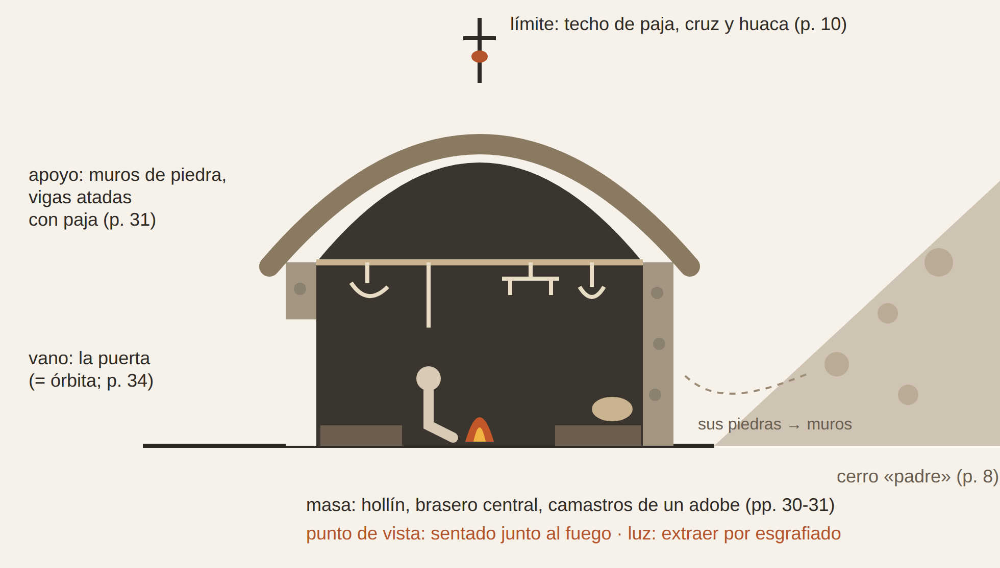
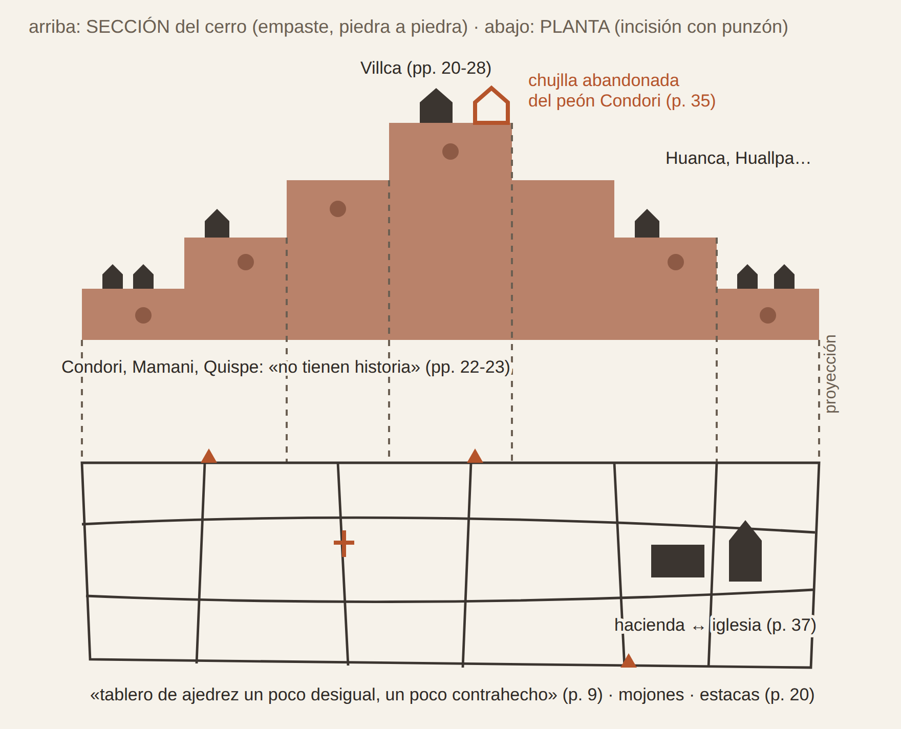
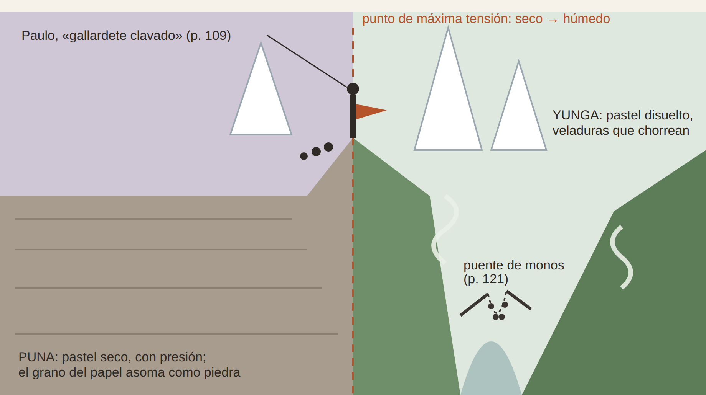
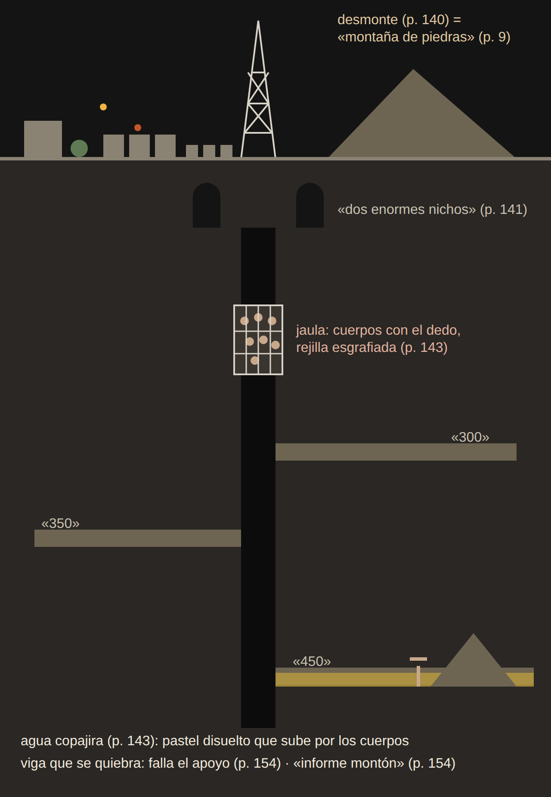
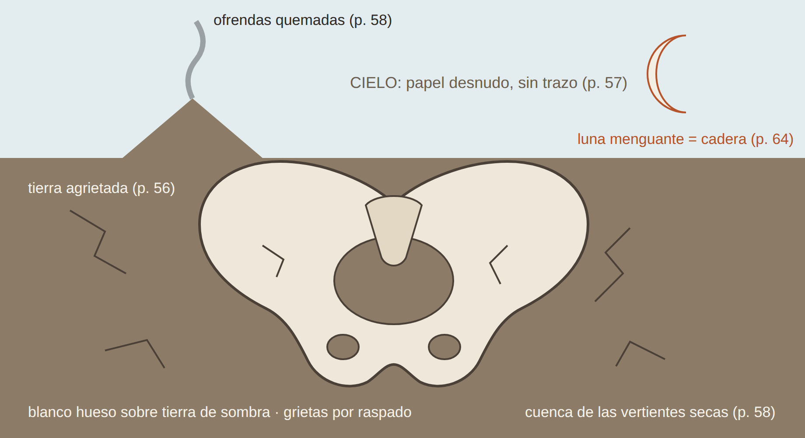
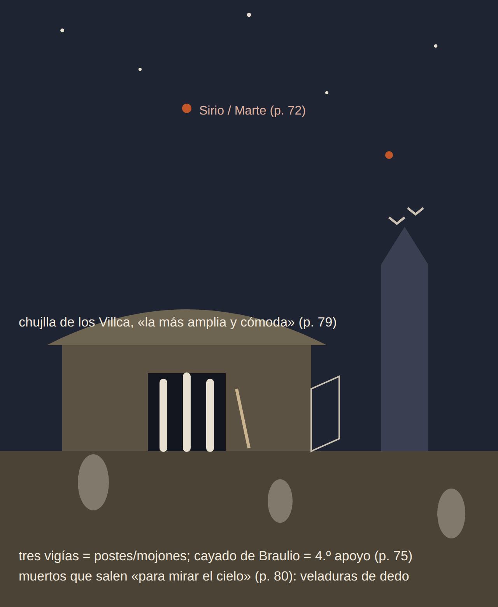

# La cosecha de piedras: dibujar el habitar en *Altiplano* de Botelho Gosálvez

**The Harvest of Stones: Drawing Dwelling in Botelho Gosálvez's *Altiplano***

⟦Nombre y apellidos del autor o autora⟧[^autor]

[^autor]: ⟦Formación y grado académico⟧. ⟦Adscripción institucional⟧. ⟦Principales publicaciones⟧. Correo electrónico: ⟦correo⟧. ⟦Ciudad⟧, ⟦país⟧. (Máximo 100 palabras).

**Resumen**

El artículo relee *Altiplano* (1945), de Raúl Botelho Gosálvez, desde su «cosecha de piedras». Si la crítica mostró que el narrador indigenista vuelve naturaleza la historia india, aquí se lee lo que la novela registra a sus espaldas: la mecánica material del despojo. Con el léxico aymara colonial, la historiografía andina, la tectónica y el manuaje, y seis pasteles al óleo como instrumento de lectura, sostiene que la novela inscribe la posesión en piedra (mojón, pirca, montón), narra su captura por papeles y máquinas, calla el uso indio de la letra y hace de la memoria una reparación selectiva.

**Palabras clave:** Botelho Gosálvez; *Altiplano*; ayllu; despojo; manuaje; dibujo como investigación.

**Abstract**

This article rereads *Altiplano* (1945), by Raúl Botelho Gosálvez, through its "harvest of stones". Criticism has shown that the indigenista narrator turns Indian history into nature; this study reads what the novel records behind the narrator's back: the material mechanics of dispossession. Drawing on colonial Aymara lexicography, Andean historiography, tectonics and manuage, with six oil pastels as reading instruments, it argues that the novel inscribes possession in stone (boundary marker, dry wall, heap), narrates its capture by papers and machines, silences Indian uses of writing, and turns memory into a selective repair.

**Keywords:** Botelho Gosálvez; *Altiplano*; ayllu; dispossession; manuage; drawing as research.

## 1. Introducción: la cosecha de piedras y la anatomía del habitar

En Jatun-Kolla, el ayllu aymara que Raúl Botelho Gosálvez asienta «en la planta de una alta y rojiza peñería» (Botelho Gosálvez, 1982 [1945]: 6), la tierra de labranza no pasa de cien hectáreas; el resto es «erial de piedras». Los comunarios lo limpian año tras año, sin fortuna:

> A medida que extraen piedras y las amontonan, brotan más y más, como paridas por la tierra. ¡Piedras! El trabajo más duro, más reñido y tenaz en Jatun-Kolla, rinde cosecha de piedras. Pero no importa: quizá un día la montaña de piedras sobrepase la altura del cerro; entonces será buena la tierra rescatada (ibid.: 9).

La paradoja es exacta: lo cosechado es el obstáculo; la tierra *pare* lo que impide sembrar; la utopía del ayllu tiene forma de montón. Habitar empieza por despejar, y su producto es un residuo que cambia de oficio: con esas piedras se hicieron «los cimientos y paredes de las chujllas» (ibid.: 8); con ellas cubre Juan Condori a su compañera muerta: «amontonó piedras sobre el cadáver» (ibid.: 35); en la mina, a Condori, asesinado, lo sepulta «un informe montón de rocas, lodo y maderos astillados» (ibid.: 154). El aymara colonial nombraba ese tránsito: el vocabulario de Ludovico Bertonio tiene verbo para la faena, *wanqathapiña*, «amontonar piedras sacándolas» (Bertonio, 2011 [1612]: 77), y un solo nombre, *chhaxwa*, para las piedras «que amontonan limpiando las chácaras» y para la piedra «hincada en la pared para atar en ella los palos del techo» (ibid.: 330). Pirca, casa, tumba, escombro: el montón es la arquitectura mínima de *Altiplano*, aquella en que habitar y enterrar se vuelven indiscernibles. Adolf Loos ilustraba la parte ínfima de la arquitectura que pertenece al arte con un túmulo hallado en el bosque, ante el cual algo nos dice que allí yace alguien (Loos, 1972 [1910]); Tim Ingold le opone el montón, que «no se construye: crece» (Ingold, 2013: 78)[^trad]. La novela conoce los dos: la cosecha es un montón; la tumba de Melchora, un túmulo. Kenneth Frampton, siguiendo a Semper, distingue la estereotomía del basamento, masa formada por «apilamiento repetitivo de elementos pesados», «ya sea piedra o adobe», de la tectónica del armazón, que ensambla «componentes ligeros y lineales» (Frampton, 1995: 5). El montón es estereotomía sin edificio; *chhaxwa* nombra el punto en que esa masa se vuelve junta, y la tensión entre la piedra que pesa y la madera que ata recorre la novela de la chujlla al socavón.

¿Qué saber sobre el habitar produce *Altiplano* cuando se la lee siguiendo sus piedras? ¿Y qué añade un dibujo hecho con una materia —el pastel al óleo— que, como el comunario, trabaja acumulando y extrayendo? Sostenemos que la novela registra, a espaldas de su narrador, la mecánica material del despojo: la posesión que el ayllu inscribe en la piedra al despejar, amontonar, cercar y amojonar, y su captura por una red de personas, instituciones, papeles y máquinas; y que el dibujo, al repetir esas operaciones con otra materia, obliga a decidir lo que el texto deja abierto y expone lo que su narrador impone.

Porque hay un narrador, y no es inocente. Publicada en Buenos Aires en 1945, la novela se cita aquí por una reedición paceña de 1982 cuya nota editorial asegura que su autor «ama al indio», que enseñó en la Escuela Indigenal de Warisata y que Jatun-Kolla «es, en realidad, Warisata» (Botelho Gosálvez, 1982 [1945]: 5). Declinamos las dos lecturas que ese paratexto pide, la documental y la redentora. Antonio Cornejo Polar mostró que el narrador indigenista, «ajeno al mundo indio aunque se solidarice con él», imagina esa vida «más en términos de naturaleza que de historia» (Cornejo Polar, 2003 [1994]: 180). Este no es la excepción: denuncia el despojo mientras animaliza, sexualiza y petrifica; las chozas son «verrugas en la piel sarmentosa del altiplano» (Botelho Gosálvez, 1982 [1945]: 10), y un minero exhibe sus «pobres costillas zafadas como surcos» (ibid.: 145). No repetimos esa crítica: buscamos la historia que el texto guarda en sus cosas mientras el narrador la vuelve paisaje. Leer el habitar exige una anatomía de esas cosas, y el dibujo, como la disección, es uno de sus instrumentos.

El cruce entre análisis literario, espacialidad crítica y dibujo tiene tres razones. La ficción es un archivo de saber espacial, y en *Altiplano* ese archivo es material. La crítica histórica del espacio obliga a no proyectar categorías del presente, y el dibujo, que debe decidir punto de vista, escala y límite, vuelve explícitas esas proyecciones. Y si dibujar es manuaje (Cárcamo Pino, 2025b: 244), dibujar una novela es leerla con otro órgano. El recorrido sigue una progresión de escalas —vivienda y ayllu (sección 3), aldea (4), éxodo (5), cuerpo (6), retorno (7)—; en ella se sitúan los seis pasteles de la serie, de los que se reproduce el esquema de encaje (figuras 1-6). Se trata de una investigación ⟦en desarrollo / concluida⟧.

[^trad]: Las traducciones de las citas en inglés, francés y portugués son nuestras.

## 2. Del espacio abstracto al manuaje de la lectura (marco teórico-metodológico)

El espacio, formulado por historiadores del arte entre 1893 y 1914, es un tema «esencialmente moderno y, como tal, movedizo y, sobre todo, abstracto», que «no habla sobre la arquitectura, sino sobre nosotros» (Vázquez Ramos et al., 2023: 4). De ahí la advertencia de Edward T. Hall contra quienes «proyectan sobre el mundo visual del pasado las estructuras del mundo visual del presente» (Hall, 1973: 133, cit. en ibid.: 3). Vale dos veces: para nosotros, que no debemos atribuir al ayllu una idea de espacio que la novela no formula —sus categorías son la piedra, la pirca, el mojón, el título—, y para el narrador, que proyecta sobre Jatun-Kolla la sociología urbana: los Villca «son la burguesía usurpadora»; los Condori, Mamani y Quispe, «el proletariado campesino» (Botelho Gosálvez, 1982 [1945]: 22).

La genealogía del concepto sirve también como instrumento, a condición de saber a quién describe. Alberti llamaba *área* a «un cierto espacio [...] perfectamente delimitado», rodeado por un muro, y concebía el edificio como un cuerpo «compuesto por edificios menores, que son como sus miembros, unidos y articulados entre sí» (Alberti, 2011: 147, cit. en Vázquez Ramos et al., 2023: 5). *Altiplano* se sitúa del lado de Alberti: su mundo está hecho de partes —piedras, muros, miembros— y su violencia se ejerce contra su articulación. Pero el área cercada es también la forma del despojo. René Zavaleta Mercado opuso en Bolivia «dos concepciones que son ambas espacialistas»: la andina, un «archipiélago» en el que «este espacio no puede concebirse sin otro espacio», y la señorial, que concibe «el dominio final del suelo como atribución ligada a una estirpe» (Zavaleta Mercado, 1986: 29-30). Worringer da una clave para leer al narrador: en la abstracción geométrica, «la emancipación de la accidentalidad y temporalidad que rigen el panorama universal encuentra su expresión acabada» (Worringer, 1953: 56, cit. en Vázquez Ramos et al., 2023: 7). Cuando el narrador atribuye a los comunarios una «voluntad de siglos de piedra» (Botelho Gosálvez, 1982 [1945]: 156), practica esa abstracción: los emancipa de la historia; los petrifica.

La piedra andina es otra. En el aymara de Bertonio, *wanqa* es solo «piedra muy grande» (Bertonio, 2011 [1612]: 506); los diccionarios, advierte Pierre Duviols, callan el «contenido religioso» que dejan ver los procesos de idolatría, donde el *huanca* era «el doble mineral del cadáver sagrado» (Duviols, 1979: 8). Esas piedras conmemoraban «al Huari que primero amojonó tal campo, al que lo cercó, al que lo desbrozó» (ibid.: 13), y la muerte no las producía por mutación, sino por «desdoblamiento» (ibid.: 23). *Huanca*, grafía colonial de *wank'a*, era también nombre de varón (Dean, 2010: 44, 202, n. 86). La novela no tematiza esa ontología, pero la registra: «mojones que han sido puestos allí desde tiempos antiguos» señalan las pertenencias del ayllu (Botelho Gosálvez, 1982 [1945]: 9), y los Huanca habitan «en los linderos» (ibid.: 30). Fuera de su lugar, en cambio, el «organismo de piedra del Kollasuyo» de Paulo Huanca (ibid.: 133) se derrite en los Yungas. La *wank'a* es piedra con dueño y con lugar; la del narrador, abstracción.

La tríada de Henri Lefebvre ordena esta materia sin abstraerla: la *práctica espacial* (lo percibido); la *representación del espacio* de técnicos y arquitectos (lo concebido), «el espacio dominante en cualquier sociedad»; y el *espacio de representación* (lo vivido), el de habitantes, usuarios y algunos artistas y escritores (Lefebvre, 1991: 38, cit. en Vázquez Ramos et al., 2023: 13). En *Altiplano*, lo percibido es despejar, amojonar, arar, pastorear, emigrar; lo concebido, el título, el expediente, la ordenanza con su «radio urbano» (Botelho Gosálvez, 1982 [1945]: 96); lo vivido, el cerro que es «una especie de padre del ayllu» (ibid.: 8), la Pachamama, la apacheta, el Tío de la mina. La novela pertenece al tercer orden y describe los otros dos; el dibujo, también.

¿Con qué leer, entonces? Con las manos, a condición de no oponerlas al papel. Mauricio Cárcamo Pino llama *manuaje* al conjunto de prácticas manuales que «se funda en la acción bimanual in-tensionada y los efectos de ello sobre la materia para comunicar (o autocomunicarse), expresar o inteligenciar» (Cárcamo Pino, 2019: 1412, cit. en Cárcamo Pino, 2025b: 244). La escritura es una acción manugráfica más, y cada ámbito tiene su *manoaje*, «un subgrupo contextual de acciones manuales» (Cárcamo Pino, 2025b: 259). La precisión evita la oposición maniquea entre la mano que ara y el papel que despoja, que en *Altiplano* enuncia el poder: en Umacachi, los vecinos niegan la escuela a los indios —«Que tiren palotes con el arado» (Botelho Gosálvez, 1982 [1945]: 87)—, y repetir el binarismo sería repetir su lógica. La novela lo repite por omisión: el ayllu que «es, en realidad, Warisata» (ibid.: 5) no tiene escuela, cuando allí funcionaba desde 1931 la escuela-ayllu del maestro indio Avelino Siñani y de Elizardo Pérez (Rivera Cusicanqui, 2010 [1984]: 105, 113) y los *kuraka* de Achacachi sostenían escuelas propias ya en 1929 (Barnadas, 1978 [1975]: 84). La cuestión es qué manoajes se autorizan y qué instituciones los respaldan: qué prácticas quedaron «minusvaloradas, invisibilizadas» por el «monopolio de la escritura y el lenguaje» (Cárcamo Pino, 2025b: 259).

Un corolario de método. Si, con Luigi Pareyson, formar es «un puro intentar» sin norma previa, una acción que «inventa *in situ* el modo de formar» (Pareyson, 2002: 18, cit. en Cárcamo Pino, 2025b: 246), ningún método es receta: lo que un pastel descubre no puede escribirse del todo antes de dibujarlo. Pero no todo dibujo descubre. Javier Seguí de la Riva distingue el dibujar que puede «servir como ilustración de un texto narrativo previo» del que deja a la mano configurar lo que no se sabía (Seguí de la Riva, 2010: 93); Tim Ingold separa los dibujos que cuentan de los que «especifican» (Ingold, 2013: 125). Los esquemas de encaje que aquí se reproducen pertenecen al dibujo que ilustra y especifica: no descubren; obligan a decidir.

Para el método, Simon Lundberg propone explorar la imagen arquitectónica «más allá del uso instrumental de la representación» en cuatro pasos: observación, disección, ensamblaje e inmersión (Lundberg, 2019: 3). La *observación* extrae coordenadas textuales —lugar, materia, medida, luz, color— hasta formar una «biblioteca de observaciones» (ibid.: 15): aquí, un fichero de pasajes con su página. La *disección* aísla las partes —«¿Qué son estos objetos? ¿Cuáles son sus agendas?» (ibid.: 18)— y las ordena en cuatro relaciones tectónicas: apoyo, vano, masa y límite (Cuadro 1). El *ensamblaje* las recompone como el *capriccio* de Canaletto, ciudad «completamente imaginaria» (ibid.: 3); sus decisiones —un perfil, una analogía— son del dibujante y no cuentan como hallazgos. La *inmersión* produce atmósfera, pero no ha de confundirse «con el realismo visual» (ibid.: 21). Observación y disección se cumplen sobre el texto; ensamblaje e inmersión, en el pastel al óleo, pigmento en cera y aceite que no seca: se acumula, se funde con los dedos, se raspa, se disuelve.

La técnica responde a una prosa que mide el espacio con el cuerpo: en la jaula, Condori siente, «como si faltase suelo bajo sus pies», «la vertiginosa caída» (Botelho Gosálvez, 1982 [1945]: 143). Abbie Garrington llama *háptico* a ese registro, «término paraguas» que abarca el tacto, la cinestesia, la propiocepción y el sentido vestibular (Garrington, 2013: 16). A una prosa háptica corresponde una lectura háptica: el pastel se trabaja por contacto. Cada figura se examina en tres planos: (1) lo que describe el texto; (2) la operación formal y matérica del pastel; (3) el contraste: lo que el esquema obliga a decidir y el texto deja abierto o contradice, cotejado cuando es posible con fuentes andinas.

**Cuadro 1.** *Disección tectónica de las seis figuras*

| Figura | Apoyo | Vano | Masa | Límite |
|---|---|---|---|---|
| 1. Cráneo/nido | Muros de piedra del cerro (8); vigas atadas con paja (31) | La puerta; el portal de la despedida (34) | Hollín, brasero, camastros de un adobe (30-31) | Techo de paja con cruz y huaca (10) |
| 2. Signo Escalonado | Peones que sostienen a los Villca (21) | Quienes «no tienen historia» (22) | Tierras de los Villca (20) | Estacas, mojones, títulos (9, 20, 36-37) |
| 3. Apacheta | Paulo, «gallardete clavado» (109) | «Fauces del abismo» (109) | Cumbres «góticas», niebla (109) | «Muralla que condena el horizonte» (108) |
| 4. Castillete | Callapos; viga que se quiebra (145, 154) | Pique, nichos, jaula, boquete (141-144) | Agua, cascotes, montón (144, 154) | Rejilla; agua sobre el cuerpo (143-153) |
| 5. Pelvis telúrica | Cadera del ganado (64) | Vertientes secas (58) | Tierra agrietada (56) | Cielo sin pincelada (57) |
| 6. Centinela | Cayado; vara de Jilakata (73, 75) | Puertas batidas (79) | Chujlla de los Villca (79) | Mirada sobre la inmensidad (80) |

Fuente: elaboración propia a partir de Botelho Gosálvez (1982 [1945]); entre paréntesis, páginas de la novela.

## 3. La chujlla y el entorno lítico: el habitáculo somático frente al despojo

El ayllu se presenta desde lo alto, como en un plano de situación: en la falda del cerro, «las chujllas de las familias más antiguas han trepado en los riscos del cerro y desde allí parecen ocupar un sitio de preeminencia sobre el resto de chozas» (Botelho Gosálvez, 1982 [1945]: 6). *Parecen*: la preeminencia es una lectura del narrador sobre la pendiente, no un dato de la pendiente.

La chujlla de los Huanca da la medida del habitáculo: dos metros de alto, paredes «renegridas por el hollín», camastros de «apenas la altura de un adobe» y, de las vigas «mal unidas con lazos de paja trenzada», las herramientas colgadas (ibid.: 30-31). Reúne así los dos modos de Frampton: muros de piedra y adobe, y un armazón atado como una cestería (Frampton, 1995: 5). Se mide con el cuerpo y guarda los instrumentos de sus manos: es una caja de herramientas, que Cárcamo Pino equipara a un repertorio de manuaje (Cárcamo Pino, 2025a: 12). El narrador, en cambio, entra como intruso —los camastros son «morada de piojos y pulgas» (Botelho Gosálvez, 1982 [1945]: 31)—, como el habitante de la casa de Loos que Beatriz Colomina describe como «un intruso en su propio espacio» (Colomina, 1992: 95, cit. en Martin, 2014: 66), solo que este intruso no habita: escribe. Para Bachelard, el nido, «una cosa precaria», hace soñar la seguridad (Bachelard, 1994 [1958]: 102, cit. en Martin, 2014: 71); para el narrador, la chujlla es una madriguera, y su umbral, el «portal de su chujlla» desde el que Paulo Huanca mira partir a los hijos que la escasez expulsa (Botelho Gosálvez, 1982 [1945]: 34).

**Figura 1. *Cráneo/nido*.** (1) *Texto*. Muros de piedra, dos metros de altura, fuego central, herramientas colgadas de las vigas (ibid.: 8, 30-31) y, en el techo, un crucifijo con «una pequeña huaca de barro cocido» (ibid.: 10). (2) *Operación*. Corte a la altura del cuerpo sentado junto al brasero. El soporte se cubre de negro y siena —el hollín— y la luz se obtiene por extracción: el esgrafiado abre en la masa oscura vigas, hoces y yugo, como el comunario abre la tierra quitándole piedras; los muros van en empaste; el humo, con el dedo. El perfil de cráneo —la bóveda de paja como calota, la puerta como órbita, el fuego en el lugar del pensamiento— es una decisión de ensamblaje tomada de Bachelard, no un hallazgo. (3) *Contraste*. El esquema debe decidir el punto de vista, y el texto ofrece dos: el del narrador, intruso en la puerta, y el del cuerpo que habita, al que remiten el hollín, los camastros y las herramientas. El corte elige el segundo y encuentra su límite donde el narrador pone el suyo: en el alma de los comunarios, «en su secreto, nadie podía entrar» (Botelho Gosálvez, 1982 [1945]: 65).

::: {custom-style="Figura"}
{width=14cm}
:::

::: {custom-style="Pie de figura"}
**Figura 1.** *Cráneo/nido: sección de la chujlla de los Huanca*. Esquema de encaje del pastel al óleo. Fuente: elaboración propia con asistencia de IA.
:::

La jerarquía no viene solo de fuera. El antepasado de los Villca llega tras la sublevación de Tupaj Katari, y su hijo Pedro «empotró en el suelo del ayllu las estacas de propiedad y empezó a dominar» (Botelho Gosálvez, 1982 [1945]: 20): la primera estaca la clava una mano aymara, y con ella entra en el ayllu la concepción señorial del suelo. Los Villca inventan genealogías imperiales porque «necesitaban aquel blasón para sustentar su orgullo y su riqueza» (ibid.: 28): el mito funciona como título. La memoria misma se escalona: la de los Villca es «edificante y fantástica»; los peones «no tienen historia», salvo tres palabras: «¡hambre, persecución y muerte!» (ibid.: 22-23). El capítulo cierra con la fórmula «Así los Villca, Huanca y Condori, son las generaciones del Signo Escalonado» (ibid.: 38), y el glosario define el término como «Signo sagrado de Tiwanaco» (ibid.: 163): el narrador convierte un signo sagrado en diagrama de clases, un caso de manual de la advertencia de Hall.

El mismo capítulo narra el despojo de Kero-Pata, el ayllu de origen de Juan Condori, cuyos comunarios habían estado «amparados por las Cédulas Reales» hasta que, con la República, «los doctores alto-peruanos les birlaron la tierra» (ibid.: 36). El papel protegió y el papel despojó, mediante una red: una hectárea pagada al cura por unos responsos pasa a un doctor; tras «una gran cuestión de títulos, papel sellado y pago de impuestos», el doctor obtiene veinte hectáreas, porque «así lo declaraban los papeles del Gobierno». Frente a la iglesia levanta su hacienda: «La religión y la propiedad quedaron frente a frente, guiñándose con sus ventanucos empolvados» (ibid.: 36-37). Los edificios son cómplices. La novela calla el tercer uso del papel: tras la Ley de Exvinculación de 1874, las comunidades comenzaron «a desenterrar antiguos títulos de propiedad» coloniales, «una pieza clave en la lucha legal» (Rivera Cusicanqui, 2010 [1984]: 99).

**Figura 2. *Signo Escalonado frente al mapa*.** (1) *Texto*. En alzado, el orden de las chujllas y de las familias (Botelho Gosálvez, 1982 [1945]: 6, 20-23, 38), contradicho por un dato: al peón Juan Condori le dan «una chujlla que estaba abandonada cerro arriba» (ibid.: 35). En planta, el «tablero de ajedrez un poco desigual, un poco contrahecho» de los barbechos (ibid.: 9), con sus mojones, estacas y títulos. (2) *Operación*. Dos proyecciones en una hoja: el cerro en sección, escalonado por acumulación de empastes; el catastro en planta, incidido con punzón en la cera. La mancha del dedo es manuaje «en sentido fuerte», de «emisiones manugráficas con baja o nula escrituralidad» (Cárcamo Pino, 2025b: 259); la incisión, manugrafía de alta escrituralidad. Entre signo y mapa media una operación, no un órgano. (3) *Contraste*. El dato está en el texto; el esquema no lo descubre, pero lo vuelve incompatible: en una misma hoja, el signo no encaja en la pendiente, porque el peón ocupa un escalón alto y los Villca bajarán al pesebre de la aldea. La escalera se rehace en el cocal y en la mina (Botelho Gosálvez, 1982 [1945]: 112, 135): el signo es un operador recursivo de dominación, no una identidad fija, y mito y mapa no se oponen: ambos escalonan.

::: {custom-style="Figura"}
{width=13cm}
:::

::: {custom-style="Pie de figura"}
**Figura 2.** *Signo Escalonado frente al mapa: el cerro de Jatun-Kolla en sección y en planta*. Esquema de encaje del pastel al óleo. Fuente: elaboración propia con asistencia de IA.
:::

## 4. El espacio concebido y la trampa de la letra: Umacachi

Umacachi es una sucesión de ocupaciones: tambo incaico, iglesia y fuerte coloniales y, con la República, la decisión de «situar la Sub-prefectura, el Municipio y la Policía donde antes aposentaba la reducida guarnición hispana» (Botelho Gosálvez, 1982 [1945]: 83). Cada régimen se aloja en la cáscara del anterior: es el espacio concebido en su versión aldeana.

Allí opera el Alcalde vitalicio, el doctor Margarito Mendoza, «con el fajo de expedientes bajo el brazo», diestro en «tejer obscuras mallas de términos seudo jurídicos»; los tinterillos «urden pleitos por nada» (ibid.: 86). *Urdir* nombra a la vez la urdimbre del telar y la maquinación, y la novela enlaza ese vocabulario con el de las tejedoras Huanca, que pasan la lanzadera «a través de la delicada malla», y el de los varones, que hacen «bonita urdimbre de surcos» (ibid.: 29). Escribir, tejer y arar comparten el vocabulario de la mano: la novela no opone la mano a la letra, sino unos manoajes a otros. Tampoco reduce el despojo a un villano: corregidor, alcalde, intendente y cura son «cuatro patas de la bestia opresora del puneño» (ibid.: 13), y «cinco gendarmes indios» arrastran a Vicente Villca al patio donde lo azotan (ibid.: 101).

Los Villca llegan a la aldea con treinta y cuatro ovejas, y la chola Encarnación, por cincuenta bolivianos, les cede el corral: «Tu familia puede acomodarse en el pesebre» (ibid.: 92). Entonces llega la letra: «Todos los animales de carneo que existen dentro del radio urbano serán requisados [...] (Fdo.) Dr. Margarito Mendoza» (ibid.: 96). La trampa es geométrica —un radio trazado sobre el papel convierte el corral en encierro— y es manual: está firmada. Un mapa catastral, observa James C. Scott, «no se limita a describir un sistema de tenencia de la tierra; lo crea», porque da a sus categorías «la fuerza de la ley» (Scott, 2020 [1998]: 3). El radio hace lo mismo con el ganado, como los papeles de Kero-Pata con la tierra, y lee con sesgo: a los mestizos «no les alcanzaba la Ordenanza» (Botelho Gosálvez, 1982 [1945]: 102). Los animales de los indios, tasados «a ojo de buen cubero», se esfuman por el «embudo» de una finca del Alcalde (ibid.), y la fortuna de los Villca se reduce «a mil seiscientos bolivianos en papel» (ibid.: 103).

La letra, además, pesa. En el cuartucho del tinterillo al que Vicente consulta hay «un desordenado montón de papeles y libracos» (ibid.) —otra vez el montón—, y el letrado tasa la defensa por tonelaje: señala «un Código Penal en infolio y un manual del Procedimiento Civil», afirma que el grande «tiene más peso legal y jurídico que el chiquitito» y cobra en consecuencia (ibid.: 104). Es un manuaje burocrático: el tinterillo no escribe; señala, compara y cuenta billetes. Como en la escena de Cajamarca con que Cornejo Polar abre la heterogeneidad andina, el libro es «mucho más fetiche que texto y mucho más gesto de dominio que acto de lenguaje» (Cornejo Polar, 2003 [1994]: 41), y su peso se vuelve argumento de autoridad y precio. Vicente no puede leer ese código, pero lee a quien lo vende —«estos tinterillos son de una sola casta y todos obran con una mala fe del demonio» (Botelho Gosálvez, 1982 [1945]: 104)— y rechaza la defensa, aunque una amenaza lo obliga a pagar la consulta (ibid.: 105). La escena no enfrenta a un indio sin juicio con la escritura: articula la materia del libro, un argumento fraudulento, el juicio del personaje y la coerción. Y calla que, en la historia, los «abogados de pueblo (peyorativamente designados como “tinterillos”)» asesoraron la lucha legal de las comunidades y fueron «la manifestación embrionaria del indigenismo criollo» (Rivera Cusicanqui, 2010 [1984]: 101), el mismo en que se inscribe la novela.

La aldea ya ha hecho su obra: dos niños mueren de hambre y los entierran «allí mismo, bajo el suelo del pesebre, para evitar el pago al cura y el municipio» (Botelho Gosálvez, 1982 [1945]: 106). Lo siniestro, dice Freud, remite «a lo que alguna vez fue bien conocido y familiar» (Freud, 2003 [1919]: 124, cit. en Martin, 2014: 64); aquí, un pesebre «donde el viento entraba por todas partes» (Botelho Gosálvez, 1982 [1945]: 105) pasa de refugio a jaula y a tumba. Los Villca «habían sido domesticados por la aldea» (ibid.: 107), y *domesticar* viene de *domus*: la aldea los alojó como a animales de casa.

## 5. Las derivas biomecánicas del éxodo (Yungas y socavón)

El éxodo a los Yungas empieza en un umbral: «Tras de la muralla que condena el horizonte del altiplano empieza el yunga» (Botelho Gosálvez, 1982 [1945]: 108). El otro piso del archipiélago andino es aquí «fábula» (ibid.: 7), y del otro lado espera la finca. En la apacheta, el viento sacude el poncho de Paulo Huanca «como un gallardete clavado en la ceja de la apacheta», su familia reza de rodillas y las cumbres se alzan «semejantes a fantásticas construcciones góticas» (ibid.: 109): otra proyección del narrador, que mira la cordillera con la arquitectura de Europa.

Del otro lado, el cuerpo del puneño deriva. Su manoaje no se traslada —«Sabrás arar en la puna, pero aquí esa es otra música» (ibid.: 113)—; Paulo se consume «derritiéndose como muñeco de cera» (ibid.: 123), y, en el aserradero, el contratista esgrime una mano cercenada en la sierra y solo lo anota en la planilla cuando Paulo se ofrece como «peón, siquiera» (ibid.: 129): la mutilación se vuelve argumento contra las víctimas. La hija mayor de Paulo, a quien el narrador presenta dejando «ver sus nacientes senos» (ibid.: 125), «había sido desflorada por el patrón»; «en seguida vinieron los capataces y peones: le daban dinero», y la desesperación la «obligó a venderse» hasta que «con su propia mano se quitó la vida» (ibid.: 132). Ella no tiene nombre, y su historia cabe en un inciso —«vieja historia»— que traslada a la muchacha, como venta, la violencia que empieza en el patrón. Su padre jura que fue un crimen, pero «las pruebas eran irrefutables» (ibid.): la palabra *crimen*, que el narrador reserva para la muerte de Condori (ibid.: 154), no alcanza al patrón, y la única agencia que concede a la mano de la muchacha es el suicidio. La única travesía lograda la hacen los monos, que tienden sobre el río «una cadena cogiéndose de manos» (ibid.: 121): una arquitectura de manos.

**Figura 3. *Umbral de la apacheta*.** (1) *Texto*. Un umbral sin piedras: el glosario define la apacheta como «abra de las cordilleras y cumbre de los caminos» (Botelho Gosálvez, 1982 [1945]: 160), un lugar y no un montón; la novela la marca con un cuerpo erguido, la familia arrodillada y la «fauce» del yunga (ibid.: 109) y, más abajo, el puente de monos (ibid.: 121). (2) *Operación*. Formato apaisado partido por la cresta: del lado de la puna, pastel seco sobre papel de grano grueso, que asoma como piedra; del lado del yunga, pastel disuelto en veladuras que chorrean. En la cresta, una técnica se vuelve la otra: es el punto de máxima tensión de la hoja. (3) *Contraste*. El esquema sigue al texto y dibuja un umbral sin montón. El aymara colonial llama *apachita* al «montón de piedras, que por superstición van haciendo los caminantes y los adoran» (Bertonio, 2011 [1612]: 317), en el que se pegaba «coca mascada con las manos» (ibid.: 349): un montón que crece con cada paso y un manoaje colectivo, que la novela sustituye por una muralla y un cuerpo clavado. Hacer del montón un rasgo del paisaje, advierte Ingold, convierte la cosa que invitaba a seguir en «un objeto que bloquea nuestro camino» (Ingold, 2013: 86). Partida la hoja, los Yungas se vuelven un cambio de estado de la materia y de la mano: la cera se funde como Paulo, *wank'a* fuera de su lugar; y lo único que cruza el abismo es colectivo y está hecho de manos, como la apacheta que falta.

::: {custom-style="Figura"}
{width=14cm}
:::

::: {custom-style="Pie de figura"}
**Figura 3.** *Umbral de la apacheta: la ceja de la cordillera y la fauce del yunga*. Esquema de encaje del pastel al óleo. Fuente: elaboración propia con asistencia de IA.
:::

La mina «Pensylvania», de la compañía yanqui The Star Syndicate, se anuncia con «el encaje de acero de la torre de un andarivel» (Botelho Gosálvez, 1982 [1945]: 134-135). El campamento reproduce la escalera, de los chalets de ingenieros al «enjambre de cuchitriles de calamina» de los mineros (ibid.: 135). La empresa inscribe a Condori —«Tomaron su identidad e impresiones digitales» (ibid.: 140)— y la mano del comunario entra en el archivo como huella: es su primera firma, y el peón es legible antes de bajar. El capataz le anuncia el retorno de la cosecha: «Aquí cosecharás miles de cargas de estaño» (ibid.: 142).

Se baja en jaula: en la entrada, los huecos de las jaulas se miran en el muro «como dos enormes nichos», y en una de ellas siete hombres van «apeñuscados contra la rejilla» (ibid.: 141-143). Abajo, Condori hace el trabajo del ayllu: acarrea cascotes para abrir «un boquete» hacia el plano «450» (ibid.: 144). La galería invierte la chujlla: la masa se excava y un armazón de madera la contiene, pero en el «450», que «se derrumbaba en algunos pasos», «recién ponían el revestimiento de callapos» (ibid.: 145). Cuando la galería se inunda, la empresa baja «rieles, maderos, dinamita, hombres» (ibid.: 151). El agua mide el cuerpo —tobillos, rodillas, cintura, ombligo (ibid.: 145, 152-153)— y, cuando Condori intenta retroceder, el ingeniero Williams «le abrió un boquete en la cabeza» (ibid.: 153): el sustantivo de la roca. Luego «quebróse la viga del techo» —cede el armazón y la masa recobra su peso—, el derrumbe sepulta a todos y «nadie sospechó el crimen» (ibid.: 154). La mina junta así la cosecha, la tumba, la gruta de la Virgen (ibid.: 136) y las ofrendas a sus dioses (ibid.: 149).

**Figura 4. *El castillete y la caída al plano 450*.** (1) *Texto*. Torre, campamento escalonado, nichos, jaula, galería inundada, derrumbe (Botelho Gosálvez, 1982 [1945]: 134-154). (2) *Operación*. Formato vertical: arriba, la torre incidida como encaje y el desmonte por el que se entra a la mina (ibid.: 140); debajo, el pique y los niveles, pisos de un edificio invertido; los siete cuerpos de la jaula, hechos con el dedo, sin línea, y la rejilla esgrafiada encima, como el marco que, en la lectura que Martin hace de Deleuze, «ejerce una fuerza sobre la figura central, aislando un cuerpo suspendido» (Martin, 2014: 85); al fondo, pastel disuelto que sube por los cuerpos como el agua. (3) *Contraste*. Superpuestas, la escalera de la superficie y los niveles subterráneos muestran la mina como doble invertido del ayllu: el mismo gesto —despejar y apilar piedras— capturado por una máquina que lo vuelve mercancía y vuelve material al cuerpo. La montaña de piedras soñada más alta que el cerro (Botelho Gosálvez, 1982 [1945]: 9) crece, pero como desmonte: el cascote se iza «a la superficie» (ibid.: 144).

::: {custom-style="Figura"}
{height=13cm}
:::

::: {custom-style="Pie de figura"}
**Figura 4.** *El castillete y la caída al plano 450*. Esquema de encaje del pastel al óleo. Fuente: elaboración propia con asistencia de IA.
:::

## 6. La carne en el espacio de la catástrofe: Francis Bacon en Jatun-Kolla

La sequía se narra con vocabulario de arquitectura y de dibujo: las sementeras «se agrietan como paredes envejecidas» (Botelho Gosálvez, 1982 [1945]: 56); «Ni una pincelada enturbió el papel celeste y deslumbrador del cielo» (ibid.: 57). En la rogativa, los comunarios avanzan de rodillas y su piel sangrante deja «manchones en el cascajo» (ibid.: 60): los cuerpos dibujan sobre el suelo. Pronto, «cielo y tierra eran para ellos como una tremenda cárcel» (ibid.: 72): la llanura sin límite se vuelve jaula, y el cerco se cerrará alrededor de un hombre.

El yatiri Basilio Quispe es acusado de la sequía; de sus ropas caen «dos muñequitos de lana» atravesados por una espina (Botelho Gosálvez, 1982 [1945]: 67). Justina Huanca lo araña «como la fiera y brava hembra del puma» y «los indios le descuartizaron» (ibid.: 68). El narrador anota «un ardor bestial» y cierra con una dispersión: «cada cual se llevó un miembro»; Justina atraviesa con espinos los genitales del muerto, «sintiendo en lo íntimo de su conciencia de hembra» la venganza, y «en muchos sitios enterraron los pedazos del cuerpo» (ibid.: 69). Dos lecturas se superponen. La de Bacon: en *Crucifixión* (1965), dos jueces examinan «las manipulaciones de la carne» (Martin, 2014: 85), como la comunidad y el lector ante la de Basilio. Y la de la *kenchería*, «mal de ojo, brujería» (Botelho Gosálvez, 1982 [1945]: 162): la espina de la muñeca reaparece en la carne; la efigie actúa. El narrador animaliza a la multitud, sexualiza la furia de Justina y hace del lector un juez de tribuna; por eso la serie no dibuja el linchamiento: un pastel de ese cuerpo sería otra efigie.

**Figura 5. *Pelvis telúrica / Pachamama sorda*.** (1) *Texto*. «La Pacha Mama, sorda, vieja, extenuada, recibía el cuerpo de sus más fieles hijos para encerrarlos en su vientre de sequedad inexorable» (ibid.: 66); las vacas famélicas muestran «las nalgas abiertas a la manera de una luna menguante» (ibid.: 64). (2) *Operación*. El cielo queda en papel desnudo: la sequía como ausencia de pincelada. La cuenca seca de las vertientes (ibid.: 58) se dibuja como pelvis —la cadera del ganado vuelta luna menguante— en blanco hueso sobre tierra de sombra, agrietada por raspado. (3) *Contraste*. Que la tierra sea madre no es invención del narrador: para Bertonio, *Pachamama* era «nombre de reverencia», y se le decía «yo seré tu hijo» (Bertonio, 2011 [1612]: 420); las montañas, en cambio, suelen ser masculinas (Dean, 2010: 68), como el cerro «padre del ayllu» (Botelho Gosálvez, 1982 [1945]: 8). Suyo es el registro: tierra que «abortó en plena gestación» (ibid.: 66) y, al final, «hembra paridora» (ibid.: 159); hasta el ayllu vacío es un «solar histérico, infecundo» (ibid.: 79), de *hystéra*, útero. Dibujada como pelvis, cintura ósea que soporta cargas y no receptáculo, la metáfora pasa del sexo a la tectónica y expone su costo: la alegoría absorbe a las mujeres reales, de Melchora Mamani (ibid.: 35) a la hija sin nombre de Paulo Huanca.

::: {custom-style="Figura"}
{width=14cm}
:::

::: {custom-style="Pie de figura"}
**Figura 5.** *Pelvis telúrica / Pachamama sorda*. Esquema de encaje del pastel al óleo. Fuente: elaboración propia con asistencia de IA.
:::

**Figura 6. *El centinela de la resistencia*.** (1) *Texto*. Cuando el Consejo decide partir, el centenario Braulio Choquehuanca, «apoyándose con dificultad en el cayado de palo», reclama amor por la tierra y lo hacen callar (Botelho Gosálvez, 1982 [1945]: 75). Quedan «tres vigilantes al cuidado del ayllu» (ibid.), peones sin tierra instalados «en la chujlla de los Villca, la más amplia y cómoda» (ibid.: 79). (2) *Operación*. Nocturno vertical: tres figuras en el vano de la chujlla vacía, trazadas como postes o mojones, y el cayado como cuarto apoyo; alrededor, puertas batidas por el viento y los muertos que salían de la tierra «para mirar el cielo» (ibid.: 80), en veladuras de dedo. (3) *Contraste*. El narrador llama a los vigías «cancerberos» y «muertos en vida» (ibid.), pero también «celadores y enfermeros» (ibid.: 79). El esquema los traza como mojones, decisión que el aymara respalda y el texto no: *achachi*, que el glosario traduce por «anciano» (ibid.: 160), es también «la cepa de una casa o familia» y el «término o mojón de las tierras» (Bertonio, 2011 [1612]: 307). Partidos los achachis que decidieron el éxodo, los sin tierra quedan como mojones del ayllu vacío: la resistencia no es gesta —el discurso de Braulio fracasa—, sino mantenimiento, un trabajo que hace el escalón más bajo del Signo en la casa del más alto.

::: {custom-style="Figura"}
{height=13cm}
:::

::: {custom-style="Pie de figura"}
**Figura 6.** *El centinela de la resistencia: los tres vigías del ayllu vacío*. Esquema de encaje del pastel al óleo. Fuente: elaboración propia con asistencia de IA.
:::

## 7. Reparación material y selección de la memoria: el retorno

Con las heladas vuelven los sobrevivientes: «en el dintel de Jatun-Kolla se detenían para ponerse de rodillas y besar el suelo» (Botelho Gosálvez, 1982 [1945]: 155). El ayllu tiene dintel: es una casa. Han muerto más de ciento cincuenta comunarios (ibid.: 156). La reparación es un trabajo de manos y de piedra: «Las chujllas fueron reparadas del estrago, las pircas de piedra que separan las parcelas fueron compuestas» (ibid.). *Compuestas*: la composición que la tratadística reservó al arquitecto reaparece como faena comunal, y recomponer la pirca es volver a amojonar, *saywaña*: «mojonar las chácaras con montones de piedra» (Bertonio, 2011 [1612]: 466). Y como ya no hay bueyes, «los mismos hombres eran quienes tiraban el arado» (Botelho Gosálvez, 1982 [1945]: 156): el cuerpo entero ocupa el lugar del animal muerto. El narrador vuelve a petrificar: trabajan «con una voluntad de siglos de piedra» (ibid.), la piedra de Worringer, no la de las *wank'a*.

La memoria del habitar se construye con la misma lógica. Cada uno guarda sus padecimientos «con el mismo pudor de los ex carcelados», y la memoria «no recordaba sino lo pasado antiguo, lo bueno y lo alegre de las cosechas» (ibid.):

> Tras la muralla de su visión, como foso hondo y alquitranado, estaba el intervalo del hambre; los comunarios, desde la atalaya de la esperanza, sólo miraban el horizonte, sin atreverse a bajar la cabeza al tremendo hoyo de la escasez pretérita (ibid.: 156-157).

Muralla, foso, atalaya: recordar es edificar, y olvidar también. La selección tiene nombres: «Llegaron los Villca, los Huanca, los Huallpa, los Yupanqui, los Ticona, los Choque, los Chuquihuanca» (ibid.: 156); faltan los Condori, los Mamani y los Quispe, la «legión» sin tierra que cerraba la escalera del narrador (ibid.: 22). Juan Condori yace en el cementerio de los mineros; los miembros de Basilio Quispe, «en muchos sitios» (ibid.: 69). El Signo Escalonado se reconstruye sin su último escalón. Con la cosecha, los derrotados «olvidaron la pesadilla pasada», y la Pachamama recuperó «su prestigio de hembra paridora y múltiple» (ibid.: 159). La paz se paga con ese olvido.

Ursula K. Le Guin opuso la ficción del arma, con forma de flecha, a la del recipiente: «Una novela es un botiquín, que contiene cosas en una relación particular, poderosa, entre sí, y con nosotros» (Le Guin, 2021 [1986]: 10). La mina es la ficción del arma: jornal, revólver, boquete. El ayllu del retorno es la del acopio: la casa, «un recipiente para personas» (ibid.: 8), vuelve a guardar la cosecha y a reunir los nombres. Pero todo recipiente selecciona —el pesebre fue tumba; el ayllu reparado deja fuera a los sin tierra—, y el narrador cierra con héroes: los derrotados vuelven a ser «los patriarcas fecundadores del suelo, los sembradores del destino» (Botelho Gosálvez, 1982 [1945]: 159). El héroe, advierte Le Guin, no cabe en la bolsa: «Necesita un escenario, o un pedestal, o una cima» (Le Guin, 2021 [1986]: 11). Aquí, la atalaya. La novela, que guarda lo que el ayllu prefiere no mirar, es el recipiente más amplio.

## 8. Conclusiones: lo que el dibujo desvela y sus límites

La lectura permite sostener cuatro hallazgos. Primero: el montón de piedras es la arquitectura mínima de la novela, estereotomía sin edificio, y la cosecha de estaño que promete el capataz (Botelho Gosálvez, 1982 [1945]: 142) es la captura de ese gesto por la máquina. Segundo: el Signo Escalonado es un operador recursivo que ayllu, aldea, cocal y campamento vuelven a escalonar, y el retorno rehace la escalera sin su último escalón. Tercero: el despojo opera mediante una red de personas, instituciones y soportes —expediente, papel sellado, radio urbano, infolio, huella dactilar— que vuelven legibles la tierra y los cuerpos; la oposición entre la mano y el papel es el discurso de la aldea, y la novela la confirma al callar el uso indio de la letra: títulos coloniales, tinterillos aliados, escuela del ayllu. Cuarto: el narrador que petrifica —con una piedra abstracta, ajena a la *wank'a*— y culmina su asimetría de género en la muchacha sin nombre vuelve paisaje una posesión que la novela, a sus espaldas, inscribe en la piedra: mojones, pircas, linderos, un apellido.

¿Qué desvela el dibujo? Ante todo, posiciones. Los esquemas obligan a decidir lo que el texto deja abierto —desde dónde se mira, a qué escala, qué queda dentro y qué fuera—, y cada decisión expone la del narrador: fuera de la chujlla, en la tribuna del linchamiento, frente a las cumbres góticas. Cuando la decisión es del dibujante, como el cráneo o los mojones, el contraste con el texto y con el léxico aymara dice si se sostiene. Las operaciones del pastel —acumular, extraer, manchar, incidir, disolver— repiten las de la novela: amontonar, despejar, pintar «manchones» (ibid.: 60, 156), escribir, derretirse. Leer con la mano no es ilustrar escenas, sino repetir operaciones: un manuaje de la lectura, háptico como la prosa que lee.

Los límites son de tres órdenes. El primero es el de Hall: la sección, el *capriccio*, Bacon, la tectónica de Semper y hasta la pelvis son estructuras visuales ajenas al mundo narrado; los dibujos hablan de la novela, no del ayllu ni de la espacialidad aymara, que exigirían otras fuentes y otra autoría: la de la historia que los aymaras, escribía Roberto Choque Canqui, «hace tiempo, hemos añorado por escribir» (Choque Canqui, 1978 [1974]: s. p.). El segundo es ético: la inmersión seduce, y un pastel puede estetizar la miseria o fabricar efigies; de ahí la decisión de no dibujar el linchamiento ni los sueños que el narrador declara inaccesibles. El tercero es de método: el dibujo depende de las coordenadas del texto y hereda sus silencios; puede volverlos visibles, no suplirlos.

Queda el montón. «Quizá un día la montaña de piedras sobrepase la altura del cerro», esperaban los comunarios (Botelho Gosálvez, 1982 [1945]: 9). La novela cumple la profecía por el revés: la montaña crece en el desmonte de la mina y en el «informe montón» que sepulta a Juan Condori (ibid.: 154). El dibujo no repara lo que la novela deja caer al foso; puede, a lo sumo, impedir que el foso se cierre. Si en Jatun-Kolla habitar es despejar piedras, leer *Altiplano* con la mano es, quizá, volver a amontonarlas para ver qué queda debajo.

## Declaraciones finales

**Conflicto de intereses.** El autor ⟦o la autora⟧ declara no tener conflictos de intereses.

**Declaración de uso de inteligencia artificial.** a) *Herramientas*: ChatGPT (OpenAI), ⟦versión⟧, y Claude (Anthropic), ⟦versión⟧, asistentes de inteligencia artificial generativa. b) *Alcance*: ChatGPT se empleó en la revisión conceptual del proyecto, el contraste de pasajes, la organización del argumento y el apoyo a la redacción ⟦ajustar⟧; Claude, en la lectura asistida de las fuentes, la localización y verificación de citas con su página, la redacción de borradores, el diseño del protocolo de dibujo y la elaboración de los esquemas de encaje reproducidos en las figuras 1 a 6 ⟦ajustar⟧. c) *Rol*: el autor ⟦o la autora⟧ formuló el problema, el esquema del artículo y las cautelas críticas; decidió las interpretaciones; es autor ⟦o autora⟧ de los pasteles al óleo; revisó y reescribió los borradores, verificó las citas contra los originales y responde por la versión final.

## Bibliografía

Alberti, Leon Battista (2011 [1452]). *Da arte edificatória*. Lisboa: Fundação Calouste Gulbenkian.

Bachelard, Gaston (1994 [1958]). *The Poetics of Space*. Trad. Maria Jolas. Boston: Beacon Press.

Barnadas, Josep M. (1978 [1975]). *Apuntes para una historia aymara*. 2.ª ed. La Paz: CIPCA (Cuadernos de Investigación, 6).

Bertonio, Ludovico (2011 [1612]). *Transcripción del vocabulario de la lengua aymara*. La Paz: Radio San Gabriel (1993) e ILLA-A (ed. digital).

Botelho Gosálvez, Raúl (1982 [1945]). *Altiplano*. 7.ª ed. La Paz: Librería Editorial Juventud.

Cárcamo Pino, Mauricio Arnoldo (2019). "Thinking and Intelligence in the Architectural Design. A Review from Language, Graphuage and Manuage". En Carlos Luis Marcos Alba (ed.), *Graphic Imprints. The Influence of Representation and Ideation Tools in Architecture. EGA 2018*. Cham: Springer: 1411-1423.

Cárcamo Pino, Mauricio Arnoldo (2025a). "Madera, herramientas y manuaje. Notas para una ontología evolutiva del diseñar". *Revista Arteoficio*, 21: 5-12. https://doi.org/10.35588/nn3v3487

Cárcamo Pino, Mauricio Arnoldo (2025b). "Oralitura/literatura y manuaje/lenguaje: una revisión por reescritura". *Revista Chilena de Literatura*, 112: 233-264.

Choque Canqui, Roberto (1978 [1974]). "Prólogo". En Josep M. Barnadas, *Apuntes para una historia aymara*. 2.ª ed. La Paz: CIPCA: s. p.

Colomina, Beatriz (1992). "The Split Wall: Domestic Voyeurism". En Beatriz Colomina (ed.), *Sexuality and Space*. Nueva York: Princeton Architectural Press.

Cornejo Polar, Antonio (2003 [1994]). *Escribir en el aire. Ensayo sobre la heterogeneidad socio-cultural en las literaturas andinas*. 2.ª ed. Lima y Berkeley: CELACP y Latinoamericana Editores.

Dean, Carolyn (2010). *A Culture of Stone: Inka Perspectives on Rock*. Durham y Londres: Duke University Press.

Duviols, Pierre (1979). "Un symbolisme de l'occupation, de l'aménagement et de l'exploitation de l'espace: le monolithe «huanca» et sa fonction dans les Andes préhispaniques". *L'Homme*, 19(2): 7-31.

Frampton, Kenneth (1995). *Studies in Tectonic Culture: The Poetics of Construction in Nineteenth and Twentieth Century Architecture*. Ed. John Cava. Cambridge, MA y Londres: MIT Press.

Freud, Sigmund (2003 [1919]). *The Uncanny*. Trad. David McLintock. Londres: Penguin.

Garrington, Abbie (2013). *Haptic Modernism: Touch and the Tactile in Modernist Writing*. Edimburgo: Edinburgh University Press.

Hall, Edward T. (1973 [1966]). *La dimensión oculta: enfoque antropológico del uso del espacio*. Madrid: Instituto de Estudios de Administración Local.

Ingold, Tim (2013). *Making: Anthropology, Archaeology, Art and Architecture*. Londres y Nueva York: Routledge.

Lefebvre, Henri (1991 [1974]). *The Production of Space*. Trad. Donald Nicholson-Smith. Oxford: Blackwell.

Le Guin, Ursula K. (2021 [1986]). "La teoría de la bolsa de transporte de la ficción". Trad. Kamen Nedev y José Pérez de Lama. Biblioteca Anarquista. https://es.theanarchistlibrary.org

Loos, Adolf (1972 [1910]). "Arquitectura". En *Ornamento y delito y otros escritos*. Barcelona: Gustavo Gili.

Lundberg, Simon (2019). *Architecture as Image*. Proyecto de grado en Arquitectura, nivel avanzado. Estocolmo: KTH, TRITA-ABE-MBT-19132.

Martin, Richard (2014). *The Architecture of David Lynch*. Londres y Nueva York: Bloomsbury Academic.

Pareyson, Luigi (2002 [1954]). *Estetica. Teoria della formatività*. Milán: Bompiani.

Rivera Cusicanqui, Silvia (2010 [1984]). *«Oprimidos pero no vencidos». Luchas del campesinado aymara y qhechwa 1900-1980*. 4.ª ed. La Paz: WA-GUI.

Scott, James C. (2020 [1998]). *Seeing Like a State: How Certain Schemes to Improve the Human Condition Have Failed*. New Haven y Londres: Yale University Press.

Seguí de la Riva, Javier (2010). *Ser dibujo*. Madrid: Mairea Libros y Escuela Técnica Superior de Arquitectura de Madrid.

Vázquez Ramos, Fernando Guillermo; Dias Ribeiro, Carlos Eduardo; Quedas Campoy, Carlos y Ferreira de Paula, Franklin Roberto (2023). "Reflexões sobre a construção histórica do conceito de espaço: uma aproximação". *Risco. Revista de Pesquisa em Arquitetura e Urbanismo*, 21: 1-18. https://doi.org/10.11606/1984-4506.risco.2023.187844

Worringer, Wilhelm (1953 [1908]). *Abstracción y naturaleza*. México: Fondo de Cultura Económica.

Zavaleta Mercado, René (1986). *Lo nacional-popular en Bolivia*. México: Siglo XXI.
