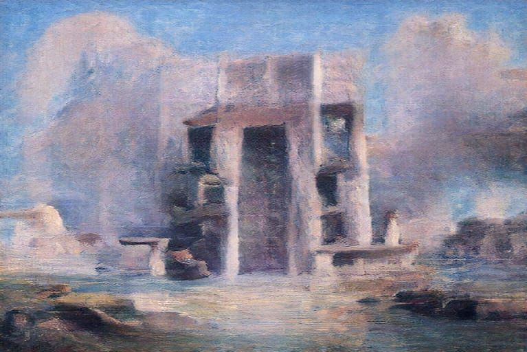
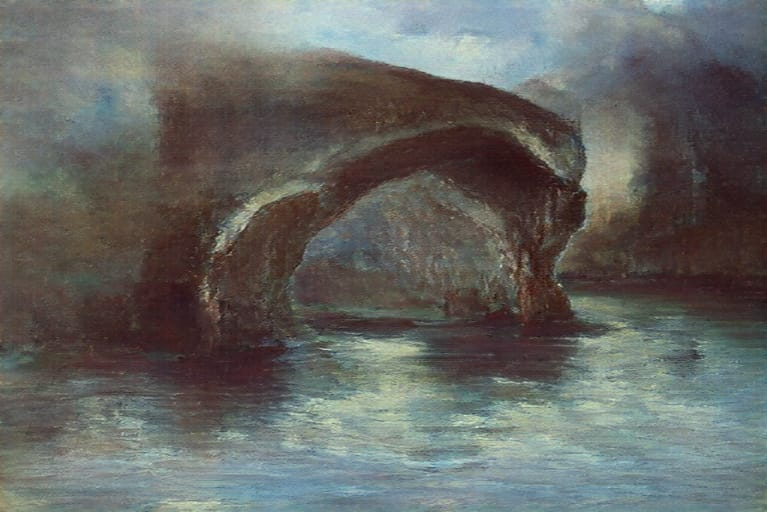
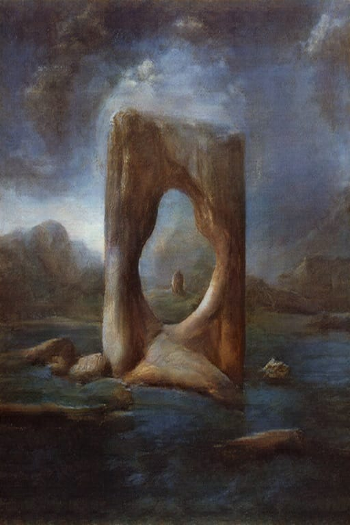
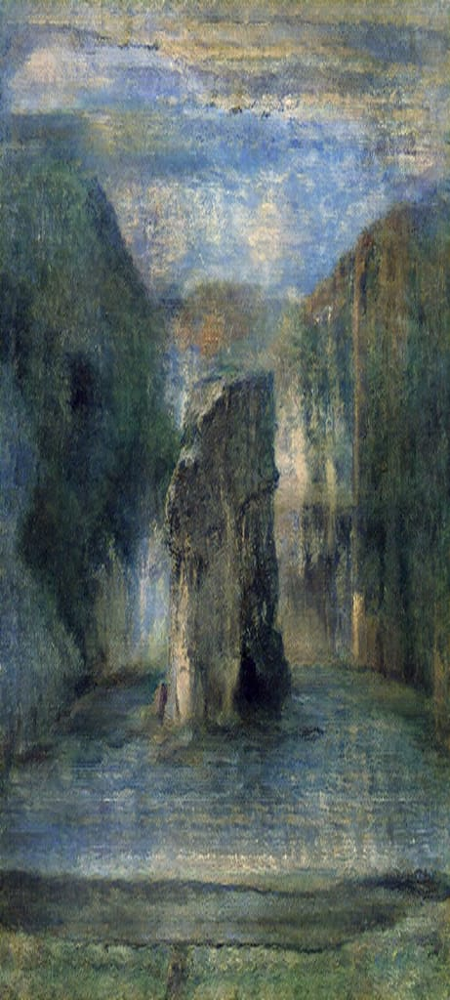

# Piedras puestas en el agua. Notas para redibujar *Altiplano* de Botelho Gosálvez

**Stones Set in Water: Notes for Redrawing Botelho Gosálvez's *Altiplano***

⟦Nombre y apellidos del autor o autora⟧[^autor]

[^autor]: ⟦Formación y grado académico⟧. ⟦Adscripción institucional⟧. ⟦Principales publicaciones⟧. Correo electrónico: ⟦correo⟧. ⟦Ciudad⟧, ⟦país⟧. (Máximo 100 palabras).

**Resumen**

Este artículo, avance de una investigación en desarrollo, relee *Altiplano* (1945), novela de Raúl Botelho Gosálvez, y pregunta qué conocimiento espacial produce la mano cuando dibuja un despojo que la novela muestra ejecutado por escrito. Cruzando el manuaje de Cárcamo Pino, el método gráfico de Lundberg, la arquitectura de la ficción de Martin y la historicidad del concepto de espacio, se ensaya un «redibujo cruzado» con cuatro pasteles al óleo. Se sostiene que la novela escenifica un conflicto entre espacio escrito y espacio vivido, y que el dibujo restituye lo que la palabra encubre: la piedra en el agua.

**Palabras clave:** Botelho Gosálvez; manuaje; espacialidad; redibujo; altiplano.

**Abstract**

This article, part of an ongoing research project, rereads *Altiplano* (1945), a novel by Raúl Botelho Gosálvez, and asks what spatial knowledge the hand produces when it draws a dispossession that the novel shows being carried out in writing. Crossing Cárcamo Pino's notion of manuage, Lundberg's drawing method, Martin's architectural reading of fiction and the historicity of the concept of space, it essays a "cross-redrawing" through four oil pastels. It argues that the novel stages a conflict between written and lived space, and that drawing restores what words conceal: stone set in water.

**Keywords:** Botelho Gosálvez; manuage; spatiality; redrawing; Altiplano.

## 1. Introducción

Si a bocajarro se pidiese a alguien dibujar el altiplano, es muy probable que trazara, antes que nada, una línea horizontal. Una sola. Quizá, sobre ella, un zigzag nevado o un semicírculo solar. El automatismo tiene su lógica: el altiplano es, por antonomasia, horizonte, y el horizonte es, por antonomasia, línea. Pero hay más. *Altiplano* reúne *alto* y *plano*, y en castellano *plano* nombra a la vez lo llano y el dibujo que representa un terreno a escala (RAE, 2024). Desde la huella etimológica, el altiplano sería un plano alto; casi un dibujo anterior al dibujo. Tal economía gráfica —reducir un territorio a un trazo— no es inocente. Es la misma con la que, según la crítica de Jeremy Till que recupera Simon Lundberg, Edmund Bacon redujo Roma a «nada más que una línea trazada entre monumentos» (Lundberg, 2019: 6)[^trad]. Es también la del lindero, esa raya que en un plano catastral separa lo propio de lo ajeno; y la del renglón, la línea de escritura sobre la que un expediente convierte un ayllu en hacienda.

[^trad]: Salvo indicación contraria, las traducciones de las citas en inglés y en portugués son nuestras.

Esa triple línea —horizonte, lindero, renglón— atraviesa *Altiplano*, novela de Raúl Botelho Gosálvez (La Paz, 1917-2004) escrita en 1940 y publicada en Buenos Aires en 1945. En ella, el doctor Las Casas, juez, se apropia mediante papeles de las tierras del ayllu Jatun-Kolla, a orillas del lago Titicaca; la sequía hace el resto y buena parte de la comunidad termina expulsada (Botelho Gosálvez, 1945: ⟦pp.⟧). Nos preguntamos entonces: ¿qué espacio construye una novela cuyo conflicto es, literalmente, una *escritura*, en el doble sentido de texto y de título de propiedad? Y, en el otro extremo del problema, ¿qué puede saber la mano, cuando dibuja, que la palabra no dice o, peor aún, encubre?

### 1.1. Problematización

La crítica ha situado *Altiplano* en la estela del indigenismo boliviano abierto por *Raza de bronce* (Arguedas, 1919): denuncia de la servidumbre, épica comunitaria, registro etnográfico. En esa tradición el paisaje comparece de dos maneras: como telón de fondo de la acción o como fuerza telúrica que determina a sus habitantes, operación letrada que tendió a fundir al indio con la tierra y a estetizarlo (cf. Sanjinés, 2005). En ambos casos el espacio es dato, no problema. Queda escasamente atendido, en cambio, aquello que la novela pone en escena con insistencia: una arquitectura del despojo —deudas, títulos, casa de hacienda, iglesia, campo de tiro, camino— cuya materia prima no es la piedra ni el adobe, sino el papel.

Por su parte, la investigación arquitectónica ha reivindicado la ficción como archivo de saber espacial. Richard Martin, apoyándose en Katherine Shonfield, recuerda que nuestra cultura contiene «una comprensión espacial y arquitectónica sin explotar», cuyo sitio «está en sus ficciones» (Shonfield, cit. en Martin, 2014: 7). Simon Lundberg, en tanto, ha propuesto el dibujo a mano como vía para explorar la imaginería arquitectónica «más allá del uso instrumental de la representación» (Lundberg, 2019: 3). Ambas vías, sin embargo, han trabajado sobre el cine norteamericano y la ciudad europea; su aplicación a la narrativa boliviana es, hasta donde sabemos, prácticamente nula. La convocatoria de este dossier, que invita a reexaminar las dinámicas entre narrativas, lenguajes y representaciones y sus materializaciones en la ficción y la memoria, ofrece el marco para intentar ese cruce. Advertimos, conforme a las normas de la revista, que se trata de una investigación en desarrollo: lo que sigue corresponde a una primera serie de cuatro dibujos y a su lectura cruzada con la novela.

### 1.2. Preguntas e hipótesis

Cuatro preguntas organizan el escrito y reaparecerán, a modo de bisagra, en su desarrollo: ¿qué espacio construye *Altiplano* cuando narra un despojo?; ¿de qué modo participa la escritura —la deuda, el título, el expediente— en la producción de ese espacio?; ¿qué conocimiento espacial produce la mano cuando dibuja lo que la novela escribe?; y, en última instancia, ¿cómo pensar la arquitectura del altiplano más allá de su uso instrumental?

La hipótesis principal (tópica) es que la espacialidad de *Altiplano* no es telón de fondo, sino campo de disputa entre dos regímenes de producción del espacio —el que se escribe (deudas, títulos, linderos) y el que se habita (ayllu, iglesia, lago, piedra)—, y que el dibujo, en cuanto manuaje, puede hacer visible aquello que en ese conflicto la escritura encubre. La hipótesis auxiliar (metodológica) presupone que el redibujo, análogo gráfico de la reescritura cruzada propuesta por Mauricio Cárcamo Pino (2025b), contribuye a producir conocimiento espacial nuevo, de ida y vuelta, sobre un texto literario. A la manera de este autor, ambas hipótesis pueden condensarse en la siguiente expresión:

$$\frac{\text{Manuaje}}{\text{Literatura}}\ \mathrel{≆}\ \frac{\text{Literatura}}{\text{Oralitura}}$$

Donde el operador ≆ informa, como en el original, una relación aproximada, pero no realmente igual (Cárcamo Pino, 2025b: 235): el manuaje de los dibujos guarda con la literatura de la novela una relación semejante, aunque no idéntica, a la que esa literatura guarda con la oralitura del ayllu que representa. La novela escribe, con la mano y la letra, un mundo aymara de oralidad, aquel en que, según Elicura Chihuailaf, «habita una visión de mundo» (cit. en ibid.: 240); los dibujos manúan, con la mano y la mancha, un mundo de letra. En ambos casos hay traducción entre órganos y soportes; en ninguno, equivalencia. La diferencia está en la asimetría: la novela representa un mundo subalterno desde la ciudad letrada; el dibujo representa un mundo letrado desde una práctica que el «monopolio de la escritura y el lenguaje» ha minusvalorado (ibid.: 259).

### 1.3. Objetivos

El texto tiene triple propósito: primero, inventariar y analizar la espacialidad de la novela; segundo, producir y leer una serie de dibujos como dispositivo de investigación, y no como ilustración; por último, poner a prueba el método.

### 1.4. Metodología

La indagación se realiza mediante lo que llamaremos *redibujo cruzado* (*cross-redrawing research method*), injerto de dos procedimientos. El primero es el método de Lundberg, que organiza la producción de imágenes en cuatro pasos: observación (representar edificios reales), disección (desmontar y analizar), ensamblaje (modificar, distorsionar, recomponer) e inmersión (volver creíble, animar) (Lundberg, 2019: 3). El segundo es la reescritura de referencias cruzadas de Cárcamo Pino: revisar por separado dos descripciones (A y B), reescribir cada una sustituyendo solo los términos que distinguen ambos contextos (Ab y Ba) y examinar después similitudes, diferencias y contradicciones (2025b: 236). El propio autor enraíza su método en «el ámbito gráfico, ligado al dibujo, la esquemática y la diagramación», donde «el collage, el calco, la repetición y la reescritura, cohabitan» (ibid.: 237). Nuestro injerto no hace sino devolverlo a su origen.

Operativamente, la *observación* recae sobre la novela, pues Jatun-Kolla es ficticia y 1940 irrecuperable; la *disección* aísla sus componentes espaciales con ayuda de los espacios simbólicos con que Martin organiza su estudio (2014: 5) y de la tríada de Henri Lefebvre; el *ensamblaje* produce cuatro pasteles al óleo (Figuras 1 a 4)[^dibujos]; y la *inmersión* se obtiene reescribiendo los textos con que Lundberg acompaña sus imágenes y marcando entre corchetes las sustituciones. Como en Cárcamo Pino (2025a: 7), parte del soporte teórico aparecerá en el desarrollo mismo, en lo que el autor llama «marco teórico implícito». Una última advertencia: la categoría *espacio* es posterior a la novela (véase 2.2). La usamos a sabiendas, como una proyección dirigida al pasado (Vázquez Ramos *et al.*, 2023: 3).

[^dibujos]: Los títulos de los dibujos son provisionales y descriptivos. Todos fueron realizados con pasteles al óleo sobre ⟦soporte⟧ entre ⟦fechas⟧.

## 2. Revisión de la literatura y soporte teórico

### 2.1. *Altiplano*: una novela escrita contra la escritura

Botelho Gosálvez estudió Derecho en la Universidad Mayor de San Andrés, ingresó a la carrera diplomática en 1938 y, un año antes, fue maestro en la Normal de Warisata. *Altiplano* fue escrita en 1940 para el concurso latinoamericano de novela convocado por la Unión Panamericana a instancias de la editorial neoyorquina Farrar & Rinehart; el jurado boliviano prefirió enviar *Metal del diablo*, de Augusto Céspedes, y el certamen lo ganó Ciro Alegría con *El mundo es ancho y ajeno* (1941), cuya trama, la de una comunidad indígena despojada y dispersa, guarda con la de *Altiplano* un parecido que no ha dejado de notarse. Publicada en 1945, la novela alcanzó su décima edición en 1987.

Dos fechas enmarcan esa escritura. La primera es la de Warisata, la escuela-ayllu fundada el 2 de agosto de 1931 por Elizardo Pérez y Avelino Siñani, cuyo edificio principal, de formas escalonadas de inspiración tiwanakota, fue levantado por los propios comunarios en jornadas de trabajo colectivo, y que fue desmantelada en 1940 (Pérez, 1962), el mismo año en que Botelho escribe *Altiplano*. La segunda es 1945: el año de la publicación es también el del Primer Congreso Indigenal, cuyas resoluciones, promulgadas como decretos por el gobierno de Gualberto Villarroel, abolieron el pongueaje y el mitanaje, sin efecto real hasta la Reforma Agraria de 1953 (cf. Rivera Cusicanqui, 1984).

La trama, por su parte, hace del despojo una operación de papel. Las Casas cancela ante el Tesoro Nacional las deudas de la comunidad, obtiene veinte hectáreas en Kero-Pata, levanta la casa de hacienda frente a la iglesia del ayllu, convierte en pongos a los varones de setecientas familias y ordena el éxodo de cuatrocientas; soldados indígenas hacen prácticas de tiro sobre sus propios hermanos, y la sequía completa la expulsión (Botelho Gosálvez, 1945: ⟦pp.⟧). Es la lógica de lo que Ángel Rama llamó la *ciudad letrada* (1984): el orden de la letra —el escribano, el abogado, el juez— como instrumento de poder sobre el territorio. De ahí una paradoja constitutiva: la novela denuncia por escrito un despojo ejecutado por escrito, y lo hace desde la pluma de un abogado. Silvia Rivera Cusicanqui lo ha formulado con precisión: en el colonialismo, las palabras «no designan, sino encubren» (2010: 19). Y si, como mostró Hayden White (2003), también la historiografía trama sus relatos con procedimientos literarios, *Altiplano* puede leerse a la inversa, como la ficción que trama un proceso histórico: la expansión de la hacienda sobre las tierras comunitarias entre la Ley de Exvinculación de 1874 y la Reforma Agraria (cf. Rivera Cusicanqui, 1984).

### 2.2. El espacio, una categoría con fecha

Vázquez Ramos, Dias Ribeiro, Quedas Campoy y Ferreira de Paula (2023) muestran que el espacio, hoy moneda corriente de la arquitectura, es un concepto moderno: ausente como valor en los tratados desde Vitruvio, formulado por historiadores del arte entre 1893 y 1914 (Schmarsow, Worringer, Scott), desatendido por los arquitectos durante las décadas de 1930 y 1940, e incorporado a la disciplina solo después de 1950. De ahí su advertencia: el espacio «es un tema esencialmente moderno y, como tal, movedizo y, sobre todo, abstracto. Su formulación no habla sobre la arquitectura, sino sobre nosotros» (Vázquez Ramos *et al.*, 2023: 4). Y de ahí también la cautela que recogen de Edward T. Hall contra quienes «proyectan sobre el mundo visual del pasado las estructuras del mundo visual del presente» (Hall, cit. en ibid.: 3). *Altiplano* se escribe, precisamente, en ese hiato de 1930-1940: no pretendemos colocar la idea de espacio en la cabeza de Botelho (ibid.: 3), sino leer con ella lo que su novela hace.

Dos instrumentos de ese repertorio nos sirven. El primero es la tríada de Lefebvre, que distingue la práctica espacial; la *representación del espacio*, concebida por arquitectos y técnicos, «el espacio dominante en cualquier sociedad»; y el *espacio de representación*, vivido «por medio de sus imágenes y símbolos asociados», propio de habitantes y usuarios, «pero también de algunos artistas» y escritores (Lefebvre, cit. en Vázquez Ramos *et al.*, 2023: 13). El segundo es la conclusión de los autores: «La espacialidad no es previa, sino resultante [...]. El espacio no es material, es social (cultural), producto de la acción humana» (ibid.: 16). Si ello es así, la pregunta por el espacio de *Altiplano* es la pregunta por las acciones que lo producen; y una de ellas, la decisiva, es escribir.

A ese repertorio moderno conviene oponer, sin fundirlo, otro: el de las categorías aymaras del espacio. Thérèse Bouysse-Cassagne (1987) describió la organización del altiplano en dos mitades, *urqu* (lo alto, seco y masculino) y *uma* (lo acuático, bajo y femenino), articuladas en torno a un *taypi* o centro, el eje del lago Titicaca y del río Desaguadero, donde los opuestos se encuentran (*tinku*). La provincia de Omasuyos, donde se levantó Warisata, conserva en su nombre la mitad de las aguas (*Umasuyu*). Por su parte, Rivera Cusicanqui ha hecho de la voz aymara *ch'ixi* una categoría para pensar la coexistencia de opuestos que no se funden: un color hecho de la yuxtaposición de «pequeños puntos o manchas» de dos colores contrastados, que «se confunden para la percepción sin nunca mezclarse del todo» (2010: 69).

### 2.3. Manuaje, imagen y ficción: la arquitectura fuera de la arquitectura

El concepto de manuaje, desarrollado desde la representación arquitectónica por Cárcamo Pino y Cecilia Wolff, designa un homólogo del lenguaje, «pero con las manos» (Cárcamo Pino, 2025a: 12): un conjunto representacional que «se funda en la acción bimanual in-tensionada y los efectos de ello sobre la materia para comunicar (o autocomunicarse), expresar o inteligenciar» (Cárcamo Pino, 2025b: 244). Lenguaje y manuaje serían «ontologías que organizan (horman/modulan) materia para mentalizar, expresar, comunicarnos y producir estados de mundo» (Cárcamo Pino, 2025a: 12). Dos consecuencias interesan aquí. La primera, que los medios no son neutros: «cada arquitectura lleva las marcas de los medios por los que ha sido proyectada» (Corona Martínez, cit. en ibid.: 12). La segunda, que reivindicar el manuaje es un acto de «justicia epistémica» hacia prácticas corporales minusvaloradas por el «monopolio de la escritura y el lenguaje» (Cárcamo Pino, 2025b: 259).

Lundberg, por su parte, parte de una sospecha: que las imágenes «nunca son solo manuales de instrucciones en manos de los arquitectos» (2019: 3), y que la representación honesta se obtiene «abrazando la naturaleza subjetiva de las imágenes, no negándola» (ibid.: 6). Su modelo es el *capriccio* de Canaletto, una ciudad imaginaria compuesta con edificios reconocibles (ibid.: 3), y su meta, la inmersión, que «no debe confundirse con el realismo visual» (ibid.: 21).

Martin aporta el tercer vértice. Su estudio de la arquitectura en el cine de David Lynch exige «una definición de arquitectura extensa e imaginativa, que abarque ciudades y decorados, lo construido y lo no realizado, lo real y lo representado» (Martin, 2014: 8), y parte de una constatación: en Lynch, «la arquitectura es la historia» (ibid.: 13). El libro se organiza según los espacios simbólicos que el cineasta manipula —pueblo y ciudad, casa, camino, escenario y cuarto— (ibid.: 5), y recoge una observación de Edward Soja decisiva para nuestro problema: mientras el lenguaje impone «un flujo lineal de enunciados», los espacios que vemos permanecen «obstinadamente simultáneos» (Soja, cit. en ibid.: 164). Es la intuición con que John Platt imaginó un manuaje capaz de zafar «del cuello de botella de un solo canal», la linealidad del habla (Cárcamo Pino, 2025b: 242). En el contexto andino, finalmente, la sociología de la imagen de Rivera Cusicanqui (2015) ha mostrado que el dibujo, de Guaman Poma en adelante, puede operar como teoría y decir lo que la letra calla; y la noción de posmemoria de Marianne Hirsch permite pensar una relación con el pasado mediada «no por el recuerdo sino por la inversión imaginativa, la proyección y la creación» (2012: 5).

## 3. Hallazgos: cuatro pasos, cuatro piedras

Pero ¿qué espacio construye *Altiplano* cuando narra un despojo?

### 3.1. Observación: leer como quien dibuja del natural

Lundberg comenzó dibujando sus lugares de estudio para construir «una biblioteca de observaciones» de la que emergería «una nueva historia» (2019: 15), convencido, con Ortega y Weihermann, de que el dibujo «se apoya en lo que ha sido observado, comprendido e interiorizado» (cit. en ibid.: 15). Martin, a su vez, abre su libro con tres viajes, a Łódź, París y Los Ángeles, preguntándose en cada uno si lo que veía era «la arquitectura de David Lynch» (2014: viii-x). Nuestra observación no puede viajar a Jatun-Kolla: aquí el sitio es un texto. Y la primera observación, a la manera etimológica de Cárcamo Pino, recae sobre los nombres. *Jatun-Kolla* reúne el quechua *hatun*, 'grande', y *Qulla*: 'Gran Colla', homónimo de Hatunqulla, antigua cabecera colla en la mitad *urqu*, vecina de las chullpas de Sillustani (cf. Bouysse-Cassagne, 1987). *Kero-Pata* reúne *q'iru*, 'madera' y, por extensión, el vaso ceremonial tallado en ella, con *pata*, 'andén, grada, borde'. *Las Casas* es, a la vez, la arquitectura en plural y el eco irónico del fraile que defendió a los indios. Y *pongo*, la condición a la que son reducidos los varones del ayllu, procede del quechua *punku*, 'puerta' (RAE, 2024).

Obsérvese el resultado. En *Altiplano*, el ayllu se llama como una nación; la tierra arrebatada se llama madera, «la materia de las materias» (Cárcamo Pino, 2025a: 12), en un territorio donde la madera escasea; el despojador se llama como la arquitectura; y los despojados son convertidos en puertas. La arquitectura, en esta novela, tiene nombre de villano; la servidumbre, nombre de umbral. No afirmamos que Botelho lo haya querido así; afirmamos que la novela lo dice, y que un dibujante no puede no oírlo.

Pero ¿de qué modo participa la escritura en la producción de ese espacio?

### 3.2. Disección: el inventario de un despojo

«Antes de armar el collage», escribe Lundberg, «es preciso aislar las partes. Es similar a establecer los personajes de una obra. ¿Qué son estos objetos? ¿Cuáles son sus agendas?» (2019: 18). El Cuadro 1 aísla los personajes espaciales de *Altiplano*.

**Cuadro 1.** Disección espacial de *Altiplano*

| Espacio (Martin) | Componente en la novela | Régimen (Lefebvre) | Operación |
|:---|:---|:---|:---|
| Pueblo | Ayllu Jatun-Kolla, a orillas del Titicaca | Espacio de representación (vivido) | Es convertido en hacienda |
| Cuarto | Deudas con el Tesoro, títulos, papeles | Representación del espacio (concebido) | Escribe el despojo |
| Casa | Casa de hacienda de Las Casas | Representación del espacio, construida | Se erige frente a la iglesia |
| Escenario | Iglesia del ayllu frente a la casa; campo de tiro | Espacio vivido y espacio del poder, enfrentados | Enfrenta, disciplina |
| Camino | Éxodo de las familias; sequía | Práctica espacial | Expulsa, dispersa |

Fuente: elaboración propia con base en Botelho Gosálvez (1945), Martin (2014: 5) y Vázquez Ramos *et al.* (2023: 13).

Tres hallazgos se desprenden de la disección. El primero es de orden léxico. Martin recuerda que cine y arquitectura comparten un vocabulario de sentidos movedizos, como *plot* y *frame* (2014: 10), y que un *plot* «puede ser una secuencia de acontecimientos, un terreno o un plan secreto» (ibid.: 46). *Altiplano* realiza las tres acepciones a la vez: su trama (*plot*) trata de una parcela (*plot*) obtenida mediante una conspiración (*plot*). El castellano añade la suya, pues el título de propiedad se llama *escritura* (RAE, 2024). El despojo, en esta novela, es literalmente una escritura.

El segundo hallazgo es de orden arquitectónico. La casa de hacienda frente a la iglesia no es un dato topográfico, sino una puesta en escena: dos fachadas enfrentadas, dos poderes en un mismo escenario. Si, como sostiene Martin, cuando edificios y lugares aparecen en la ficción «no son pasivos» (2014: 8), la casa de Las Casas es un personaje que lleva inscrita su genealogía: «cada arquitectura lleva las marcas de los medios por los que ha sido proyectada» (Corona Martínez, cit. en Cárcamo Pino, 2025a: 12), y los medios de esta casa son una deuda saldada y unos papeles. Es, en los términos de Lefebvre, una representación del espacio que ha tomado cuerpo; y una representación así, advierte el propio Lefebvre, «puede perpetuarse, sobrevivir a sus condiciones, inspirar una ideología» (cit. en Martin, 2014: 17): la casa sobrevive al juez. Es, también, el efecto de un lindero. Martin cita a Heidegger, para quien «un límite no es aquello en lo que algo se detiene sino [...] aquello a partir de lo cual algo comienza su presenciar», y concluye que los bordes, hechos deliberadamente visibles, «generan una cierta noción de espacio» (Martin, 2014: 133). En *Altiplano*, el lindero trazado sobre papel no es donde el ayllu termina, sino donde la hacienda empieza.

El tercer hallazgo invierte una pareja clásica. Para Martin, la casa y el camino forman en la cultura norteamericana un par fundamental: la casa como espacio estructurado y el camino como ilimitación fantasmática, que presupone «impulso y difusión, no permanencia ni encierro» (2014: 108). *Altiplano* invierte la ecuación: el ayllu no confina, arraiga; el camino no libera, expulsa. El éxodo de la novela es una *road movie* al revés: allí donde Simone de Beauvoir celebraba que «ningún sueño de arraigo» desafiara «la vertiginosa euforia del auto y del viento» (cit. en ibid.: 107), *Altiplano* no narra otra cosa que un sueño de arraigo. En el altiplano, el viento es otra cosa.

Pero ¿qué conocimiento espacial produce la mano cuando dibuja lo que la novela escribe?

### 3.3. Ensamblaje: caprichos para una Jatun-Kolla análoga

Los cuatro dibujos no son vistas de Jatun-Kolla, que no existe, sino caprichos en el sentido de Lundberg: mundos creíbles compuestos con elementos reconocibles (portadas, arcos, monolitos, muros, agua) para una Jatun-Kolla análoga, como la ciudad análoga de Aldo Rossi que el autor evoca (2019: 12). Operan como los dibujos que Kevin Lynch pidió a los habitantes de Boston o Los Ángeles, imágenes hechas «reduciendo, eliminando o incluso añadiendo elementos a la realidad, por fusión o distorsión» (K. Lynch, cit. en Martin, 2014: 17-18); o como el mapa de *Twin Peaks*, que Martin lee no como representación de un lugar existente, sino como «un plano para una geografía futura, un marco para relatos posibles» (ibid.: 46).

La técnica no es accesoria. El pastel al óleo, pigmento aglutinado con cera y aceite no secante, se resiste a la línea fina y a la arista: construye por masas, capas y manchas, y se funde con la yema del dedo. Es manuaje «en sentido fuerte», es decir, emisión manugráfica de «baja o nula escrituralidad» (Cárcamo Pino, 2025b: 259). Una consecuencia es casi física: con pastel al óleo no se puede trazar un lindero. David Lynch pasó de la pintura al cine porque, frente a sus cuadros, quería «que los bordes desaparecieran [...] entrar en el interior. Era espacial» (Lynch, cit. en Martin, 2014: 4); Lundberg buscaba un motivo que no se limitara «a los bordes del papel» (2019: 42). El pastel lo consigue por su propia materia: sus bordes se deshacen.

En la Figura 1, una portada frontal de gran masa, con un vano central oscuro y nichos laterales, se alza sobre gradas entre nubes que suben del suelo. En la Figura 2, un arco de roca, sin dovelas, salva un espejo de agua bajo la niebla. En la Figura 3, un monolito perforado encuadra, a través de su abertura, una pequeña figura sobre una colina verde. En la Figura 4, de formato vertical, una piedra erguida se levanta en el agua entre dos masas altas, con una diminuta figura rojiza a su pie.

{width=11.5cm}

{width=11.5cm}

{width=8cm}

{width=6cm}

### 3.4. Inmersión: reescribir a Lundberg para ver los pasteles

La inmersión, en Lundberg, se logra con imágenes y también con textos: breves relatos que invitan «a un lugar que existe según su propia lógica» (2019: 42). Nuestros textos de inmersión no fueron escritos: fueron reescritos. El Cuadro 2 presenta, para cada dibujo, un pasaje de Lundberg (A) y su reescritura (Ab), con las sustituciones entre corchetes.

**Cuadro 2.** Reescritura cruzada de los textos de inmersión

| Figura | A: Lundberg (2019) | Ab: reescritura |
|:---|:---|:---|
| 1. *Umbral* | «Una perspectiva central y una proyección ortográfica al mismo tiempo [...]. No es la luz del alba; es, más bien, la luz de una detonación lejana» (14) | «Una [portada] central y una proyección ortográfica al mismo tiempo [...]. No es la [niebla] del alba; es, más bien, [el humo] de una detonación lejana» |
| 2. *Puente* | «Una construcción a modo de puente termina en nada. ¿Es un puente que espera el regreso de la marea?» (45) | «Una construcción a modo de puente termina en [niebla]. ¿Es un puente que espera el regreso [del agua]?» |
| 3. *Mirilla* | «El edificio como objeto. Es un edificio aislado que domina la imagen y es el único punto focal y narrador de la composición» (14) | «[La piedra] como [sujeto]. Es [una piedra] aislada que domina la imagen y es el único punto focal y narrador[a] de la composición» |
| 4. *Quebrada* | «Es difícil determinar si es asfalto mojado o agua negra lo que se mueve en el fondo» (43) | «Es difícil determinar si es [camino] mojado o agua [del lago] lo que se mueve [al pie de la piedra]» |

Fuente: elaboración propia con base en Lundberg (2019: 14, 43, 45).

Las reescrituras funcionan como hipótesis de lectura. En la Figura 1, el humo de una detonación lejana convoca las prácticas de tiro de la novela, y el vano central es el umbral que, según la fórmula de Beatriz Colomina que Martin recoge, coincide con «un punto de máxima tensión» (cit. en Martin, 2014: 88). ¿Portada de iglesia, puerta de hacienda o pórtico lítico? El dibujo no elige, y en esa indecisión reside su hallazgo: el umbral del templo y el de la hacienda son, aquí, uno solo. Junto al vano, una figura blanca y pequeña espera sobre un poyo; a la izquierda, un bulto rojizo puede ser escombro o *q'ipi*, el atado de quien se va. Si *pongo* viene de *punku*, la figura que custodia la puerta admite un nombre preciso. Bachelard escribió que, si se diera cuenta de todas las puertas que uno ha cerrado y abierto, y de todas las que quisiera reabrir, habría que contar la historia entera de la propia vida (cit. en ibid.: 164). En *Altiplano*, la historia entera de una comunidad cabe en una puerta.

En la Figura 2, la reescritura introduce lo que el pasaje original no contenía: la sequía. El arco espera el regreso del agua. Es, además, un arco sin dovelas, estereotomía sin arquitecto; y es una *cámara*, pues en su raíz latina la cámara es una bóveda o recinto abovedado (Martin, 2014: 10): la roca encuadra. José Saramago escribió que las palabras son «piedras puestas atravesando la corriente de un río» para llegar a la otra orilla (2001: 98-99). Aquí la otra orilla es niebla: un éxodo sin llegada.

En la Figura 3, la piedra deja de ser objeto para ser sujeto y narradora. En el mundo andino, ciertas piedras son ancestros petrificados, dobles líticos que custodian la tierra (cf. Duviols, 1979). Lo que la abertura encuadra, una figura pequeña sobre una colina verde, es el pasado visto a través de la piedra: una posmemoria espacial, «la presencia del pasado en los espacios del presente» (Martin, 2014: 185), un lugar que, como el Cuarto Rojo de Lynch, «debe ser imaginado antes de poder ser plenamente habitado» (ibid.: 160).

En la Figura 4, la duda entre camino y lago es la duda de la novela: el éxodo o la orilla. El formato vertical contradice la horizontalidad del altiplano y lo convierte en quebrada, en bajada. Al frente, en la hierba, un trazo vertical mínimo: ¿estaca, mojón, jalón de agrimensor? Martin describe en *The Straight Story* unos postes de telégrafo a los que el horizonte opone «un contrapunto perpendicular» (2014: 125). Aquí, la estaca y la banda oscura de la orilla reponen las dos líneas del inicio: el lindero y el horizonte.

Queda el viaje de vuelta (Ba). Lundberg describe así uno de sus barrios: «Aunque es un lugar que carece de toda topografía, apenas un campo abierto, tan llano que alguna vez se usó como aeródromo, tiene un extraño carácter montañoso. Las torres que brotan de la masa edificada contribuyen a la sensación de que Skarpnäck no ha sido construido, sino que es más bien un lugar tallado por la erosión» (2019: 47). Reescrito («tan llano que alguna vez se usó como [campo de tiro] [...]. Las [chullpas] que brotan de la masa [de adobe] contribuyen a la sensación de que [Jatun-Kolla] no ha sido construid[a], sino que es más bien un lugar tallado por la erosión»), el pasaje describe casi sin fricción un altiplano como el de la novela. Pero, leído contra los pasteles, se invierte: sus rocas no parecen talladas por la erosión, sino construidas. El arco es puente; el monolito, ventana; la portada, en cambio, se deshace en nubes como una roca. Donde Lundberg veía arquitectura como geología, los dibujos ven geología como arquitectura; y en el altiplano la distinción entre lo construido y lo dado no se resuelve: permanece *ch'ixi*.

## 4. Análisis final

Pero, en última instancia, ¿cómo pensar la arquitectura del altiplano más allá de su uso instrumental?

### 4.1. Un invariante: la piedra en el agua

Los cuatro dibujos comparten un rasgo que la novela no impone: una piedra, o una arquitectura, erguida en el agua o a su orilla. El invariante no se deduce del texto; emerge del conjunto. Leído con Bouysse-Cassagne (1987), admite una interpretación precisa: la piedra es *urqu*, el agua es *uma*, y su encuentro (*tinku*) ocurre en el *taypi*, el centro lacustre. Los dibujos sitúan a Jatun-Kolla en el centro; los papeles de Las Casas convierten ese centro en parcela, y a sus habitantes, en expulsados. Si la novela narra la expulsión de una comunidad de su centro, los pasteles la devuelven, sin decirlo, al único lugar donde el despojo no ha llegado a escribirse: el agua.

### 4.2. Instrumentos: del plano al pastel

La fórmula de Lundberg, explorar la imagen «más allá del uso instrumental de la representación» (2019: 3), adquiere aquí un sentido literal, pues en castellano el documento que prueba un derecho es un *instrumento* (RAE, 2024). Martin observa que los verdaderos diseñadores del paisaje del Medio Oeste, que forman figuras que parecen «naturales», son «instrumentos mecanizados de la voluntad humana» (2014: 129); los diseñadores del altiplano de *Altiplano* son instrumentos públicos. Y la pregunta que Martin formula ante los escenarios de Lynch, «de quién es la mano que mueve los hilos y con qué fin» (ibid.: 134), tiene aquí respuesta: la del juez que escribe.

Cabe entonces reescribir, por última vez, una nota de Cárcamo Pino. En el imaginario de los tres cerditos, la madera era para él «punto medio» entre la casa de paja y la de ladrillo: más tectónica que la filigrana de paja, menos estereotómica que la fábrica (2025a: 8). En el altiplano, donde la madera escasea, las tres casas serían de ichu, de adobe y de piedra, y el lobo que las derriba no es el viento: es el papel. Y el papel, como el lápiz, es madera (ibid.: 10). Kero-Pata, el andén de madera, es arrebatado con madera a una sociedad de piedra y barro. Frente a ello, el pastel opone una materia que no traza linderos: sus trazos yuxtapuestos se confunden para la percepción sin mezclarse del todo, como en lo *ch'ixi* (Rivera Cusicanqui, 2010: 69). Ruina y porvenir, templo y hacienda, piedra y cuerpo coexisten sin síntesis, a contrapelo de la fusión telúrica del indio con el paisaje (cf. Sanjinés, 2005). Y donde la novela, como todo lenguaje, avanza en línea, el dibujo restituye la simultaneidad obstinada del espacio (Soja, cit. en Martin, 2014: 164).

### 4.3. 1945, o el espacio indecible

En 1945, año en que se publica *Altiplano*, Le Corbusier escribe *L'espace indicible*: «Tomar posesión del espacio es el gesto primero de los seres vivos [...]. La prueba primera de la existencia es ocupar el espacio» (Le Corbusier, cit. en Vázquez Ramos *et al.*, 2023: 10). Ese mismo año, un decreto abolía en La Paz el pongueaje, sin efecto hasta 1953. Tres documentos de un mismo año: uno proclama la posesión del espacio como prueba de existencia; otro narra cómo esa prueba se revoca con papeles; un tercero suprime en el papel la servidumbre que convertía a los hombres en puertas. Si la espacialidad es «resultante», «producto de la acción humana» (ibid.: 16), *Altiplano* demuestra que esa acción puede ser una escritura; Warisata, levantada a mano por sus comunarios, había demostrado que también puede ser un trabajo colectivo de las manos. Los dibujos, modestamente, se ponen del lado de estas.

### 4.4. Límites

Tres límites deben declararse. El primero es el anacronismo: leemos con una categoría, el espacio, posterior a la novela, y lo hacemos a sabiendas. El segundo es de posición: los dibujos no representan la espacialidad aymara; la atraviesan desde fuera, con el riesgo de reeditar con otros medios la estetización telúrica que se critica; la lectura *ch'ixi* previene la fusión, pero no disuelve la asimetría. El tercero es de alcance: la tipología de Martin fue concebida para el cine norteamericano y aquí opera como rejilla, no como teoría del mundo andino. La investigación continúa con una segunda serie de dibujos sobre el edificio de Warisata y con la dirección de vuelta (Ba) de la reescritura, apenas ensayada aquí.

## 5. Conclusiones

### 5.1. Conclusión tópica

Como hemos visto, la espacialidad de *Altiplano* es un conflicto entre dos regímenes de producción del espacio, principalmente en razón de que:

- La arquitectura del despojo es una escritura: la trama (*plot*) de una parcela (*plot*) obtenida mediante una conspiración (*plot*), cuya casa de hacienda lleva las marcas de los papeles con que fue proyectada. Los nombres de la novela lo condensan: un ayllu con nombre de nación, una tierra con nombre de madera, un villano con nombre de casas y unos siervos con nombre de puerta.
- El dibujo, en cuanto manuaje en sentido fuerte, no ilustra la novela: restituye lo que sus palabras encubren. En los cuatro pasteles, la piedra en el agua devuelve a la comunidad al *taypi* del que el papel la expulsa, y la coexistencia *ch'ixi* de lo construido y lo erosionado resiste la fusión telúrica.
- La tesis de Martin según la cual la arquitectura puede ser la historia (2014: 13) vale para Botelho: en *Altiplano*, la arquitectura es la historia; los dibujos muestran que puede ser, además, su memoria.

### 5.2. Conclusión metodológica

El redibujo cruzado produjo hallazgos que la lectura del texto, por sí sola, no ofrecía: el invariante de la piedra en el agua, la sequía que el puente espera, el quiasmo entre arquitectura y geología. Es evidente, con todo, que hemos citado la estructura de Lundberg más que el sentido de sus palabras. Habríamos de ofrecerle la coautoría; como advierte Cárcamo Pino en un caso análogo, muchos discreparían «y con bastante razón» (2025b: 261). Así, si investigar por reescritura «es intentar saber lo que uno escribiría si investigase» (ibid.: 261), tendremos que admitir, quizá, que investigar por redibujo es intentar saber lo que uno dibujaría si investigase; o, más exactamente, lo que uno investigaría si dibujase. Si ahora se nos pidiera, a bocajarro, dibujar el altiplano, quizá ya no trazaríamos una línea. Pondríamos una piedra en el agua.

## Declaración sobre el uso de inteligencia artificial

En cumplimiento del punto 8 de las normas editoriales, se declara: a) herramienta utilizada: Claude (Anthropic), asistente de inteligencia artificial generativa ⟦indicar versión o modelo⟧; b) alcance: ⟦lectura asistida y resumen de las fuentes, análisis estilístico de referencias, propuesta de estructura, redacción de un borrador inicial y verificación preliminar de datos bibliográficos⟧; c) rol: ⟦el autor o autora concibió el problema, realizó los dibujos y su interpretación, revisó y reescribió el texto, verificó contra los originales todas las citas y referencias, y asume la plena responsabilidad del contenido⟧. ⟦Ajustar esta declaración a lo efectivamente realizado antes del envío⟧.

## Bibliografía

Alegría, Ciro (1941). *El mundo es ancho y ajeno*. Santiago de Chile: Ercilla.

Arguedas, Alcides (1919). *Raza de bronce*. La Paz: González y Medina.

Botelho Gosálvez, Raúl (1945). *Altiplano. Novela india*. Buenos Aires: Ayacucho.

Bouysse-Cassagne, Thérèse (1987). *La identidad aymara. Aproximación histórica (siglo XV, siglo XVI)*. La Paz: HISBOL / IFEA.

Cárcamo Pino, Mauricio Arnoldo (2025a). "Madera, herramientas y manuaje. Notas para una ontología evolutiva del diseñar". *Revista Arteoficio*, núm. 21: 5-12. https://doi.org/10.35588/nn3v3487

Cárcamo Pino, Mauricio Arnoldo (2025b). "Oralitura/literatura y manuaje/lenguaje: una revisión por reescritura". *Revista Chilena de Literatura*, núm. 112: 233-264.

Duviols, Pierre (1979). "Un symbolisme andin du double: la lithomorphose de l'ancêtre". En: *Actes du XLIIe Congrès International des Américanistes*, vol. IV. París: Société des Américanistes: 359-364.

Hirsch, Marianne (2012). *The Generation of Postmemory. Writing and Visual Culture After the Holocaust*. Nueva York: Columbia University Press.

Lundberg, Simon (2019). *Architecture as Image*. Trabajo de grado en Arquitectura, nivel avanzado. Estocolmo: KTH, Skolan för arkitektur och samhällsbyggnad.

Martin, Richard (2014). *The Architecture of David Lynch*. Londres: Bloomsbury Academic.

Pérez, Elizardo (1962). *Warisata. La escuela-ayllu*. La Paz: Empresa Industrial Gráfica E. Burillo.

Rama, Ángel (1984). *La ciudad letrada*. Hanover: Ediciones del Norte.

Real Academia Española (RAE) (2024). *Diccionario de la lengua española*, 23.ª ed. [versión en línea]. https://dle.rae.es

Rivera Cusicanqui, Silvia (1984). *Oprimidos pero no vencidos. Luchas del campesinado aymara y qhechwa de Bolivia, 1900-1980*. La Paz: HISBOL / CSUTCB.

Rivera Cusicanqui, Silvia (2010). *Ch'ixinakax utxiwa. Una reflexión sobre prácticas y discursos descolonizadores*. Buenos Aires: Tinta Limón.

Rivera Cusicanqui, Silvia (2015). *Sociología de la imagen. Miradas ch'ixi desde la historia andina*. Buenos Aires: Tinta Limón.

Sanjinés C., Javier (2005). *El espejismo del mestizaje*. La Paz: IFEA / Embajada de Francia / PIEB.

Saramago, José (2001). *La caverna*. Madrid: Alfaguara.

Vázquez Ramos, Fernando Guillermo (et al.) (2023). "Reflexões sobre a construção histórica do conceito de espaço: uma aproximação". *Risco. Revista de Pesquisa em Arquitetura e Urbanismo*, vol. 21: 1-18. https://doi.org/10.11606/1984-4506.risco.2023.187844

White, Hayden (2003). *El texto histórico como artefacto literario y otros escritos*. Barcelona: Paidós.
