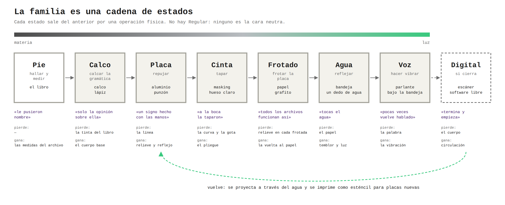

# 03. El sistema: *Contenida*

*Contenida* es una familia tipográfica de caja baja, monoespaciada, hecha a mano en papel de aluminio. Sus letras salen del pie de la lámina que Rebeca usó. Su pauta sale de la piscina donde ocurrió la obra, y su caja, de la retícula de la cabeza del ídolo. Sus estilos no son pesos: son los estados por los que pasa la letra, del papel a la placa, al cuerpo, al agua y a la pared.

Las láminas de `esquemas/` son planos: la caja, la pauta, la ficha, la cadena y los montajes. Las letras las hace la mano (§3.2, regla 9). La única excepción es `simulacion/`, la propuesta de la máquina, hecha para confrontarla con la de la mano; ninguna de sus formas entra en la caja.

## 3.1. El nombre

**Contenida.**

- Es el participio del verbo del título de Rebeca.
- Es femenino, como la «Monolita» del boceto y como «la ídolo» de tu poema.
- En español, una **voz contenida** es la que no sale del todo, que es la condición de la voz en la obra.
- En tipografía, contener es lo que hacen la caja y el cuerpo.

**Subtítulo propuesto:** *acciones para componer una voz*. Componer se dice de los tipos y de la música.

**El nombre no es *Kochamama*.** Tu poema lo dice: «le pusieron nombre, / otra manera de enterrar». Ponerle a la fuente el nombre del ídolo sería enterrarlo otra vez. Tampoco se usa una palabra aymara o quechua como marca.

## 3.2. Nueve reglas

1. **De la lámina se toma el pie, no la imagen.** Rebeca tomó lo que la lámina muestra; la tipografía toma lo que la lámina dice. Es la misma hoja, en dos mitades.
2. **Lo hallado y lo reconstruido se distinguen siempre.**
   - Lo hallado va en línea continua; lo reconstruido, en punteado.
   - Vale para el calco, el repujado (punteado con el punzón) y todos los estados que siguen.
   - Es la convención del dibujo arqueológico, y la que la lámina no cumple: su pie confiesa que el dibujo es reconstructivo, pero el dibujo no distingue qué parte lo es.
3. **La forma la decide el material.**
   - El punzón sobre papel de aluminio no permite ángulos agudos sin romper, ni contraformas diminutas sin aplastarlas: esas son las reglas del dibujo.
   - Una placa rota no se corrige: se registra en su ficha y se guarda en la caja junto a la que se hizo después.
4. **Solo caja baja.**
   - Las mayúsculas latinas son letras de monumento (Brookes, en `02`).
   - El pie escribe en mayúsculas justamente el nombre impuesto: «EL IDOLO KOCHAMAMA».
   - La obra cambia el material del monumento por uno doméstico, y la tipografía cambia la letra del monumento por la de la mano.
   - Una mayúscula tecleada se escribe en caja baja.
5. **Monoespaciada: una letra, un azulejo.**
   - La piscina, las celdas de la lámina y la máquina de escribir de tu poema son retículas de celdas iguales.
   - La letra se adapta a su contenedor, y no al revés: la «m» llena su azulejo y la «i» queda rodeada de piel.
6. **No hay Regular.**
   - La figura de la obra no tiene rostro distinguible: la cinta color piel le tapa los ojos y la boca.
   - La familia tampoco tiene una cara neutra. Cada estilo es un estado, y ninguno es la versión «normal» de los demás.
   - En español, el *ojo* del tipo es su cara de imprimir.
7. **El juego cabe en 56 celdas; lo que no cabe, se ve como celda vacía.** Ningún contenedor aguanta lo que contiene (§3.5).
8. **Primero la mano, después lo digital, y lo digital vuelve a pasar por el agua.** Es el mismo orden de la obra: repujado → video → agua → pared (`05`).
9. **De la piscina no se saca nada.**
   - «Nos fuimos con las manos secas, / que es como se sale de todas las ruinas.»
   - La piscina se mide, se frota y se fotografía. No se despega ni se pinta nada, y no queda nada pegado.
   - Tampoco hay letras hechas por una máquina en lugar de la mano: «desenterrar una voz / es desenterrar la mano del que la escribió».
   - La simulación de `simulacion/` no reemplaza a la mano: es una propuesta de la máquina, para confrontarla con la tuya. Sus formas no entran en la caja ni en la fuente.

## 3.3. Cuadro de correspondencias

Cada decisión de la obra (numerada como en `01`) y su traducción. La tercera columna dice por qué rima.

| Nº | Decisión de la obra | Decisión tipográfica | Por qué rima |
|---|---|---|---|
| D1 | Partir de la lámina y no de la piedra | Las letras salen del pie de la lámina | Las dos obras parten del registro. Rebeca toma su imagen y *Contenida*, su texto |
| — | El pie confiesa que el dibujo es reconstructivo | Hallado (continuo) frente a reconstruido (punteado), en todos los estados | La tipografía cumple la confesión que el dibujo no cumple |
| — | El pie confiesa que el calendario no se ha interpretado | No se traduce ningún signo tiwanacota. Y el pie no trae una sola cifra, así que las diez cifras, que sirven para contar el tiempo, son todas reconstruidas | Lo que mide el tiempo es, en el archivo, lo que no se sabe leer |
| — | El pie supone otro lugar de origen | El colofón es una cadena de custodia (§3.11) | El desplazamiento se nombra, no se borra |
| D2 | Asperón → papel de aluminio | Matrices de papel de aluminio repujado. Solo caja baja | Material doméstico en lugar de material de monumento; letra de la mano en lugar de letra de monumento. Y el tipo de plomo también era un relieve de metal hecho en espejo, como el repujado, que se trabaja por el reverso |
| D3 | Placas sueltas, con piel entre ellas | Cada letra es una placa suelta: un tipo móvil. Entre palabras, un azulejo vacío: la piel | La composición es distribuir placas sobre un soporte, como en el cuerpo |
| D4 | Puertas en el pecho y la espalda | La tapa de la caja tiene una sola puerta, calada del tamaño de una celda, sobre la celda 1 | *Portada* viene de *puerta*. Con la caja cerrada se ve solo la coma que sigue al nombre del ídolo, el primer signo hallado |
| D5 | Iconografía interpretada, no copiada | Ningún signo del monolito entra como letra. Se toma su retícula (la caja) y su celda vacía (el `.notdef`) | Rebeca interpreta; *Contenida* toma solo el marco vacío |
| D6 | Piscina de azulejo vacía, en un estudio de tatuajes | La pauta es la piscina: un azulejo por letra, la tesela como unidad, la junta como espacio entre letras. El esténcil de tatuaje como matriz | El contenedor de la obra es la caja de la tipografía. El lugar donde los signos se ponen en la piel da la técnica de transferencia |
| D7 | Placas en el fondo, que se leen como peces | No se dibujan peces. Las letras sueltas en el fondo de la piscina ya se leen como peces | El signo «pez» de la Kochamama llega sin copiarlo |
| D8 | Proyección a través de una bandeja con un dedo de agua | Estado *Agua* y *pliego de agua*: un impreso que solo se lee reflejado | La imagen solo llega pasando por el elemento que al lugar le falta |
| D9 | La piscina es escenario, pantalla y tema | La pauta definitiva es un frotado de la pared. El espécimen final se proyecta sobre esa misma pared | La piscina escribe, sostiene y recibe la letra |
| D10 | Bucle | Componer, registrar y distribuir: la caja es un ciclo. El hectógrafo se limpia solo y vuelve a empezar | «Termina y empieza» |
| D11 | Moverse como la piedra: apenas | Estado *Piel*: las placas se visten el tiempo de un bucle y los pliegues no se corrigen | El cuerpo escribe sobre la letra |
| D12 | Ojos y boca tapados: sin rostro | No hay Regular | Ninguna cara neutra |
| D13 | De la boca sale una placa: un signo, no un sonido | El signo final `¶`, hecho con los dedos, en la última celda | «Un signo / hecho con las manos, / ninguna palabra» |
| D14 | Canto que se oye y no se entiende | Estado *Voz*: tu voz mueve el agua y se registra lo que hace, no la grabación. Sin «¡ !»: la voz contenida no exclama | La voz aparece como deformación, no como palabra |
| D15 | Tocar el agua: la imagen se deforma, con ecos | *Agua tocada*. En lo digital, tocar deforma el texto, que se recompone sin volver igual | «La misma diosa dos veces / y ninguna igual» |
| D16 | El líquido en la boca, negro contra la plata, chorrea | Tinta hectográfica: casi negra en la primera copia, violeta después. La bandeja bebe la matriz | «La tierra se dio de beber a sí misma / y ningún contenedor aguanta lo que contiene» |
| — | La cadena de desplazamientos: cada paso pierde materia y gana luz | La familia es esa cadena (§3.7). El peso se mide en copias | La familia tipográfica como linaje literal |

## 3.4. De dónde salen las letras: el pie

El pie es la única escritura del objeto de origen, la voz del archivo sobre la piedra. Sus letras se extraen como Tshuma extrajo las de *Nedmural* de un mural: tal como están, eligiendo en cada caso el testigo mejor conservado.

**El recuento** lo hace `inventario.py`; el resultado completo está en `textos/inventario.md`.

- **Hallados.** El pie trae **30 de los 55 signos** del juego: 26 letras en caja baja, contando las acentuadas, y 4 signos de puntuación. Sus mayúsculas no cuentan: son otra forma.
  - Algunos tienen un solo testigo: la «j» (*viejas*), la «k» (*Posnansky*), la «q» (*que*) y los dos paréntesis.
  - Los paréntesis encierran la confesión: «(hoy está muy erosionado y casi no se ven esos detalles)».
- **A reconstruir: 25.**
  - la ñ, la w, la x y la z;
  - é, ó y ü;
  - las diez cifras;
  - ; : ¿ ? « » — y …

**Dos hallazgos que salen de contar, no de diseñar:**

1. **Las palabras que no se pueden escribir solo con lo hallado.** Con las letras halladas se escriben **31 de los 42 versos** del poema. Los otros once necesitan una letra reconstruida, y las palabras que la exigen son «quedó», «vez», «después», «salvó», «opinión», «empieza», «voz» y «escribió».
   - La primera palabra del poema ya necesita una hipótesis: la ó de «quedó».
   - «No se salvó la piedra, / solo la opinión sobre ella»: *salvó* y *opinión* solo se escriben con letras reconstruidas.
   - Y la z de *voz* hay que reconstruirla: la voz no se puede desenterrar del pie, hay que rehacerla.
2. **El primer signo que se halla no es una letra.** Es la coma que sigue a «KOCHAMAMA,»: una pausa después del nombre.

**Cómo se reconstruye.** Por analogía, a partir de lo hallado, y dejando dicho en la ficha de qué letras sale cada parte:

- é y ó: con la tilde de á, í y ú;
- ñ: de la n, con una virgulilla que no tiene modelo;
- ü: de la i, con dos de sus puntos;
- z: de los trazos de la s y la k;
- w: de dos v;
- x: de la diagonal de la k;
- ; y :: del punto y la coma;
- ¿ y ?: sin modelo;
- « »: de ángulos de la v;
- —: del travesaño de la e;
- …: de tres puntos.

Las cifras son lo más hipotético: se arman con partes de letras (el 0 de la o, el 1 de la l).

**La fuente real es el libro.** La foto que tenemos sirve para contar, no para calcar. Hay que fotografiar el pie en el ejemplar con luz rasante, que es como se leen las piedras erosionadas y la huella del tipo de plomo en el papel. Después, volver a correr el inventario con la transcripción corregida.

## 3.5. La caja: 8 × 7

**Por qué 56.** La retícula de la cabeza es la única parte de la lámina hecha de contenedores vacíos, la caja del propio monolito. *Contenida* usa su número de celdas visibles y no su contenido.

**El juego:**

| Grupo | Signos | Cantidad |
|---|---|---|
| Letras | a–z y ñ | 27 |
| Acentuadas | á é í ó ú ü | 6 |
| Cifras | 0–9 | 10 |
| Signos | . , ; : ¿ ? ( ) « » — … | 12 |
| Signo final | ¶ | 1 |
| **Total** | | **56** |

**Lo que no cabe:**

- **La exclamación.** Ni el poema ni el pie la usan, y la voz de la obra no exclama: está contenida.
- **El guion corto:** las palabras no se parten.
- **Las comillas inglesas y el apóstrofo:** no son del español.

Todo eso, y cualquier otro signo, se ve como el `.notdef`: la celda vacía de la lámina, calcada a mano. Las mayúsculas no tienen celda: se escriben con la caja baja.

**El orden** es un convenio de lectura latina, por filas:

1. los hallados, por orden de aparición en el pie;
2. los reconstruidos, en el orden en que el poema los pide (ó, z, ?, é, ;) y después los demás;
3. en la última celda, el signo final.

**La caja física.**

- **Tamaño:** una bandeja de 8 × 7 compartimentos de un azulejo cada uno. Con azulejos de 15 cm y juntas de 3 mm, mide unos 1,22 × 1,07 m: un paño de pared de la piscina.
- **Contenido:** cada compartimento guarda las placas de su signo y sus fichas.
- **La tapa:** tiene una sola puerta calada, sobre la celda 1.

## 3.6. La pauta: el azulejo

- **Cuerpo:** un azulejo de la pared. En la foto parece medir entre cinco y media y seis teselas del piso. Hay que medirlo.
- **Unidad:** una tesela del piso.
- **Ancho:** todas las letras miden un azulejo. Nada se estira para llenar.
- **Espacios:**
  - entre letras, la junta;
  - entre palabras, un azulejo vacío;
  - entre líneas, nada: las filas de azulejos se apilan, y el interlineado es igual al cuerpo.
- **Escala:** la decide el pie.
  - La ascendente más alta y la descendente más baja de las letras halladas tienen que entrar en el azulejo, con media tesela de aire arriba y abajo.
  - La línea de base y la altura de x caen donde caen, redondeadas a media tesela.
  - La pauta impresa trae líneas provisionales, a partir de la tesela de abajo: descendentes 0,5; base 1,5; altura de x 4; ascendentes 5,5.
- **Lo que no entra, desborda.** Si una descendente del pie sale del azulejo, invade la junta y se registra. No se recorta.
- **Dos cuerpos, los dos de la piscina:**
  - **cuerpo azulejo:** placas y pared;
  - **cuerpo tesela:** impresos (hectógrafo, fichas). En cuerpo tesela, la caja entera cabe en una hoja A4: 20 × 17,5 cm, si la tesela mide 2,5 cm.
- **La pauta impresa es provisional.** La definitiva es un frotado (grafito sobre papel) de un paño de 8 × 7 azulejos de la pared de la piscina: la retícula real, con sus juntas torcidas y sus grietas, no una retícula ideal.

Plantilla: `esquemas/pauta_azulejo.svg`, a escala 1:1. Se regenera con las medidas reales (`esquemas/generar_esquemas.py --azulejo … --teselas … --junta …`).

## 3.7. La familia: estados, no pesos

| Estilo | Acción (`04`) | Cómo se hace | Rima con |
|---|---|---|---|
| **Calco** | 3 | Calco sobre la pauta: continuo lo hallado, punteado lo reconstruido | El dibujo reconstructivo de Posnansky, hecho desde fotos viejas |
| **Placa** | 4 | Repujado por el reverso, en espejo | Asperón → aluminio |
| **Piel** | 6 | La placa, vestida el tiempo de un bucle y después aplanada con la mano | Las placas sobre el cuerpo; moverse como la piedra |
| **Copia 01 … Copia *n*** | 8 | Hectógrafo: cada copia sale más clara que la anterior | La bandeja; cada paso pierde materia; el esténcil del estudio |
| **Agua** (quieta, tocada) | 9 | La placa en el fondo de una bandeja, reflejada hacia un azulejo | La proyección a través del agua; tocar el agua |
| **Voz** | 10 | El agua movida por tu voz | La banda sonora que no se entiende |
| **Azulejo** | 11 | La luz de la letra sobre la pared de la piscina, cortada por las juntas y en trapecio | La pared que recibe; las dos retículas superpuestas |

**El peso se mide en copias.** No hay Light ni Bold. La serie del hectógrafo va de la *Copia 01*, la más cargada de tinta, a la última legible. Es la cadena de la obra hecha escala tipográfica: pierde materia y gana luz.

## 3.8. La póliza

En la imprenta de tipos móviles, la póliza dice cuántas piezas de cada letra trae una fuente. Aquí la dicta el poema:

- **94 placas** alcanzan para componer cualquier verso sin repetir placa: 9 «a», 8 «e», 8 «n», 6 «o», 6 «s»… (tabla en `textos/inventario.md`).
- **119 placas** hacen la caja completa: las 94 del poema, más una por cada uno de los 24 signos que el poema no usa, más el signo final.

**Una consecuencia.** Dentro de un verso ninguna letra se repite igual: cada «a» es una placa distinta, hecha en otro momento por la misma mano. «La misma diosa dos veces / y ninguna igual.» La versión digital hereda esta regla (`05`, §5.3).

**El material.** Con placas de 15 cm, las 119 suman unos 2,7 m² de papel de aluminio en hoja simple: un rollo doméstico de 30 cm × 10 m, más una reserva para roturas.

## 3.9. Color

| Color | Qué es | De dónde viene |
|---|---|---|
| Plata | La letra: el material | Las placas de Rebeca |
| Casi negro → violeta | La tinta: la del hectógrafo y la del esténcil de tatuaje | El líquido que contra la plata se veía negro. Como él, esta tinta cambia de color según cuánto queda |
| Verde | Solo luz, nunca tinta. Aparece en la proyección y en la pantalla, no en el papel | La luz del proyector |
| Blanco | El azulejo y el papel | La piscina |
| Piel | El blanco entre palabras cuando el soporte es un cuerpo | D3 |

## 3.10. El signo final

**El signo:** `¶`, el calderón.

- En los manuscritos marcaba dónde empezaba un párrafo; en música, *calderón* es la suspensión del compás.
- Aquí va al final de cada texto: un signo de comienzo puesto al final. «Termina y empieza.»

**Cómo se hace:** con los dedos, sin punzón, sobre una placa. Es el único signo que no se halla ni se reconstruye: se hace. Se le propone a Rebeca que lo haga ella, y si no quiere, lo hace la mano de quien compone. Es el único que puede tener otra autora (Acción 7 en `04`).

## 3.11. El colofón de manos

«Desenterrar una voz / es desenterrar la mano del que la escribió.» El colofón nombra cada mano de la cadena. Donde no hay nombre, lo dice. Borrador, compuesto en la propia *Contenida*, en caja baja:

> contenida. letras halladas en el pie de una lámina que reproduce el dibujo de arthur posnansky del ídolo llamado kochamama [libro, autor, año y página: por identificar]. piedra tallada en tiwanaku por manos sin nombre registrado; movida de lugar por manos sin nombre registrado; excavada en 1903 por [por verificar]; fotografiada por [sin nombre registrado]; dibujada por arthur posnansky; reproducida por [autor del libro]. llevada al aluminio por rebeca paz prada con creaciónxacuerpamiento en «contener una ruina: acciones para desenterrar una voz» (artefacto tatuajes, la paz, 22 de agosto de 2026). calcada, repujada, vestida, copiada, mojada y dicha por [manos]. 30 signos hallados, 25 reconstruidos, 1 hecho con las manos. ¶

El colofón necesita cifras, dos puntos y comillas angulares. Por eso esos signos están en la caja aunque el poema no los use.
