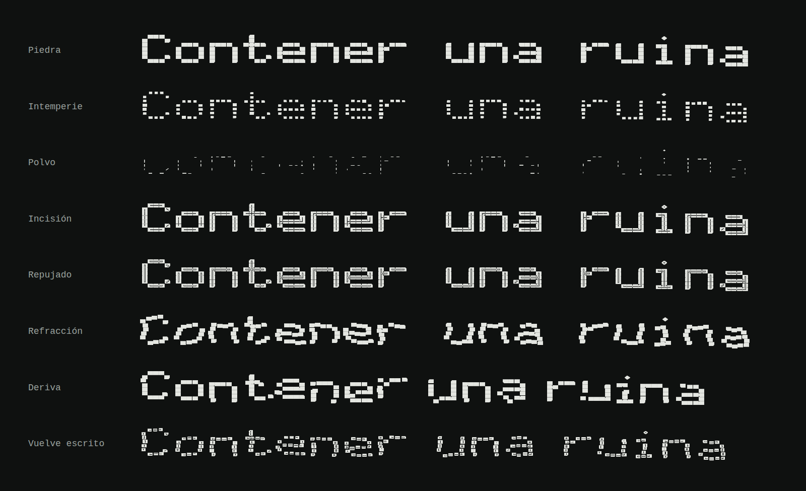
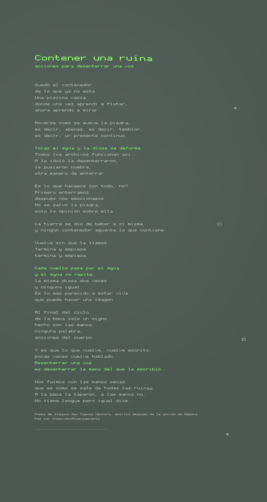

# 4. Ruina: el marco de cuatro ejes

El 28 de septiembre de 2026, después de Vasijas, mandaste un marco para diseñar la tipografía. Proponía cuatro cosas:

- una fuente variable con cuatro ejes que traducen fases materiales de la obra;
- traducciones técnicas de los seis cuadernos de *A Typographic Quest*, de Carl Dair;
- una dimensión transmodal tomada de *EthnoGraphemes*;
- instrucciones para componer el poema en una página.

**Resultado.**

- **Ruina**, la fuente variable del marco (`ruina/`):
  - cuatro ejes: erosión, repujado, onda y retícula;
  - 144 caracteres y tres ligaduras, con cuatro vueltas por letra;
  - once maestros y ocho instancias con nombre.
- **La página del poema**, compuesta con las instrucciones del marco (`ruina/pagina.png`).
- **`vasijas/ruina.html`**: el probador de los ejes, los quiebres, los signos y la página.
- Una lista de lo que cambió respecto del marco y por qué (§ 4.5). Incluye citas que no coinciden con sus fuentes.

## 4.1. Qué se toma del marco

El marco parte de la paradoja del poema: si ningún contenedor retiene lo que contiene, la tipografía no puede ser un conjunto de formas fijas. Propone definir estructuras y comportamientos antes que formas. Coincide con la recomendación del § 2 y con el replanteo del § 3, así que se toma entero.

Queda una tensión. El § 3.1 dice que una fuente cerrada es la botella contra la que advierte la tesis, y el marco vuelve a pedir una fuente. La respuesta está en el propio marco: una tipografía «que acepta su propia condición de ruina». En Ruina cada eje es una fase de un proceso, no un estilo. En reposo la letra es piedra, y todo lo que se le hace la gasta, la marca, la mueve o la suelta.

Ruina usa la misma retícula que Contenedor (`fuente/glifos.py`). Ninguna letra se dibujó a mano: las cuatro fases salen de reglas aplicadas a esa retícula.

## 4.2. Los cuatro ejes

| Eje | En el marco | Regla en Ruina |
|---|---|---|
| `EROD` Erosión, 0 a 100 | La piedra a la intemperie. En 0, masa pétrea, pesada y angulosa; en 100, trazos que pierden continuidad y quedan como incisiones desvanecidas | **0 · Piedra:** las placas encajan con una junta de 3 unidades, como sillares. Cada trazo termina en un corte a 45° (30 unidades) y cada rincón de una unión tiene una trampa (24 unidades). **50 · Intemperie:** la junta sube a 18; cada placa queda entre el 70 y el 92 % según su resistencia, y cada esquina se desprende hasta un 22 %. **100 · Polvo:** desaparecen las placas con resistencia menor que 0,38. Las demás quedan como astillas de 12 a 22 unidades de ancho en la dirección del trazo. Los extremos resisten menos, así que la letra se gasta por las puntas |
| `REFL` Repujado, 0 a 100 | El asperón reemplazado por aluminio de cocina. Abajo, un contorno grabado; arriba, una placa facetada con esquinas prensadas y una doble línea de sombra y brillo | **0:** piedra lisa. **50 · Incisión:** un surco de 16 unidades corre por el esqueleto de la letra, de placa en placa, y se detiene antes de cada extremo. **100 · Repujado:** el surco se abre a 34 unidades y deja un lomo de 16 en el medio, corrido 3 unidades hacia la luz. Quedan dos líneas, una de 6 unidades del lado de la luz y otra de 12 del lado de la sombra. El prensado achaflana cada esquina entre 5 y 12 unidades |
| `ONDA` Onda, 0 a 100 | La luz que atraviesa la bandeja. Los fustes vibran y se desfasan; en el extremo, la palabra se disuelve | Cada fila de placas se corre a los lados hasta 42 unidades (una onda de 4,2 filas). Cada columna sube o baja hasta 22 (una onda de 3,4 columnas). La fase cambia en cada vuelta. En 100 · Refracción los fustes se escalonan; el agua mueve las placas, no las deforma |
| `GRID` Retícula, 0 a 100 | Los azulejos de la piscina. Retícula estricta frente a caracteres que flotan y rompen la línea de base | **0:** monoespaciada; cada letra mide seis azulejos. **100 · Deriva:** cada letra ocupa lo que necesita (sus columnas y una más de aire), y el espacio mide tres azulejos. Cada letra flota hasta 55 unidades arriba o abajo de la línea. Se sueltan y caen la mitad de los extremos, el 12 % de las demás placas y el 60 % de los peces de los acentos |

Hay dos instancias más. **Vuelve escrito** combina los cuatro ejes (erosión 30, repujado 100, onda 40, retícula 50), por el verso «lo que vuelve, vuelve escrito». **Incisión** y **Repujado** son las de 50 y 100 del segundo eje.

**Por qué el azulejo es 1,4 veces más ancho que alto.** El marco pide mayúsculas cuadradas y un ancho de set amplio. Las mayúsculas miden cinco azulejos por siete, así que el azulejo tiene que ser 1,4 veces más ancho que alto para que queden cuadradas (700 × 700 unidades). La proporción sale de la letra, no de la piscina: en la foto de la pared los azulejos parecen cuadrados.

**Por qué el surco sabe adónde ir.** Cada placa sabe con qué vecinas se toca. El surco de una placa llega exactamente al borde por donde toca a la siguiente, y así la incisión es continua aunque la letra esté hecha de piezas. En las diagonales el surco se corta, como un buril que se levanta en una vuelta.

## 4.3. Las traducciones de Dair

Los cuadernos de Dair no llegaron (§ 4.5). Estas son las propuestas del marco tal como vienen, y lo que hace Ruina con cada una.

| Propuesta del marco | En Ruina |
|---|---|
| La contraforma como cuenca, con rebosaderos (vols. 1 y 4) | Ninguna contraforma se cierra. Las esquinas de la o, la a o la e son escalones abiertos, y cada junta entre placas es un rebosadero. La única vasija cerrada es la ligadura `()`, y lleva un pez adentro |
| Los siete contrastes y el quiebre del jazz (vol. 5) | El contraste de estructura está entre la retícula ortogonal y la onda. El quiebre está en cinco palabras del poema (§ 4.4) |
| Ancho de set amplio e interlínea generosa (vol. 3) | Cada letra mide 0,84 em y la línea, 1,38 em. En la página, el interlineado es de 1,8 |
| Ornamentos hechos de puntuación (vol. 6) | `()` es una vasija con un pez; `[]`, un azulejo vacío; `\|\|`, el nivel del agua. Repetidos, dan escamas, una pared y una línea de agua |
| El glifo-boca | El asterisco es un signo sellado que enmarca un pez. En «boca», la o se cambia por él |

## 4.4. Quiebres, vueltas y ligaduras

- **`calt`:** las cuatro vueltas se encadenan como en Contenedor, así que la misma letra dos veces no se erosiona, ni ondula, ni flota igual. En reposo las vueltas son idénticas. Además, en «boca» la o es el glifo-boca: a la boca la taparon.
- **`kern`:** cinco palabras se quiebran, solo cuando están enteras.
  - **agua:** las letras suben y bajan (36 y −26 unidades) y se separan un poco. «Aguanta», que tiene agua adentro, no se quiebra.
  - **piedra:** una falla. «pie» se queda, se abre una grieta y «dra» cae 40 unidades.
  - **ruina y ruinas:** cada letra se hunde más que la anterior, hasta 120 unidades.
  - **voz:** sale de abajo de la línea, como desenterrándose.
- **`liga`:** la vasija, el azulejo y el nivel del agua.

Se apagan con `font-feature-settings: "calt" 0, "liga" 0` y `font-kerning: none`.

## 4.5. Lo que cambió del marco, y por qué

| El marco | Ruina | Por qué |
|---|---|---|
| Llamarla «Ruina Variable» o «Kochamama Mono» | Ruina | El poema dice que ponerle nombre a la ídolo fue otra manera de enterrar. Una fuente llamada Kochamama repetiría el gesto (§ 3.7) |
| Remates con aleta de pez «inspirados en los bajorrelieves de Akapana»; fustes inspirados en la arquitectura monolítica de Tiwanaku; corchetes que arman el escalonado andino | Nada de eso | Es lo que el mismo marco, siguiendo a Morcos, pide no hacer: agregarle al latín adornos que fetichizan otra cultura. El pez sigue siendo el de Contenedor, un azulejo desprendido y girado. Los corchetes arman un azulejo. Por coherencia, el calderón de Ruina no es el escalonado que tiene Contenedor (§ 3.7), sino un calderón de imprenta |
| Ondulaciones en juegos estilísticos (`ss01`, `ss02`) | Un eje continuo, `ONDA` | El agua no tiene dos estados |
| El glifo-boca en el punto final o en el asterisco | En el asterisco y en la o de «boca» | Cambiar el punto haría ilegible cualquier texto |
| Cimática en *EthnoGraphemes*, pp. 33–35 | Está en el proyecto *Sonic typeface*, dentro de «Transmodaling» (p. 42 en adelante) | Cotejado con el texto de la tesis |
| Estudio caligráfico de Sora Sompeng, pp. 84–90 | El tipo Sora Sompeng, con sus versiones monolineal y caligráfica, está en *Ellipsis* (p. 154 en adelante) | Cotejado con el texto de la tesis |
| Trampas de tinta en *EthnoGraphemes*, p. 43 | La tesis no habla de trampas de tinta | Las trampas de Ruina salen de la obra (el líquido que retiene la unión), no de la tesis |
| Morcos «denomina» *Frankenstein typography* | Morcos usa la expresión citando a Nadine Chahine | Entrevista con Wael Morcos (p. 102) |
| Páginas de *A Typographic Quest* (vols. 1 a 6) | Sin verificar | De los seis libros que mencionaste llegó uno, el de Kimberly Elam. Si los otros cinco son los cuadernos de Dair, con subirlos se pueden cotejar |
| «Monolito Kochamama (asperón rojo de 1903)» | Asperón colorado; según Posnansky, excavado en 1903 | La fecha es de la excavación, no de la piedra, y conviene atribuirla (§ 1, fila 3) |
| Una licencia abierta | Por definir | La SIL Open Font License es la opción habitual para fuentes libres. Conviene decidirlo con Rebeca, porque la fuente sale de su obra |

## 4.6. La página del poema

Sigue las cuatro instrucciones de la sección VI del marco:

1. **La mancha:** una columna angosta, en bandera, sin justificar. Su ancho es el del verso más largo, así que ningún verso se parte. En pantallas angostas los versos largos se parten con sangría, como en los libros de poesía.
2. **Color:**
   - el fondo es gris verdoso apagado, el azulejo bajo el agua (`#4C5952`);
   - la letra es gris plateada, con un degradado de brillo por línea, el aluminio;
   - el verde fósforo (`#8CFF6B`) va solo en el título y en cinco versos. Tres nombran el agua («Tocas el agua y la diosa se deforma.», «Cada vuelta pasa por el agua / y el agua no repite,») y dos, la voz desenterrada («Desenterrar una voz / es desenterrar la mano del que la escribió.»);
   - los versos del agua llevan onda 45.
3. **El vacío:** la columna ocupa la mitad del ancho y la mancha, menos de dos quintos de la página. El resto queda vacío, como si el bloque estuviera suspendido en el fondo de una piscina seca.
4. **Los signos sueltos:** en el margen exterior hay cuatro signos-pez (dos peces, una vasija y un glifo-boca), repujados, en retícula libre y apenas girados, como baldosas desprendidas. Abajo, una línea de plecas marca el nivel del agua que ya no está.

**El título.** El poema no tiene título. La página lo encabeza con el de la obra, «Contener una ruina: acciones para desenterrar una voz», que además nombra la voz desenterrada. Al pie dice de quién es el poema y sobre qué obra está escrito. Si el poema tiene título, se cambia en `vasijas/plantillas/ruina.html`.

## 4.7. Cómo está hecha

`ruina/generar_ruina.py` lee la retícula de `fuente/glifos.py` y aplica las reglas del § 4.2. Las constantes del comienzo (`JUNTA`, `CINCEL`, `TRAMPA`, `SURCO`, `LOMO`, `ONDA_X`, `FLOTA_Y`, etc.) son las reglas: al cambiar una, se regenera todo.

- **Cada placa es tres contornos:** el cuerpo (un octógono con sus cortes), el surco (un hueco) y el lomo (una isla dentro del hueco). En los estados donde no hay surco, el surco y el lomo se reducen a un punto.
- **Los maestros:** la erosión y el repujado se multiplican (el surco depende del tamaño de la placa), así que hay un maestro en cada cruce de 0, 50 y 100 de los dos ejes. Son nueve, más uno de onda y uno de retícula. Onda y retícula solo trasladan placas y se suman sin maestros de cruce.
- **Comprobación:** `--comprobar` instancia la fuente en 100 combinaciones de los cuatro ejes (0, 25, 50, 75 y 100 de erosión y repujado, con y sin onda y retícula). En cada una revisa cada placa: que ningún contorno se invierta, que el surco quede dentro de la placa y que el lomo quede dentro del surco. Resultado: ningún problema.
- **Tamaño:** la fuente variable pesa unos 2 MB en TTF y 350 KB en WOFF2. Las ocho instancias estáticas están en `ruina/estaticas/`.
- **Tamaños de uso:** el repujado se ve desde unos 40 píxeles; más chica, la letra vuelve a ser piedra. No tiene hinting. Por debajo de unos 14 píxeles la retícula se empasta.

## 4.8. Qué falta

- Imprimir la página (risografía o impresión digital sobre papel gris verdoso) y probar la tinta plateada.
- Usar Repujado como guía para repujar de verdad: la doble línea marca por dónde empujar el aluminio.
- Cotejar las páginas de Dair con los cuadernos.
- Decidir el nombre final y la licencia con Rebeca.
