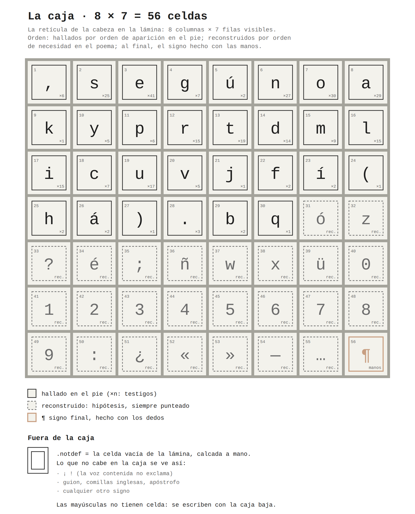

# *Contenida*: acciones para componer una voz

Proyecto tipográfico en homenaje a *Contener una ruina: acciones para desenterrar una voz*, de Rebeca Paz Prada con CreaciónxAcuerpamiento (Artefacto Tatuajes, Sopocachi, La Paz, 22 de agosto de 2026).

**Referencias de método:**

- Vaishnavi Mahendran, *EthnoGraphemes: Scripts as Vessels for Culture* (RISD, 2020);
- Osmond Tshuma, *Afrography: Scripting Futures Anchored in Culture & Community* (RISD, 2025).

**El orden:** primero analógico. Después, digital, solo si cierra.

## La idea en siete líneas

1. **Las letras salen del pie de la lámina que Rebeca usó.** Ella tomó lo que la lámina muestra; la tipografía toma lo que la lámina dice.
2. **Lo hallado y lo reconstruido se distinguen siempre**, en línea continua y en punteado. De 55 signos, el pie da 30 y hay que reconstruir 25: entre ellos, las diez cifras, porque el pie no trae ningún número, y la z de «voz».
3. **La caja tiene 56 celdas**, las de la retícula de la cabeza en la lámina. Lo que no cabe se ve como celda vacía: la celda de la lámina, calcada a mano.
4. **Una letra, una celda.** La de la cabeza del ídolo, 0,84 de ancho por alto. Monoespaciada, solo caja baja: la letra de la mano, no la del monumento. La piscina no mide la letra: la recibe, y sus juntas la cortan.
5. **Las letras son placas de papel de aluminio repujado**, el material de Rebeca. Sueltas, como tipos móviles: 119 placas, 94 de ellas para componer el poema verso a verso sin repetir placa.
6. **No hay Regular.** Los estilos son estados de la letra: *Calco*, *Placa*, *Cinta*, *Frotado* (el peso se mide en frotadas), *Agua* y *Voz*. *Piel*, *Copia* y *Azulejo* quedan en pausa.
7. **Lo digital es un estado más.** Vuelve a pasar por el agua y vuelve a ser placa: «termina y empieza».



## Archivos

| Archivo | Contenido |
|---|---|
| `01_la_obra_decision_por_decision.md` | Las 16 decisiones de la obra, con su procedencia. Lo que muestran los videos y las fotos. Lo que se deja afuera |
| `02_lo_que_se_toma_de_dos_tesis.md` | Qué se toma de *EthnoGraphemes* y de *Afrography*, con citas cotejadas, qué no y dónde el proyecto se aparta de las dos |
| `03_sistema_contenida.md` | **El sistema.** Nombre, nueve reglas, el cuadro de correspondencias (cada decisión de la obra y su traducción), el pie, la caja, la pauta, la familia, la póliza, el color, el signo final y el colofón |
| `03b_anatomia.md` | **La anatomía.** Del pie, el esqueleto; de la obra, el cuerpo: canal, desagüe, bandeja, lluvia, gotas, puntos-tesela, tildes-gota, onda, asta en la retícula, líneas con nombres de la piscina y cifras en celdas |
| `03c_gramatica.md` | **La gramática.** Anatomía base → estados. Parámetros que salen de la obra (canal, cuenca, hombro, facetas, asiento, intemperie, alivio, gota, sifón, punto de cinta), los cuatro generadores (o, l, n, a), cómo se arman con ellos los 55 signos y un estado nuevo, *Cinta*. Reemplaza a `03b` |
| `04_taller_analogico.md` | **El taller.** Trece acciones en tres cuadernos (*Desenterrar*, *Contener*, *Devolver*), con materiales, pasos, registro y seguridad; y tres en pausa |
| `05_migracion_digital.md` | Cuándo es coherente migrar, cómo digitalizar, la especificación de la fuente, el espécimen web y cómo cierra el ciclo |
| `06_etica_fuentes_y_pendientes.md` | Consentimiento, créditos, lo verificado y lo que falta verificar, y los pendientes en orden |
| `textos/pie_de_lamina.txt`, `textos/poema.txt` | Los dos textos fuente |
| `textos/inventario.md` | Hallados, reconstruidos, la caja, la póliza y los versos (generado) |
| `inventario.py` | Recalcula el inventario desde los textos |
| `esquemas/` | La caja, la pauta de calco 1:1, la ficha de hallazgo, la cadena de estados y los montajes con agua (SVG y PNG), y `plantillas_imprimibles.pdf` |
| `esquemas/generar_esquemas.py` | Regenera los esquemas con las medidas reales de la piscina |
| `simulacion/informe.md` | **La propuesta de la máquina:** el pie, la gramática y seis estados simulados con código (calco, placa, cinta, frotado, agua y voz), con sus láminas, 119 fichas y lo que apareció sin diseñarlo. Para confrontarla con la tuya |
| `simulacion/simular.py` | Corre la simulación (`comun.py`, `desenterrar.py`, `gramatica.py`, `contener.py`, `devolver.py`) |
| `simulacion/extraer_testigos.py`, `simulacion/testigos/` | El pie en la foto de la lámina: 336 letras recortadas y enderezadas, y lo que la foto deja medir (sin la foto) |
| `07_posnansky.md` | Lo que se rescata del libro de Posnansky (tomo I, 1945), y el testigo: lo que se probó y lo que quedó |
| `08_nombres.md` | **Propuesta** de nombres: por qué seguir con *Contenida*, qué otras candidatas hay y los estilos como participios (*Calcada*, *Repujada*, *Tapada*, *Frotada 01*…) |
| `laminas/` | **Las láminas de exposición:** diecisiete láminas 4:3 (PNG y PDF), al modo de las dos tesis: la obra, el sistema, el taller simulado y lo que queda |
| `informe/` | **El informe de decisiones** (.docx y PDF), con seis mapas dibujados a mano (con código) que conectan conceptos, teoría, retórica y poética en cada etapa |
| `aplicacion/` | **La gramática en el navegador:** la ficha de parámetros, la caja, el signo con sus partes, el texto compuesto y los seis estados. Exporta `parametros.json` para `simular.py --parametros` |

## Estado

- **Hecho:**
  - el plan completo del proyecto y las plantillas para empezar el taller;
  - la propuesta de la máquina (`simulacion/`): el taller simulado, para confrontarla con la propuesta de la mano;
  - la gramática en el navegador (`aplicacion/`), para discutir cada parámetro;
  - el informe de decisiones, con sus mapas (`informe/`);
  - las láminas para exponerlo (`laminas/`).
- **Sin hacer:** las letras de la caja. Las hace la mano, desde la Acción 3.
- **Lo primero:** la Acción 0, hablar con Rebeca (`04`).

## Regenerar

```bash
pip install pillow numpy opencv-python-headless scikit-image scipy shapely
python3 tipografia/inventario.py                    # después de corregir textos/pie_de_lamina.txt
python3 tipografia/simulacion/extraer_testigos.py \
  RUTA/A/LA/FOTO_DEL_PIE                            # solo si cambia la foto (necesita tesseract, spa)
python3 tipografia/simulacion/gramatica.py          # la gramática: los 55 cuerpos base y la cinta
python3 tipografia/esquemas/generar_esquemas.py \
  --azulejo 150                                     # la placa, en mm; la pauta toma las líneas de la gramática
python3 tipografia/simulacion/simular.py            # la propuesta de la máquina (un minuto y medio);
                                                    #   con --parametros parametros.json, los ajustes de la aplicación
python3 tipografia/aplicacion/exportar.py           # los datos del pie para la aplicación
python3 tipografia/informe/mapas.py                 # los mapas del informe
python3 tipografia/informe/armar.py                 # el informe de decisiones (.docx y PDF; necesita node y docx)
python3 tipografia/laminas/imagenes.py              # las láminas de exposición
python3 tipografia/laminas/generar_laminas.py       #   (los esquemas y las láminas necesitan Chromium: CHROME)
```
