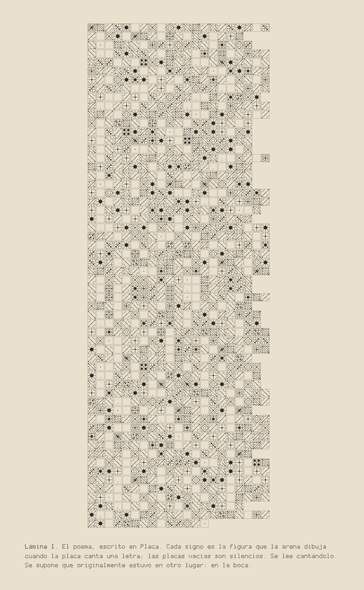
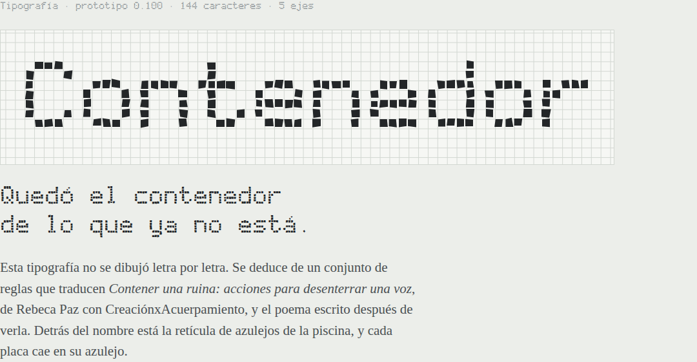

# Tipografía para *Contener una ruina*

Traducciones tipográficas de *Contener una ruina: acciones para desenterrar una voz*, de Rebeca Paz con CreaciónxAcuerpamiento (Artefacto Tatuajes, Sopocachi, La Paz, 22 de agosto de 2026), y del poema escrito después de verla (`poema.txt`).

El proyecto tiene tres etapas:

1. **Contenedor** (`fuente/`, `muestrario/`). Una fuente variable deducida de reglas. Es la primera versión.
2. **Vasijas** (`vasijas/`). El replanteo que siguió a la lectura de *EthnoGraphemes*, de Vaishnavi Mahendran. Son cuatro piezas donde la letra solo existe de paso (por el agua, por la voz, por el cuerpo, por el desgaste), más Placa, una escritura que se canta y no se lee. Por qué cambió el enfoque está en `03_replanteo_vasijas.md`.
3. **Ruina** (`ruina/`). La fuente del marco de cuatro ejes que llegó después: erosión, repujado, onda y retícula, con el poema compuesto en una página. Qué se tomó del marco y qué cambió está en `04_ruina.md`.

Las fotos, los videos y el audio de la obra no están en el repositorio: las piezas usan solo datos derivados de ellos y pueden abrir los archivos localmente (`03_replanteo_vasijas.md`, § 3.7).

## Ruina


| Archivo | Contenido |
|---|---|
| `04_ruina.md` | Qué se toma del marco, las reglas de cada eje, las traducciones de Dair, los quiebres, lo que cambió y por qué, la página y cómo está hecha |
| `ruina/Ruina-Variable.ttf` y `.woff2` | La fuente variable: 144 caracteres y tres ligaduras, cuatro vueltas por letra, once maestros |
| `ruina/estaticas/` | Ocho instancias fijas: Piedra, Intemperie, Polvo, Incisión, Repujado, Refracción, Deriva y Vuelve escrito |
| `ruina/generar_ruina.py` | Aplica las reglas a la retícula de `fuente/glifos.py` y genera la fuente; con `--comprobar`, revisa 100 combinaciones de los ejes |
| `ruina/pagina.png` | El poema compuesto con las instrucciones del marco |
| `ruina/muestra.png` | Las ocho instancias |
| `ruina/capturar.js` | Guarda las dos imágenes a partir de `vasijas/ruina.html` |
| `vasijas/ruina.html` | Probador de los cuatro ejes, quiebres, signos, la página y lo que cambió del marco |

| Eje | Rango | Instancias |
|---|---|---|
| `EROD` Erosión | 0 a 100 | Piedra (0), Intemperie (50), Polvo (100) |
| `REFL` Repujado | 0 a 100 | Incisión (50), Repujado (100) |
| `ONDA` Onda | 0 a 100 | Refracción (100) |
| `GRID` Retícula | 0 a 100 | Deriva (100) |

Vuelve escrito combina los cuatro (erosión 30, repujado 100, onda 40, retícula 50).

- **`calt`:** las vueltas, y el glifo-boca en la o de «boca».
- **`kern`:** los quiebres de «agua», «piedra», «ruina», «ruinas» y «voz».
- **`liga`:** `()` vasija con un pez, `[]` azulejo, `||` nivel del agua.
- **El asterisco** es el glifo-boca.

```css
@font-face { font-family: "Ruina"; src: url("Ruina-Variable.woff2") format("woff2"); }
.poema {
  font-family: "Ruina", monospace;
  font-variation-settings: "EROD" 0, "REFL" 50, "ONDA" 0, "GRID" 0;
  font-kerning: normal;   /* los quiebres */
}
```


Para regenerar:

```bash
pip install fonttools brotli skia-pathops
python3 tipografia/ruina/generar_ruina.py --comprobar   # la fuente, las instancias y la revisión
python3 tipografia/vasijas/armar.py                     # las páginas, incluida ruina.html
NODE_PATH=... node tipografia/ruina/capturar.js         # pagina.png y muestra.png (Playwright, Chromium)
```

## Vasijas



| Archivo | Contenido |
|---|---|
| `03_replanteo_vasijas.md` | Qué era convencional en la primera versión, qué propone la tesis, las tres piezas, otras vasijas posibles, el método, los cuidados y lo que falta |
| `vasijas/index.html` | Portada de Vasijas |
| `vasijas/agua.html` | **Tocas el agua:** el poema solo llega refractado por el agua hasta la pared de azulejo; tocarlo lo deforma, con eco |
| `vasijas/placa.html` | **La voz sobre la placa:** cada letra es un modo de vibración de una placa de aluminio; la arena dibuja el signo y una voz grave lo canta |
| `vasijas/espalda.html` | **Espalda:** las ocho placas de la foto de espalda son marcos de texto enlazados; el poema recorre el cuerpo y lo que no cabe se derrama |
| `vasijas/cadena.html` | **La cadena:** una palabra recorre piedra, erosión, fotografía, lámina, escaneo, repujado, cuerpo, agua y pared, y la vuelta siguiente parte de la pared |
| `vasijas/placa/Placa.ttf` y `.woff2` | Placa, la escritura de las figuras de Chladni (47 glifos) |
| `vasijas/placa/lamina.png` | El poema completo escrito en Placa |
| `vasijas/placa/canto.json` | El contorno del canto de los videos (altura, intensidad y golpes cada 50 ms), sin el audio |
| `vasijas/placa/modos.py`, `generar_placa.py` | El modo de cada letra y la generación de la fuente |
| `vasijas/plantillas/`, `vasijas/armar.py` | Las páginas antes de incrustarles las fuentes y el poema |

Las páginas se abren en cualquier navegador, sin servidor. Para regenerarlas:

```bash
pip install fonttools brotli numpy skia-pathops
python3 tipografia/vasijas/placa/generar_placa.py   # la fuente Placa y modos.json
python3 tipografia/vasijas/armar.py                 # las páginas (necesita Ruina ya generada)
```

## Contenedor (primera versión)

Ninguna letra se dibujó a mano. La fuente se deduce de un conjunto de reglas escritas como programa: la retícula de azulejos de la piscina, las placas con piel entre ellas, los terminales que se desprenden, los puntos como peces, el agua que cada letra retiene. Las reglas y su origen están en `02_traducciones.md`.



### Qué tiene

- **144 caracteres:** castellano, las vocales largas del aimara (ä, ï, ü), el apóstrofo de las consonantes glotalizadas (ʼ) y cuatro ornamentos.
- **Cuatro vueltas de cada carácter.** La función `calt` las alterna para que la misma letra repetida no salga igual.
- **Cinco ejes:**

| Eje | Rango | Instancias |
|---|---|---|
| `wdth` Ancho | 60 a 150 | Monolito (60), Piscina (150) |
| `wght` Peso | 100 a 900 | Piel (100), Seca (400), Piedra (900) |
| `AGUA` Agua | 0 a 100 | Agua (100) |
| `VASO` Vaso | 0 a 100 | Vaso (100) |
| `TEMB` Temblor | 0 a 100 | Temblor (100) |

Hay además dos instancias combinadas: Presente continuo (temblor 55, agua 35) y Ruina (peso 900, vaso 60, temblor 100).

- **Tres juegos estilísticos:** `ss01` Boca tapada, `ss02` Ojos tapados, `ss03` Agua devuelta. El agua sale verde donde el programa sabe de color y del color del texto donde no.

### Archivos

| Archivo | Contenido |
|---|---|
| `01_verificacion_posnansky.md` | Qué se sostiene y qué no del párrafo sobre la lámina de Posnansky, con fuentes |
| `02_traducciones.md` | La decisión entre estructuras y formas, la tabla de traducciones, el color, qué letras contienen y lo que falta |
| `poema.txt` | El poema, tal como se compone en el muestrario |
| `fuente/Contenedor-Variable.ttf` y `.woff2` | La fuente variable |
| `fuente/estaticas/` | Diez instancias fijas, para programas que no manejan fuentes variables |
| `fuente/glifos.py` | La retícula de cada carácter |
| `fuente/vasos.py` | Calcula qué letras retienen agua |
| `fuente/generar_fuente.py` | Aplica las reglas y genera la fuente |
| `muestrario/index.html` | Muestrario interactivo: probador, ejes, contrastes, vasos, poema y repertorio |
| `muestrario/0*.png` | Capturas de cada sección del muestrario |
| `muestrario/plantilla.html`, `generar_muestrario.py`, `capturar.js` | Arman el muestrario y sus capturas |

### Usarla en una página web

```css
@font-face {
  font-family: "Contenedor";
  src: url("Contenedor-Variable.woff2") format("woff2");
}
.poema {
  font-family: "Contenedor", monospace;
  font-variation-settings: "wdth" 100, "wght" 400, "AGUA" 0, "VASO" 0, "TEMB" 0;
  font-feature-settings: "calt" 1, "ss03" 1;   /* ciclo de vueltas y agua devuelta */
}
```

El color del agua se cambia con `@font-palette-values` y `override-colors: 0 <color>`.

### Regenerar

```bash
pip install fonttools brotli
python3 tipografia/fuente/generar_fuente.py            # la fuente y las instancias
python3 tipografia/muestrario/generar_muestrario.py    # el muestrario
python3 tipografia/muestrario/generar_muestrario.py --png   # y sus capturas (Node, Playwright, Chromium)
python3 tipografia/fuente/vasos.py                     # la tabla de lo que contiene cada letra
```

La retícula de cada letra está en `glifos.py` y las reglas, como constantes al comienzo de `generar_fuente.py` (`PIEL`, `MANO`, `ONDA`, `TEMBLOR`, etc.). Al cambiar una, se regenera todo.

### Comprobaciones

- Las 243 combinaciones de mínimo, defecto y máximo de los cinco ejes se instanciaron y se revisó la orientación de cada contorno: ninguno se invierte.
- El ciclo de vueltas se probó con HarfBuzz: «diosa diosa diosa» sale en tres combinaciones distintas.
- La fuente y el muestrario se probaron en Chromium, incluido el verde del agua.

### Estado

Prototipo 0.100. El nombre es provisional y la licencia está por definir (ver `02_traducciones.md`, § 2.6).
