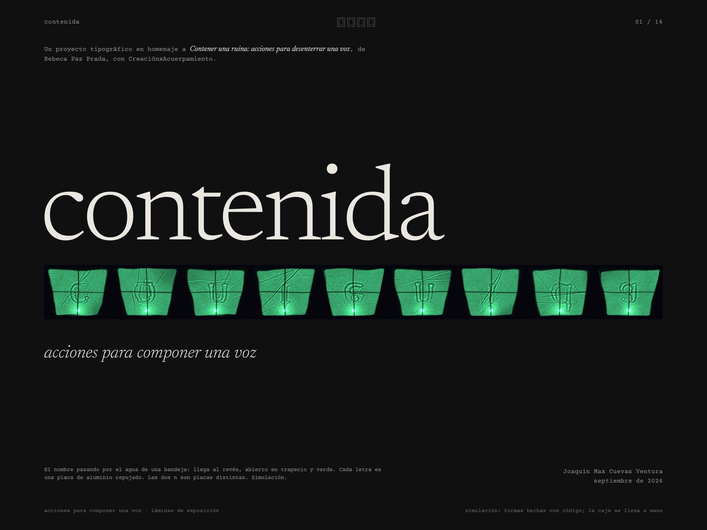

# Láminas de exposición

Dieciséis láminas 4:3 para mostrar *Contenida*: la obra de la que sale, el sistema, el taller simulado y lo que queda. Siguen el modo de las dos tesis de referencia: fichas con rótulo y valor, como en *Afrography*; figuras numeradas con su leyenda y mucho blanco, como en *EthnoGraphemes*.

- `png/`: cada lámina a 2400 × 1800 px.
- `contenida_laminas.pdf`: las dieciséis, una por página.
- `html/`: las páginas de las que salen las dos cosas anteriores. Se abren en un navegador.



## Las dieciséis

| Nº | Lámina | Capítulo |
|---|---|---|
| 01 | contenida (portada) | — |
| 02 | una piscina vacía | 1 · la obra |
| 03 | lo que dice la lámina | 1 · la obra |
| 04 | dos tesis, un método | 1 · la obra |
| 05 | 56 celdas | 2 · el sistema |
| 06 | la piscina es la pauta | 2 · el sistema |
| 07 | del pie, el esqueleto; de la obra, el cuerpo | 2 · el sistema |
| 08 | doce reglas | 2 · el sistema |
| 09 | no hay regular | 2 · el sistema |
| 10 | la propuesta de la máquina | 3 · el taller simulado |
| 11 | piel y copia | 3 · el taller simulado |
| 12 | agua y voz | 3 · el taller simulado |
| 13 | la letra llega a la pared | 3 · el taller simulado |
| 14 | una letra de punta a punta | 3 · el taller simulado |
| 15 | lo que apareció sin buscarlo | 4 · lo que queda |
| 16 | lo que sigue (y colofón) | 4 · lo que queda |

## Decisiones

- **La retícula es la de la piscina:** 16 × 12 azulejos de 150 px, con un azulejo de margen. La lámina 06 la deja ver.
- **La marca de capítulo** son cuatro celdas de la cabeza del ídolo, cada una con su desagüe abajo. La del capítulo en curso lleva el centro violeta.
- **El color es el del proyecto.** El violeta es tinta: versos, testigos y lo reconstruido. El verde solo aparece como luz, en las fotos del agua.
- **Las cifras son elzevirianas**, como las de *Contenida*.
- **Los títulos van en caja baja.**
- **Los textos dicen hechos.** Los versos del poema hacen el resto.
- **Los números no se escriben a mano:** salen de las fichas de la simulación (`../simulacion/salida/fichas_simuladas.json`).
- **Cada lámina con imágenes simuladas lo dice al pie.** Ninguna de esas formas entra en la caja ni en la fuente.
- **No hay fotos de la obra ni del cuerpo de Rebeca.** El montaje de la lámina 02 es un esquema dibujado a partir de los videos.

## Letras

- **Newsreader** (Production Type), para el texto.
- **Courier Prime** (Alan Dague-Greene), para fichas y leyendas: una monoespaciada de máquina de escribir, como la del poema.

Las dos tienen licencia SIL OFL (`fuentes/LICENSE_*.txt`).

## Regenerar

Desde la raíz del repositorio, después de `simular.py`:

```bash
python3 tipografia/laminas/imagenes.py          # recortes y las pocas imágenes que se rehacen más grandes
python3 tipografia/laminas/generar_laminas.py   # HTML → PNG y PDF; necesita Chromium (variable CHROME)
```

`imagenes.py` repite con la misma semilla las placas que la portada y la lámina 12 muestran grandes: la palabra «contenida» en el agua y la «a» quieta, tocada y con voz.
