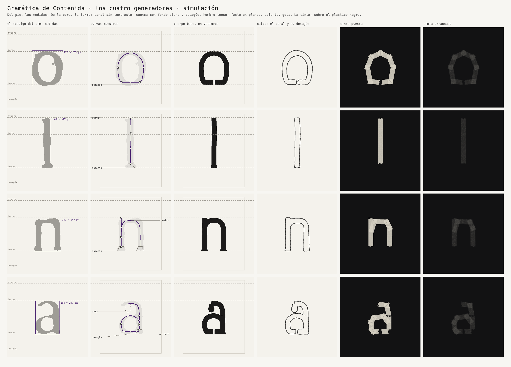
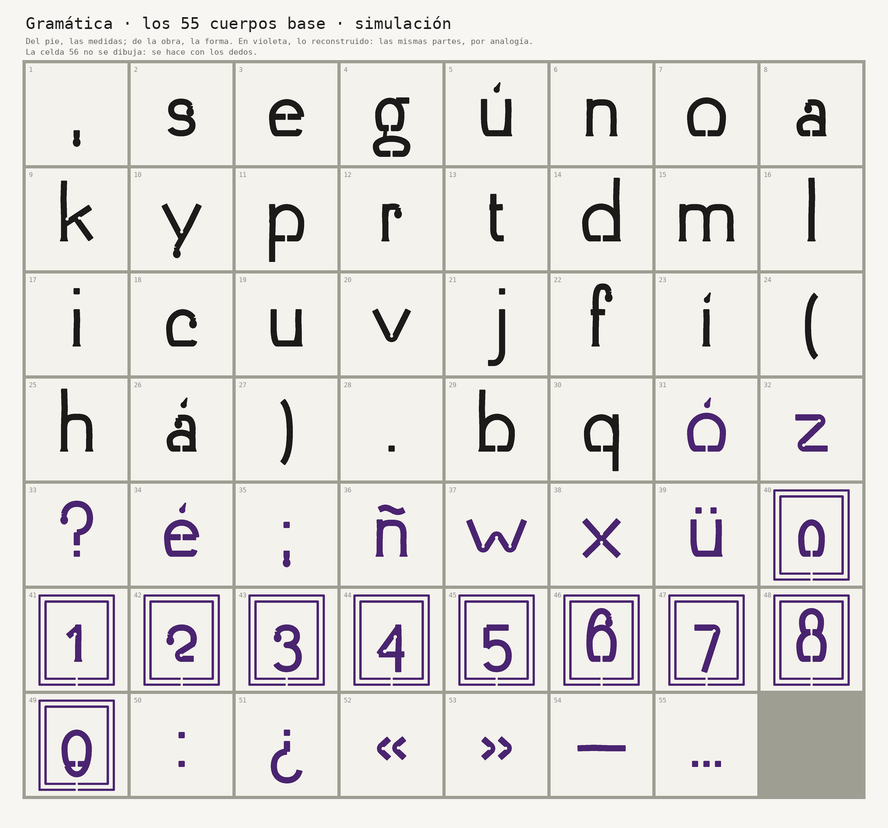
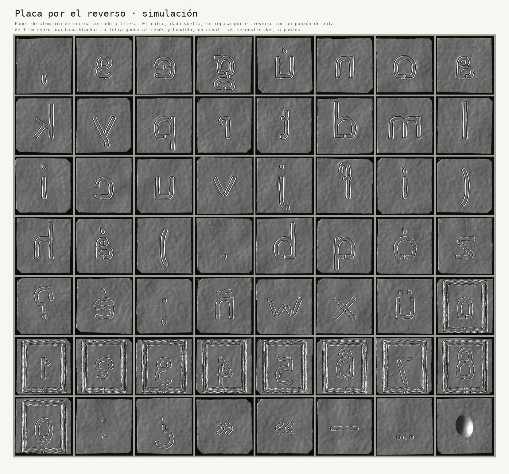
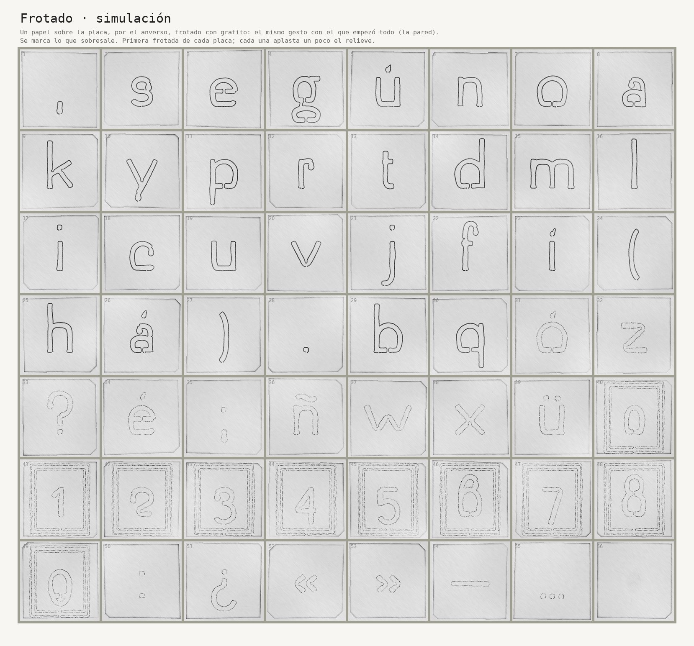
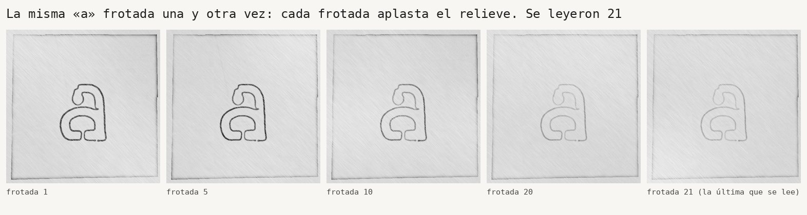
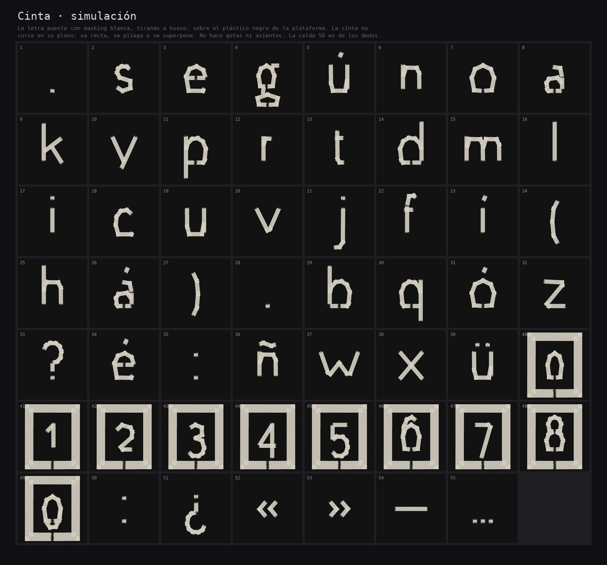
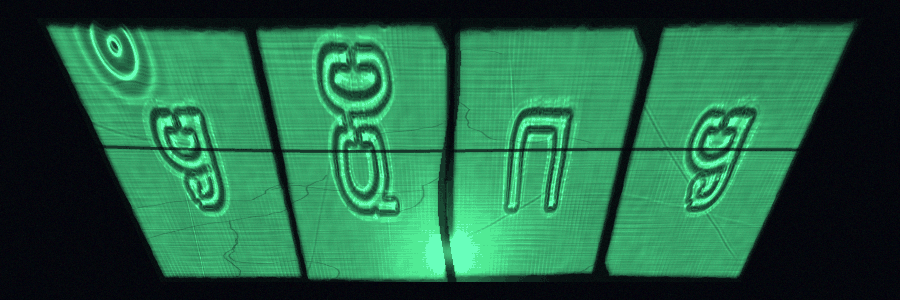

# La propuesta de la máquina: el taller simulado

Generado por `simular.py`. Es una **hipótesis hecha por código**, para confrontarla con la que se haga a mano. Ninguna de estas formas entra en la caja ni en la fuente: la caja se llena con placas repujadas por una persona.

La semilla es fija (el 22 de agosto de 2026): el resultado es siempre el mismo. Cambiarla es cambiar de mano.

La máquina simula seis estados del taller: **calco, placa, frotado, cinta, agua y voz**. Antes arma el testigo del pie y la gramática, que da el cuerpo base de cada signo.

## Lo que la máquina tuvo que suponer

- **El testigo de las formas.** El pie está en la foto de la lámina, pero la foto no alcanza para calcar: la altura de x mide unos 12 px y la tinta se corrió; los ojos de la a y de la e se cierran. Las formas del testigo salen de una letra de imprenta parecida, **LiberationSerif-Regular**, impresa con tipos de plomo simulados. La foto queda para mirar el pie real y para medirlo (más abajo, *Lo que dice la foto*).
- **El cuerpo del pie:** 8,5 puntos.
- **La piscina:** azulejo de 150 mm y junta de 3 mm, hasta que se mida. La pared da el frotado sobre el que se calca.
- **La celda:** 0,84 de ancho por alto, la proporción de las celdas de la cabeza del ídolo. En la foto cercana de la cabeza, el paso de la retícula de 8 × 7 mide 0,81 en los bordes y 0,91 al centro (promedio 0,86): el dibujo curva la cabeza como un cilindro. El 0,84 cae dentro.
- **El frotado:** cada frotada aplasta entre un 5 y un 9 % del relieve del surco. Es un supuesto: se mide frotando.
- **La voz:** no es la tuya. Es el ritmo silábico del poema, con alturas inventadas entre 110 y 220 Hz.
- **El signo final:** la máquina no tiene dedos. Simula una sola presión de un pulgar genérico.

## El pie

Para cada signo hallado, la máquina amplió todos sus testigos en tres generaciones de fotocopia y eligió el mejor conservado: el que tiene las partes que debe tener (la i, dos) y el borde menos roto. La *opinión* es cuánto del borde tuvo que decidir al limpiar.

| Celda | Signo | Testigo elegido | Palabra | Línea | Opinión |
|---|---|---|---|---|---|
| 1 | `,` | 3 de 6 | reconstructivo, | 1 | 5,8 % |
| 2 | `s` | 7 de 25 | viejas | 1 | 1,0 % |
| 3 | `e` | 18 de 41 | bien | 2 | 0,7 % |
| 4 | `g` | 3 de 7 | fotografías | 1 | 1,4 % |
| 5 | `ú` | 2 de 2 | según | 1 | 0,5 % |
| 6 | `n` | 9 de 27 | no | 2 | 0,5 % |
| 7 | `o` | 28 de 30 | donde | 3 | 0,8 % |
| 8 | `a` | 8 de 29 | erosionado | 2 | 1,0 % |
| 9 | `k` | 1 de 1 | Posnansky, | 1 | 1,7 % |
| 10 | `y` | 2 de 5 | (hoy | 1 | 0,8 % |
| 11 | `p` | 4 de 6 | Suponemos | 3 | 1,2 % |
| 12 | `r` | 1 de 15 | presentado | 1 | 0,6 % |
| 13 | `t` | 11 de 19 | distinto | 2 | 0,5 % |
| 14 | `d` | 3 de 14 | erosionado | 2 | 0,8 % |
| 15 | `m` | 8 de 9 | originariamente | 3 | 0,5 % |
| 16 | `l` | 10 de 15 | Sol | 2 | 0,4 % |
| 17 | `i` | 11 de 15 | motivos | 3 | 0,6 % |
| 18 | `c` | 6 de 7 | encontraba | 3 | 2,0 % |
| 19 | `u` | 14 de 17 | luego | 3 | 0,6 % |
| 20 | `v` | 4 de 5 | todavía | 2 | 1,2 % |
| 21 | `j` | 1 de 1 | viejas | 1 | 0,6 % |
| 22 | `f` | 1 de 2 | fotografías | 1 | 0,7 % |
| 23 | `í` | 1 de 2 | fotografías | 1 | 2,2 % |
| 24 | `(` | 1 de 1 | (hoy | 1 | 2,0 % |
| 25 | `h` | 1 de 2 | (hoy | 1 | 0,4 % |
| 26 | `á` | 1 de 2 | está | 2 | 0,8 % |
| 27 | `)` | 1 de 1 | detalles). | 2 | 2,0 % |
| 28 | `.` | 2 de 3 | antiguos. | 3 | 10,9 % |
| 29 | `b` | 2 de 2 | encontraba | 3 | 1,3 % |
| 30 | `q` | 1 de 1 | que | 3 | 0,5 % |

### Lo que dice la foto

`extraer_testigos.py` endereza las cuatro líneas de la foto (la tercera sube sobre el pliegue del papel), deshace en parte el desenfoque y corta cada palabra en sus letras, como con tijera. Las 336 letras quedan en `testigos/`, sin la foto. Lo que se puede medir, contra el sustituto:

| Medida | La foto | El sustituto |
|---|---|---|
| Altura de x | 11,7 px de foto | — |
| Ascendentes, sobre la altura de x | 1,71 | 1,72 |
| Descendentes, sobre la altura de x | 0,43 | 0,55 |
| Trazo, sobre la altura de x | 0,19 o más | 0,16 (el canal) |
| Desenfoque de la foto | σ = 1,66 px | — |

El trazo se mide por la tinta que junta, no por su borde: el desenfoque corre la tinta, pero no cambia cuánta hay. En 57 trazos aislados, el pico y la tinta total dan el desenfoque; la tinta llena no se puede despejar, porque todos los trazos son más finos que el desenfoque. Se la toma como negro pleno, y el ancho que resulta es un mínimo. El pie real tiene ascendentes más largas, descendentes más cortas y un trazo más grueso que el sustituto.

## La gramática

La anatomía base se construye antes de los estados, en vectores (`03c_gramatica.md`, `gramatica.py`). Del pie se toman medidas; la forma la dictan parámetros que salen de la obra. Cuatro generadores (o, l, n, a) dan las partes; con ellas se arman los 55 signos: los elementos forman motivos y los motivos, signos.

| Parámetro | Valor | Qué controla | De dónde sale |
|---|---|---|---|
| `canal` | 35,5 px | Grosor único del trazo: la media entre el grueso y el fino de la o del pie. | El punzón y la cinta no modulan: no hay contraste de pluma (D2, D12) |
| `radio_chapa` | 21,3 px | Radio mínimo de toda curva del eje. Mayor que medio canal: así el contorno interior nunca se cruza. | El aluminio se rasga en un ángulo agudo (D2) |
| `trapecio` | 0,7  | Ancho del fondo plano de cada cuenca, sobre su ancho mayor. | La proyección llega en trapecio; la bandeja con un dedo de agua (D8) |
| `pared` | 0,55  | Cuánto se abomba la pared de la cuenca al bajar: 0 es la pared recta del trapecio, 1 una vasija redonda. | El vaso: una ficha llama «vaso» al monolito (a verificar) |
| `desague` | 12,0 px | Abertura en el fondo de cada cuenca: 3 mm, el surco del punzón con sus lomas. | «Ningún contenedor aguanta lo que contiene» (D16) |
| `hombro` | 3,0  | Exponente de la superelipse de los arcos altos (2 sería una elipse). | La chapa curvada a la fuerza sobre un hombro o una clavícula (D3) |
| `hombro_caida` | 0,4  | Dónde el arco se vuelve vertical, del borde al fondo. | Del testigo de la n, a ojo: falta medirlo en el libro |
| `facetas` | 3  | Planos de cada fuste. | La placa cambia de plano al apoyarse en el cuerpo (D3, D11) |
| `quiebre` | 1,6 ° | Ángulo entre plano y plano: apenas. | «Moverse como se mueve la piedra, es decir, apenas» (D11) |
| `asiento_ancho` | 71,0 px | Ancho del pie de cada fuste sobre el fondo. | El peso se asienta en la tierra; la piedra en pie |
| `asiento_alto` | 31,9 px | Altura de la curva cóncava con que el fuste se ensancha. | Ídem |
| `intemperie` | 4,3 px | Radio con que se gastan todas las esquinas. Arriba no hay remates: el fuste termina en un corte. | «Hoy está muy erosionado y casi no se ven esos detalles» (el pie) |
| `alivio` | 9,9 px | Radio del rebaje en cada encuentro interior en ángulo agudo (k, v, w, x, y, z, 1, 2, 4, 7, « »). Donde el encuentro es tangente no hace falta. | Para que el aluminio no se desgarre bajo el punzón (D2) |
| `gancho_fin` | 105 ° | Dónde termina el gancho alto antes de dejar caer la gota. | Que la gota cuelgue libre, sin tocar la cuenca |
| `gota_masa` | 44,4 px | Diámetro de la gota que cuelga de un terminal que mira abajo. Un terminal que mira arriba termina en un corte: la gravedad no se da vuelta. | El líquido que chorrea de la boca (D16) |
| `gota_caida` | 10,6 px | Cuánto baja la gota antes de juntar peso. | Ídem: la gravedad |
| `gota_cuello` | 19,5 px | Ancho del cuello de la gota. | Ídem |
| `sifon` | 0,6  | Ancho del cuello que une dos cuencas (g, 8), sobre el canal: el único trazo más fino. | Vasos comunicantes: el agua que pasa de una cuenca a otra |
| `cinta` | 35,5 px | Ancho de la cinta, a la escala en que iguala al canal. Masking blanca, tirando a hueso claro. | La cinta que tapó ojos y boca (D12) |
| `punto` | 35,5 px | Lado del punto: un trozo cuadrado de cinta, tan ancho como la cinta. | La cinta sobre ojos y boca (D12): un parche, no una gota de tinta |

| Parte | Signos |
|---|---|
| La cuenca con su desagüe | «e», «g», «o», «a», «p», «d», «á», «b», «q», «ó», «é», «0», «6», «8», «9» |
| El asiento | «ú», «n», «a», «k», «r», «d», «m», «l», «i», «u», «f», «í», «h», «á», «b», «ñ», «ü», «1» |
| La gota | «,», «s», «a», «y», «r», «c», «f», «á», «?», «;», «2», «3», «6» |
| El alivio | «k», «y», «v», «z», «w», «x», «1», «2», «4», «7», ««», «»» |
| El punto de cinta | «,», «i», «j», «.», «?», «;», «ü», «:», «¿», «…» |
| La tilde en gota | «ú», «í», «á», «ó», «é» |
| El sifón | «g», «8» |
| La onda | «ñ» |
| La celda | «0», «1», «2», «3», «4», «5», «6», «7», «8», «9» |

**Las reconstrucciones:**

| Signo | Receta |
|---|---|
| `ó` | la cuenca de la o y una tilde en gota |
| `z` | dos barras y una diagonal, redondeadas al radio de la chapa, con alivio en los dos rincones |
| `?` | un gancho que gotea, un fuste corto y un punto de cinta |
| `é` | la e y una tilde en gota |
| `;` | un punto de cinta sobre la coma: un punto del que cae una gota |
| `ñ` | la n y la onda del agua tocada |
| `w` | dos v: cuatro rectas y tres alivios |
| `x` | dos rectas que se cruzan, con alivio arriba y abajo del cruce |
| `ü` | la u y dos puntos de cinta |
| `0` | una cuenca más angosta que la o; en su celda |
| `1` | un fuste con asiento y una bandera, con alivio; en su celda |
| `2` | un gancho que gotea, una diagonal y una barra de fondo, con alivio; en su celda |
| `3` | dos hombros apilados que bajan del fondo; el de arriba gotea, el de abajo mira arriba y no; en su celda |
| `4` | una diagonal, una barra y un fuste que baja del fondo, con dos alivios; en su celda |
| `5` | una barra, un fuste corto y un hombro que baja del fondo; en su celda |
| `6` | una cuenca y un hombro que sube y gotea; en su celda |
| `7` | una barra y una diagonal que baja del fondo, con alivio; en su celda |
| `8` | dos cuencas apiladas y comunicadas: un sifón; en su celda |
| `9` | el doble opuesto del 6, con variación: la cuenca y un trazo que baja; no gotea, porque la gravedad no se da vuelta; en su celda |
| `:` | dos puntos de cinta |
| `¿` | el doble opuesto de la ?, con variación: el punto arriba y el gancho abajo, que no gotea porque la gravedad no se da vuelta |
| `«` | dos ángulos redondeados al radio de la chapa, con alivio |
| `»` | el doble opuesto de «, con variación: armado con su propio azar |
| `—` | una recta en tres planos |
| `…` | tres puntos de cinta |

Una decisión propia de la máquina: **cifras elzevirianas**, de altura de x, con 6 y 8 que suben y 3, 4, 5, 7 y 9 que bajan. Cada cifra vive en su celda: un rectángulo dentro de otro, con desagüe.

**Los dobles opuestos varían.** En la litoescultura de Tiwanaku, las figuras enfrentadas casi nunca son idénticas (Agüero, Uribe y Berenguer 2003). Aquí tampoco: la ¿ no es la ? dada vuelta, ni el 9 el 6, porque la gravedad no se da vuelta: la gota cae siempre hacia abajo, y el terminal que mira arriba termina en un corte.

## Calco

Un paño de 8 × 7 azulejos con juntas torcidas, craquelado, manchas y desportillados. En el frotado se marca lo que sobresale: juntas y grietas quedan blancas; las manchas no salen, porque no tienen relieve. Sobre ese frotado se pone el papel de calco.

Se calca el cuerpo de la gramática, en vectores: su contorno, con el temblor de la mano, abierto en su punto más bajo. 97 desagües en 55 signos. **La escala la decidió el pie:** la letra más alta y la más baja caben en la placa con aire. Medidas desde el fondo:

| Línea | Desde el fondo |
|---|---|
| Afuera (ascendentes) | 94,1 mm |
| Borde (altura de x) | 54,8 mm |
| Fondo (base) | 0 |
| Desagüe (descendentes) | −30,2 mm |

El trazo grueso de la o del testigo mide 11,2 mm y el fino, 7,0 mm. El canal de la gramática, sin contraste, mide 8,9 mm: la media entre los dos. Ningún signo desborda la placa.

El `.notdef`, la celda de la lámina calcada: 

## Placa

Papel de aluminio de cocina, cortado a tijera: cada lado en dos o tres cortes, con un escalón donde la tijera se retoma y, a veces, una esquina cortada en diagonal. El calco se da vuelta y se repasa por el reverso con un punzón de bola de 1 mm sobre una base blanda. Por el reverso la letra queda al revés y hundida: una canaleta con dos lomas bajas, un canal. Por el anverso se lee, en relieve. Donde la mano arranca y donde se detiene, el punzón hunde un poco más; cerca del surco, las arrugas de la hoja se alisan.

- **119 placas** (93 de signos hallados, 25 reconstruidos y 1 signo final).
- **Tiempo simulado:** 86,0 horas de repujado, contando las placas que se rompieron. El plan estimaba entre 30 y 40. La máquina supuso 20 mm de surco por minuto, 9 mm de punteado por minuto y 4 minutos para preparar cada placa.
- **Roturas:** 6 en 93 placas halladas y 6 en 25 reconstruidas. La máquina supuso que el punteado perfora: una placa punteada se rompe con más probabilidad (16 % por intento contra 6 %).

## Frotado

Un papel sobre la placa, por el anverso, frotado con grafito: el gesto de la acción 1, ahora sobre la letra. El papel no entra en los valles finos; toca toda la hoja y se carga donde la placa sube por encima de su entorno. Se frota hasta que la letra no se lee: **el peso de una letra se mide en frotadas.** Las halladas se leen, en promedio, hasta la frotada 22,1; las reconstruidas, hasta la 9,8. **Lo que la máquina no diseñó y apareció:** las hipótesis, hechas a puntos, tienen menos relieve que tomar el grafito y se borran antes.

**Las primeras en borrarse:** «é» (7), «;» (8), «:» (8), «»» (8), «z» (9), «?» (9), «ñ» (9), «2» (9).

**Las últimas:** «)» (23), «b» (23), «s» (24), «o» (24), «r» (24), «l» (24), «c» (24), «í» (24).

El signo final, una presión de pulgar, da 0 frotadas legibles: el domo es liso y el papel lo acompaña; solo marca el filo.

## Cinta

La letra puesta con masking blanca, tirando a hueso claro, sobre el plástico negro de la plataforma: la cinta que tapó ojos y boca. Va recta; para girar se pliega o se superpone. Hicieron falta 444 tramos y 303 pliegues para los 55 signos. No hace gotas ni asientos: en la cinta, la letra pierde lo que le daba la gravedad.

## Agua

La placa, por el anverso, en el fondo de una bandeja con un dedo de agua. Contraste de la letra en el agua quieta (cuánto se aparta la luz donde cae la letra, contra el resto de la placa): 4,07 en las halladas y 1,34 en las reconstruidas. **Lo que la máquina no diseñó y apareció:** las reconstruidas, hechas a puntos, llegan más débiles al agua. El punteado tiene menos relieve que el surco y desvía menos luz: en el agua, las hipótesis se ven menos.

## Voz

El poema se lee una vez en voz alta junto a la bandeja, mientras se fotografían las 56 placas: a cada placa le toca una sílaba de su verso. El agua responde con ondas de Faraday, a la mitad de la frecuencia de la voz; cuanto más aguda la sílaba, más corta la onda (entre 3,5 y 5,0 mm). Con volumen alto, la onda cruza tres frentes en lugar de dos.

## Una letra de punta a punta

## Lo que la máquina no sabe

- **El libro:** qué letra tiene el pie en su tamaño real, ni cómo se imprimió. La foto da sus medidas, no sus formas.
- **La mano:** el temblor es ruido con un ritmo; no cansa, no duda, no se distrae.
- **El aluminio:** cómo se rompe de verdad. Aquí se rompe con una probabilidad.
- **El grafito:** cuánto relieve se lleva cada frotada.
- **La cinta:** cómo se despega de verdad; aquí cada tramo deja un residuo supuesto.
- **El agua:** un solo rebote, un eco desplazado y ninguna polarización.
- **La voz:** no es la tuya.

## Cómo confrontar

Cuando exista tu propuesta, conviene guardarla con los mismos nombres para compararlas placa por placa:

- **Fotos:** `tipografia/mano/<estado>/<celda>_<variante>.jpg`, con dos dígitos (`mano/placa/08_01.jpg`) y estas carpetas de estado: `calco`, `placa`, `frotado`, `cinta`, `agua`, `voz`.
- **Fichas:** `tipografia/mano/fichas.json`, con los mismos campos que `salida/fichas_simuladas.json`.

**Qué se compara:**

1. **Forma:** la silueta de cada calco superpuesta a la de la máquina, en dos colores; qué testigo eligió cada una y cuánto opinó.
2. **Métricas:** la base y la altura de x que dio la foto contra las que dio el testigo sustituto.
3. **Reconstrucciones:** las 25 recetas de la máquina contra las tuyas. Es donde más van a diferir, y donde más interesa.
4. **Tiempo y roturas:** horas, intentos y roturas por placa.
5. **Frotado:** cuántas frotadas se leen, y qué signos se borran primero.
6. **Agua:** si las reconstruidas también llegan más débiles.
7. **Voz:** qué sílaba le tocó a cada placa y qué onda dejó.
