# La propuesta de la máquina: el taller simulado

Generado por `simular.py`. Es una **hipótesis hecha por código**, para confrontarla con la que se haga a mano. Ninguna de estas formas entra en la caja ni en la fuente: la caja se llena con placas repujadas por una persona.

La semilla es fija (el 22 de agosto de 2026): el resultado es siempre el mismo. Cambiarla es cambiar de mano.

## Lo que la máquina tuvo que suponer

- **El testigo.** No tenemos el pie del libro en alta resolución: en la foto, la altura de x mide unos 4 px y no se puede calcar. La máquina lo reemplaza por una letra de imprenta parecida, **LiberationSerif-Regular**, impresa con tipos de plomo simulados. Es su suposición más débil: tu propuesta partirá del libro.
- **El cuerpo del pie:** 8,5 puntos.
- **La piscina:** azulejo de 150 mm, 6 teselas y junta de 3 mm, hasta que se mida.
- **El bucle:** 5 minutos, hasta que Rebeca diga cuánto dura.
- **La voz:** no es la tuya. Es el ritmo silábico del poema, con alturas inventadas entre 110 y 220 Hz.
- **El signo final:** la máquina no tiene dedos. Simula una sola presión de un pulgar genérico.

## Acción 1 · La pared y su frotado

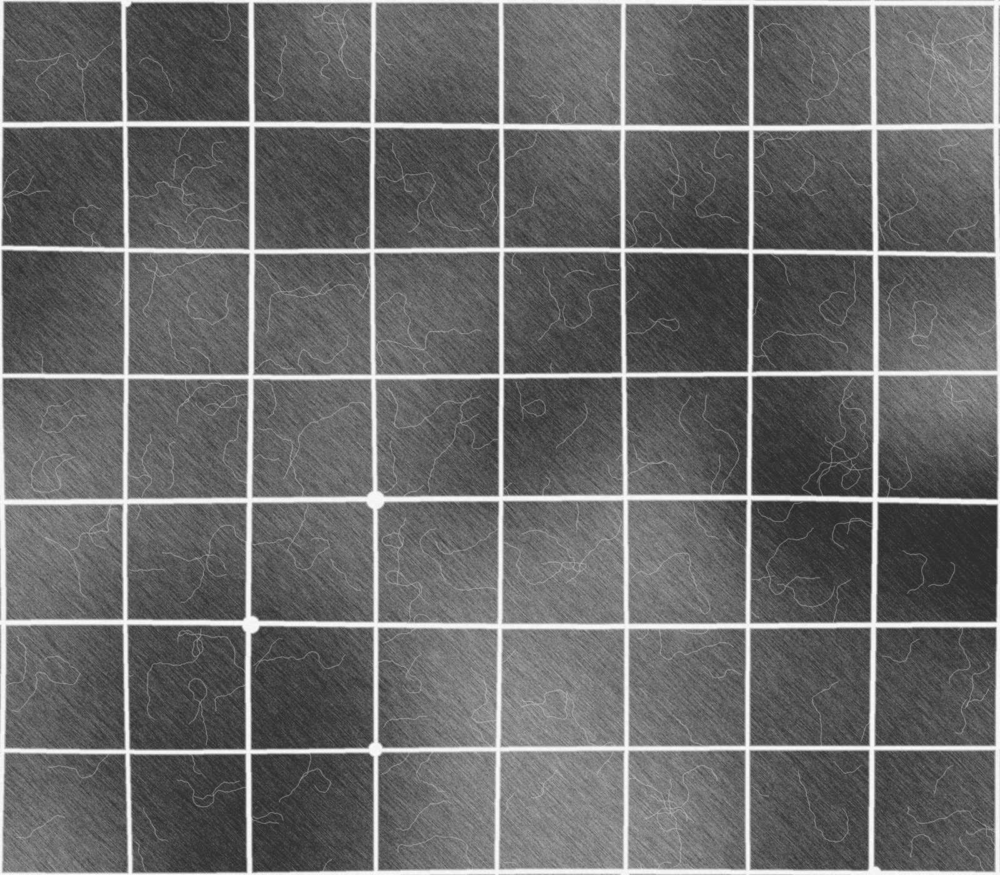

Un paño de 8 × 7 azulejos con juntas torcidas, craquelado, manchas y desportillados. En el frotado se marca lo que sobresale: juntas y grietas quedan blancas; las manchas no salen, porque no tienen relieve.

## Acción 2 · El pie

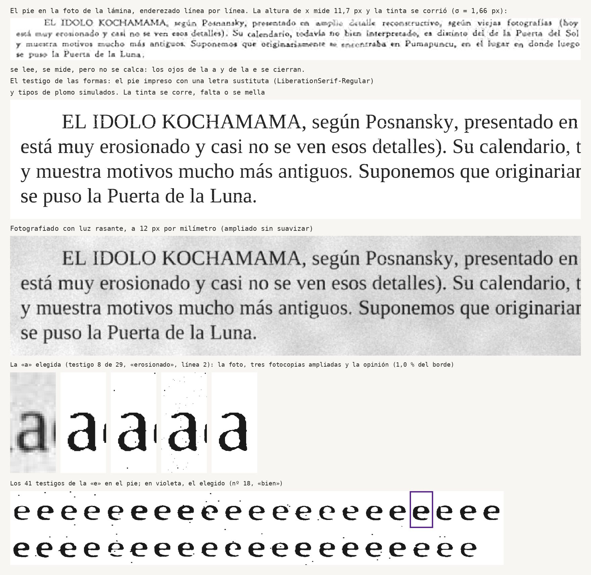

Para cada signo hallado, la máquina amplió todos sus testigos en tres generaciones de fotocopia y eligió el mejor conservado: el que tiene las partes que debe tener (la i, dos) y el borde menos roto. La *opinión* es cuánto del borde tuvo que decidir al limpiar.

| Celda | Signo | Testigo elegido | Palabra | Línea | Opinión |
|---|---|---|---|---|---|
| 1 | `,` | 3 de 6 | reconstructivo, | 1 | 5,8 % |
| 2 | `s` | 7 de 25 | viejas | 1 | 1,0 % |
| 3 | `e` | 18 de 41 | bien | 2 | 0,7 % |
| 4 | `g` | 3 de 7 | fotografías | 1 | 1,4 % |
| 5 | `ú` | 2 de 2 | según | 1 | 0,5 % |
| 6 | `n` | 9 de 27 | no | 2 | 0,5 % |
| 7 | `o` | 28 de 30 | donde | 3 | 0,8 % |
| 8 | `a` | 8 de 29 | erosionado | 2 | 1,0 % |
| 9 | `k` | 1 de 1 | Posnansky, | 1 | 1,7 % |
| 10 | `y` | 2 de 5 | (hoy | 1 | 0,8 % |
| 11 | `p` | 4 de 6 | Suponemos | 3 | 1,2 % |
| 12 | `r` | 1 de 15 | presentado | 1 | 0,6 % |
| 13 | `t` | 11 de 19 | distinto | 2 | 0,5 % |
| 14 | `d` | 3 de 14 | erosionado | 2 | 0,8 % |
| 15 | `m` | 8 de 9 | originariamente | 3 | 0,5 % |
| 16 | `l` | 10 de 15 | Sol | 2 | 0,4 % |
| 17 | `i` | 11 de 15 | motivos | 3 | 0,6 % |
| 18 | `c` | 6 de 7 | encontraba | 3 | 2,0 % |
| 19 | `u` | 14 de 17 | luego | 3 | 0,6 % |
| 20 | `v` | 4 de 5 | todavía | 2 | 1,2 % |
| 21 | `j` | 1 de 1 | viejas | 1 | 0,6 % |
| 22 | `f` | 1 de 2 | fotografías | 1 | 0,7 % |
| 23 | `í` | 1 de 2 | fotografías | 1 | 2,2 % |
| 24 | `(` | 1 de 1 | (hoy | 1 | 2,0 % |
| 25 | `h` | 1 de 2 | (hoy | 1 | 0,4 % |
| 26 | `á` | 1 de 2 | está | 2 | 0,8 % |
| 27 | `)` | 1 de 1 | detalles). | 2 | 2,0 % |
| 28 | `.` | 2 de 3 | antiguos. | 3 | 10,9 % |
| 29 | `b` | 2 de 2 | encontraba | 3 | 1,3 % |
| 30 | `q` | 1 de 1 | que | 3 | 0,5 % |

## Acción 3 · La escala y el calco

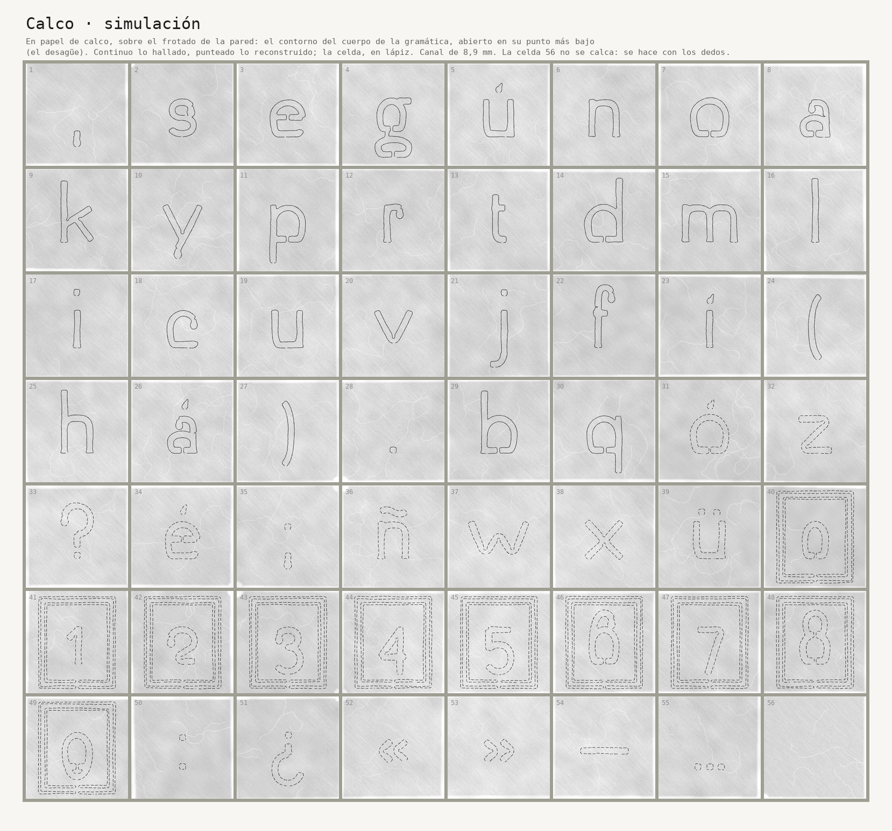

**La escala la decidió el pie.** La letra más alta y la más baja caben en el azulejo con media tesela de aire. Después, la anatomía corre y escala todo el juego para que el fondo y el borde caigan en líneas de media tesela (`03b_anatomia.md`, regla 8). Así caen las líneas, en teselas desde abajo:

| Línea | Pauta provisional (`03`, §3.6) | Lo que dio el pie | En la retícula |
|---|---|---|---|
| Desagüe (descendentes) | 0,5 | — | 0,28 |
| Fondo (base) | 1,5 | 1,71 | 1,5 |
| Borde (altura de x) | 4 | 4,19 (la x mide 2,48) | 4,0 (la x mide 2,5) |
| Afuera (ascendentes) | 5,5 | — | 5,21 |

El trazo grueso de la o mide 11,5 mm y el fino, 5,5 mm. Ningún signo desborda el azulejo.

**Las reconstrucciones de la máquina:**

| Signo | Receta |
|---|---|
| `ó` | la o con la tilde de la á |
| `z` | la diagonal de la x reconstruida (hipótesis sobre hipótesis) y dos barras del grueso fino de la o |
| `?` | el arco de arriba de la o, un asta que baja al centro y el punto |
| `é` | la e con la tilde de la á |
| `;` | la coma y el punto subido |
| `ñ` | la n con una virgulilla sin modelo, del grueso fino de la o |
| `w` | dos v estrechadas |
| `x` | los dos trazos de la v, inclinados hasta cruzarse (quedan con remates solo arriba) |
| `ü` | la u con dos puntos de la i |
| `0` | la o, algo más estrecha; dentro de una celda de la cabeza del ídolo |
| `1` | la i sin punto, con una bandera; dentro de una celda de la cabeza del ídolo |
| `2` | el arco de arriba de la o, una diagonal y una barra de base; dentro de una celda de la cabeza del ídolo |
| `3` | dos mitades derechas de la o, la de abajo bajo la línea; dentro de una celda de la cabeza del ídolo |
| `4` | un asta que baja, una diagonal fina y una barra; dentro de una celda de la cabeza del ídolo |
| `5` | una barra, un asta corta y la mitad baja de la o, bajo la línea; dentro de una celda de la cabeza del ídolo |
| `6` | la o con la curva de una c agrandada que sube (achicada en alto al 93 % para caber en el azulejo); dentro de una celda de la cabeza del ídolo |
| `7` | una barra y una diagonal que baja (achicada en alto al 90 % para caber en el azulejo); dentro de una celda de la cabeza del ídolo |
| `8` | dos o apiladas, la de arriba más chica; dentro de una celda de la cabeza del ídolo |
| `9` | el 6 dado vuelta (achicada en alto al 67 % para caber en el azulejo); dentro de una celda de la cabeza del ídolo |
| `:` | dos puntos |
| `¿` | la ? dada vuelta, bajo la línea |
| `«` | ángulos de la v girada y achicada |
| `»` | ángulos de la v girada y achicada |
| `—` | una barra sin modelo, del grueso fino de la o |
| `…` | tres puntos |

Una decisión propia de la máquina: **cifras elzevirianas**, de altura de x, con 6 y 8 que suben y 3, 4, 5, 7 y 9 que bajan. En una tipografía de caja baja, las cifras de monumento (todas a la altura de las mayúsculas) serían ajenas.

El `.notdef`, la celda de la lámina calcada: 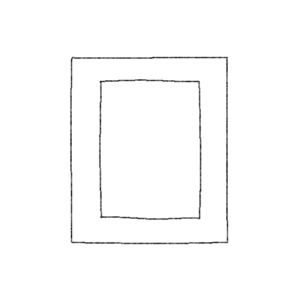

## La anatomía

Del pie, la máquina tomó el esqueleto; la anatomía la dicta la obra (`03b_anatomia.md`). Estas son las reglas que aplicó y a qué signos alcanzaron:

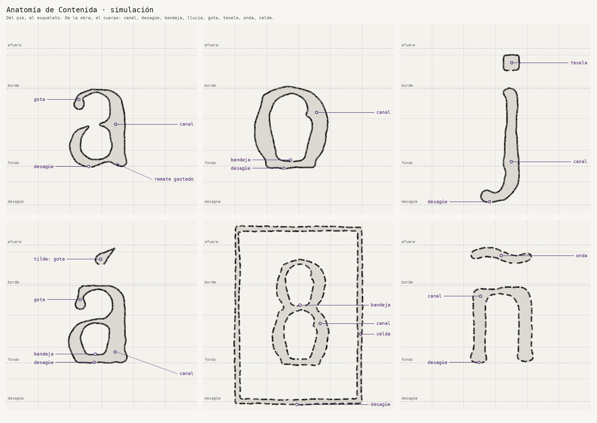

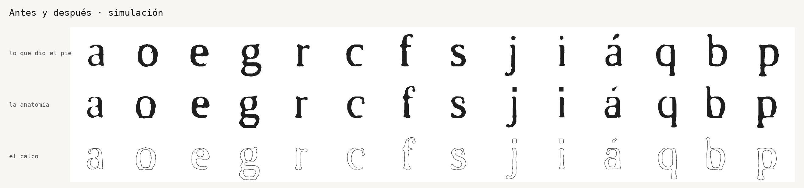

| Regla | Qué hizo la máquina | Signos |
|---|---|---|
| El canal | Dibujó solo el contorno: la letra es hueca | los 55 |
| El desagüe | Abrió cada contorno en su punto más bajo, con una junta de ancho | 111 desagües en 55 signos |
| La bandeja | Rehízo la mitad baja de cada ojo y asentó plana la panza | «e», «g», «o», «p», «á», «b», «ó», «é», «0», «4», «6», «8», «9» |
| La lluvia | Redondeó todo y gastó más arriba: los remates altos casi desaparecen | los 30 hallados |
| Las gotas | Colgó una gota donde un trazo termina mirando hacia abajo | «s», «a», «c», «f», «á» |
| Los puntos | Los volvió cuadrados de media tesela | «i», «j», «.», y los que heredan sus puntos |
| Las tildes | Las volvió gotas | «ú», «í», «á», y la é y la ó, que heredan la de la á |
| La onda | La virgulilla de la ñ es una onda de agua tocada | «ñ» |
| El asta | Corrió la letra hasta que su asta cae en una línea de media tesela | 37 signos con asta |
| La celda | Cada cifra, dentro de una celda de la cabeza del ídolo | las 10 cifras |

## Acción 4 · Repujar

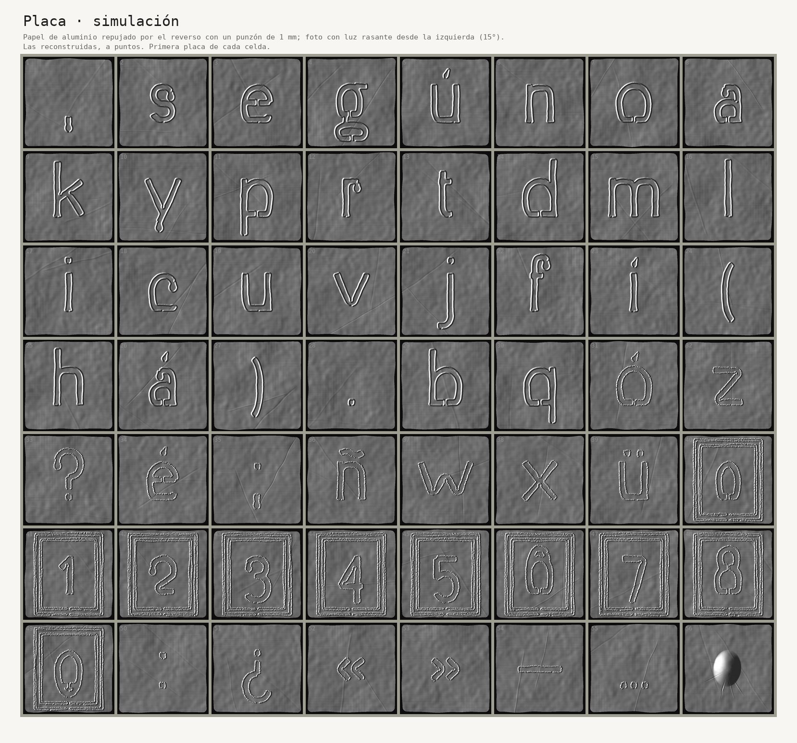

- **119 placas** (93 de signos hallados, 25 reconstruidos y 1 signo final).
- **Tiempo simulado:** 69,3 horas de repujado, contando las placas que se rompieron. El plan estimaba entre 30 y 40. La máquina supuso 20 mm de surco por minuto, 9 mm de punteado por minuto y 4 minutos para preparar cada placa.
- **Roturas:** 9 en 93 placas halladas y 2 en 25 reconstruidas. La máquina supuso que el punteado perfora: una placa punteada se rompe con más probabilidad (16 % por intento contra 6 %).

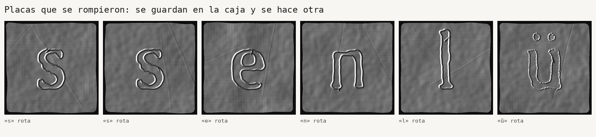

## Acción 5 · La caja

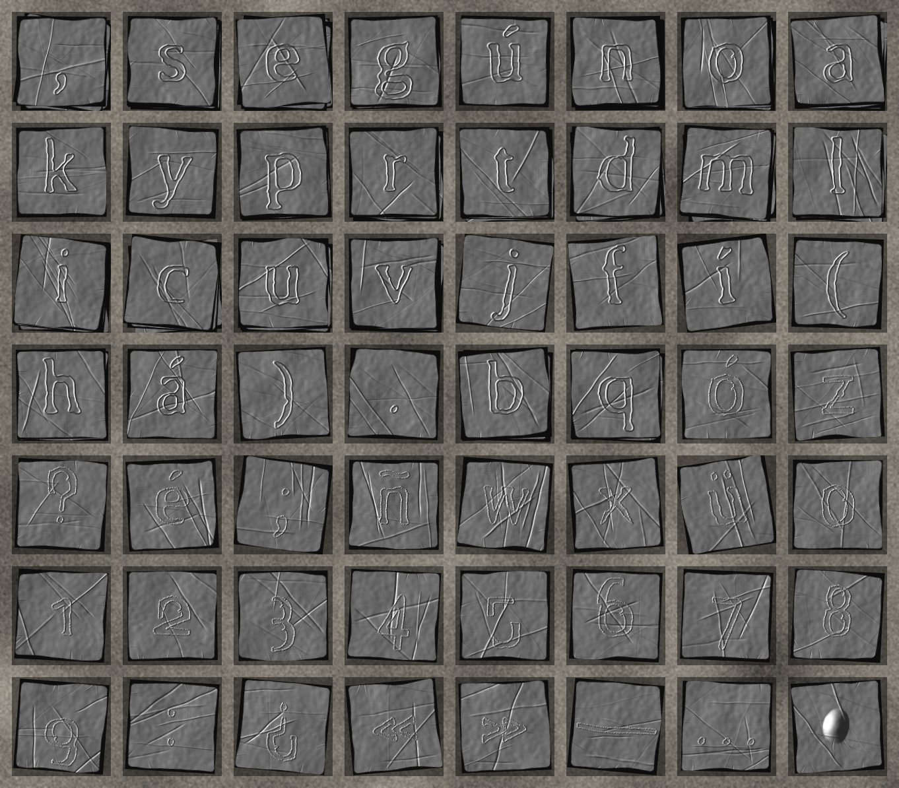

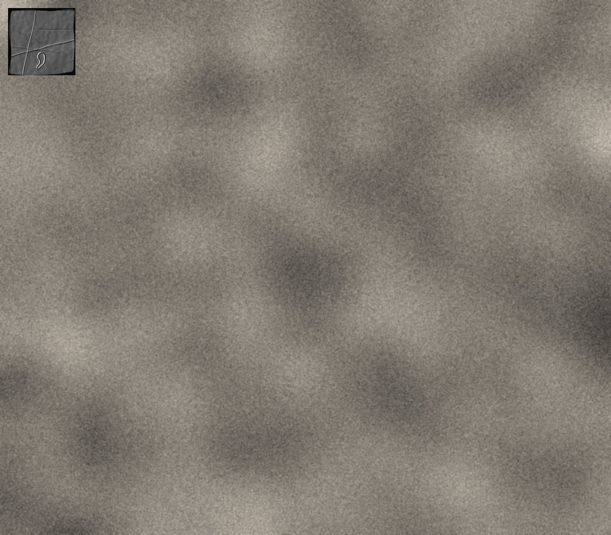

Cerrada, por la única puerta se ve la coma.

## Acción 6 · Vestir

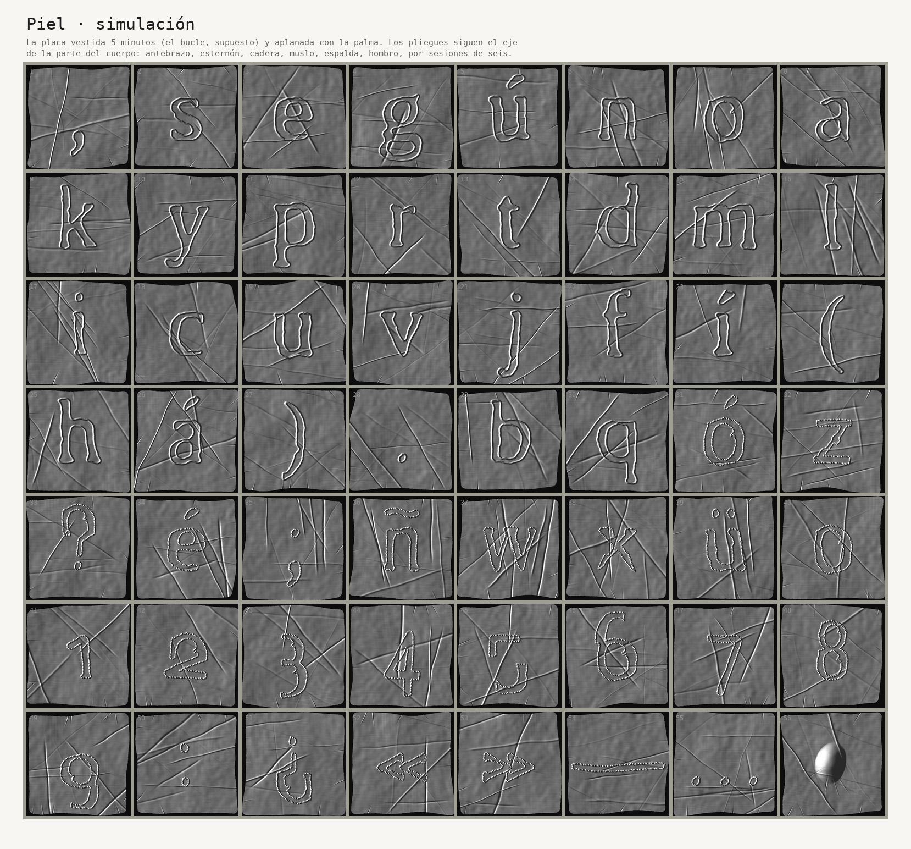

## Acción 8 · El hectógrafo

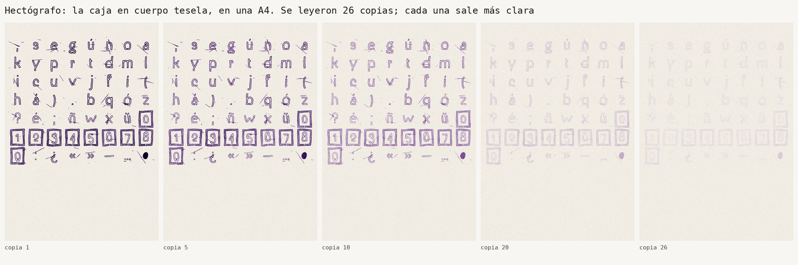

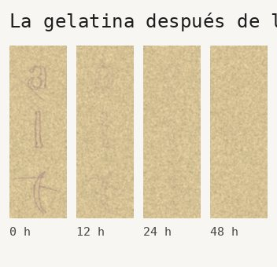

Se leyeron **27 copias**. La primera sale casi negra y las siguientes, violeta: el color depende de cuánta tinta queda. Las halladas se leen, en promedio, hasta la copia 23,1; las reconstruidas, hasta la 21,7. **Lo que la máquina no diseñó y apareció:** las hipótesis, hechas a puntos, dejan menos tinta en la matriz y se borran antes.

**Los primeros en borrarse:** «6» (20), «z» (21), «?» (21), «é» (21), «ü» (21), «1» (21), «2» (21), «7» (21).

**Los últimos:** «d» (24), «i» (24), «c» (24), «í» (24), «(» (24), «.» (24), «¶» (26), «l» (27).

## Acción 9 · Agua

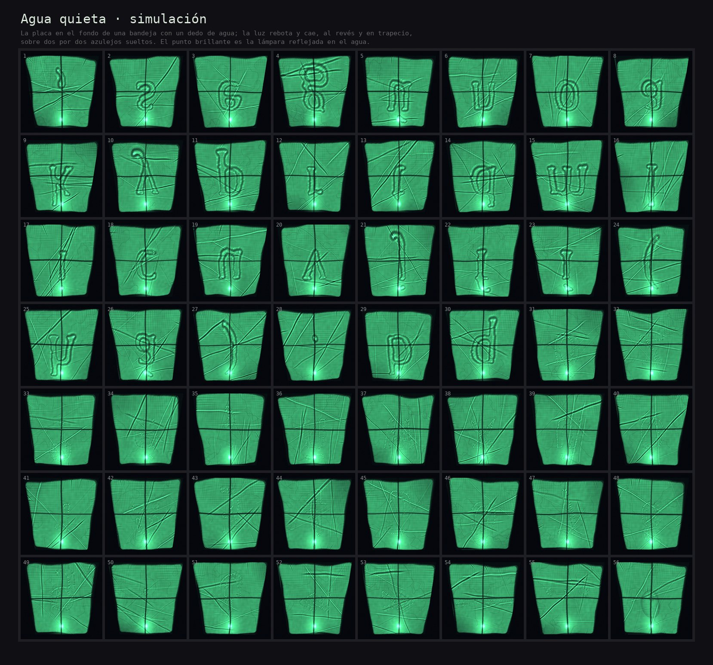

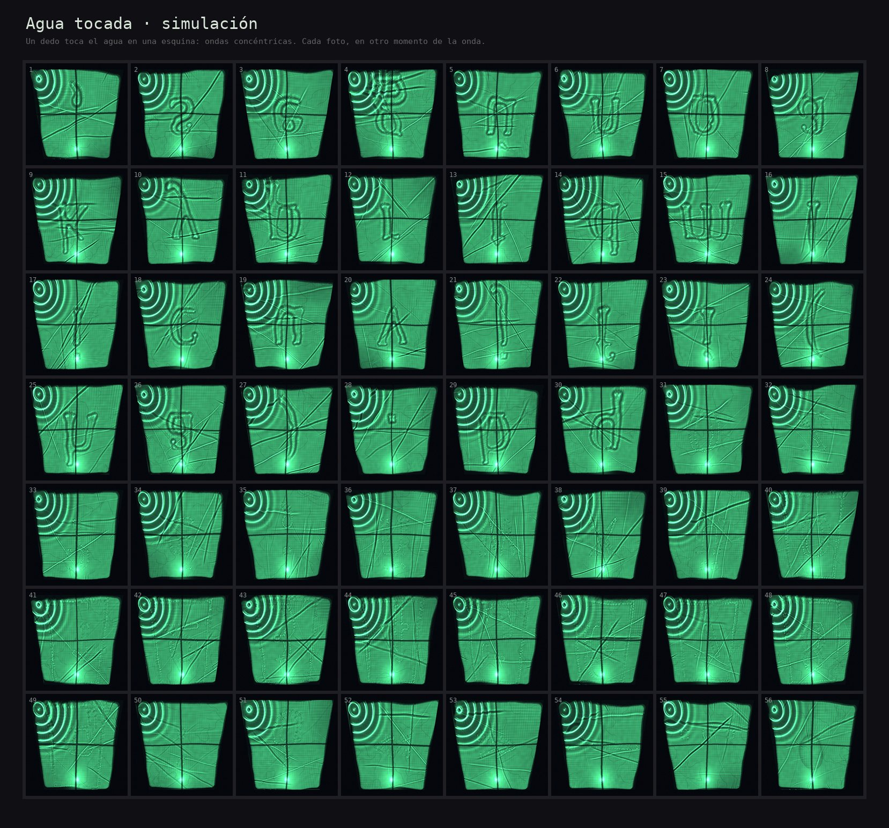

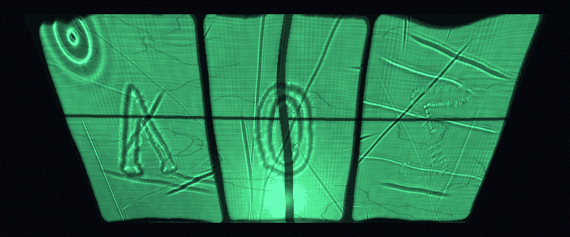

Contraste de la letra en el agua quieta (cuánto se aparta la luz donde cae la letra, contra el resto de la placa): 2,10 en las halladas y 1,26 en las reconstruidas. **Lo que la máquina no diseñó y apareció:** las reconstruidas, hechas a puntos, llegan más débiles al agua. El punteado tiene menos relieve que el surco y desvía menos luz: en el agua, las hipótesis se ven menos.

## Acción 10 · Voz

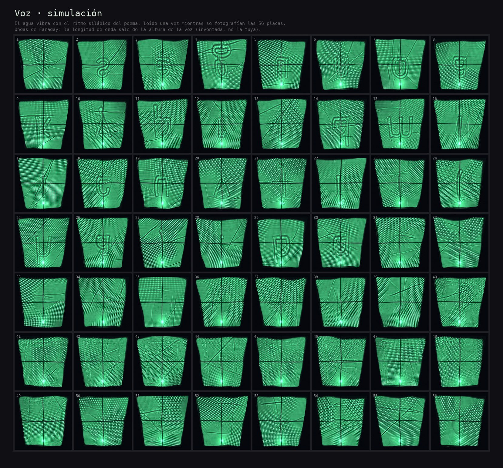

## Acción 11 · Azulejo y la estrofa en la pared

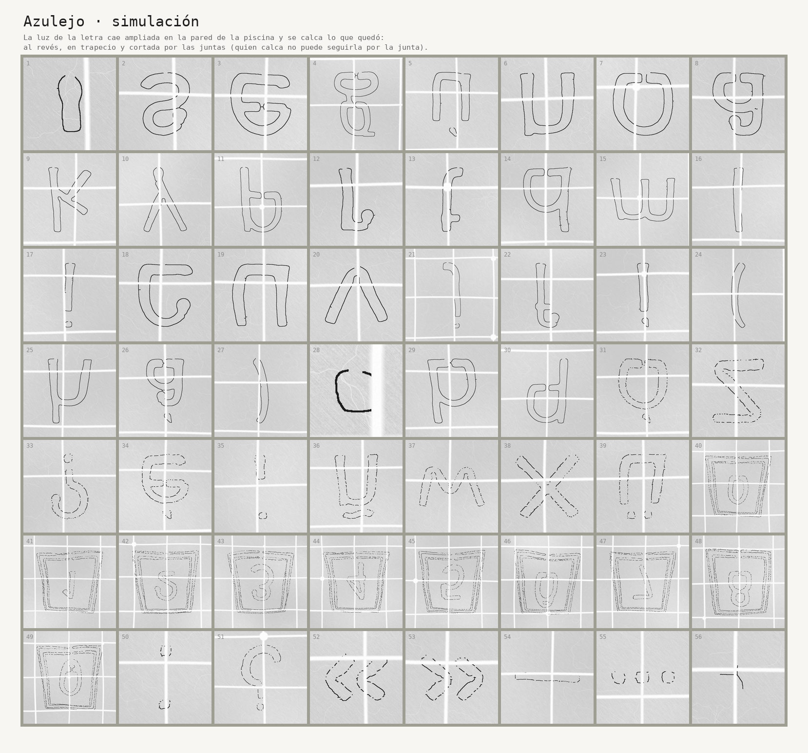

Juntas que cortan cada letra al caer ampliada: entre 1 y 4 (media 2,3).

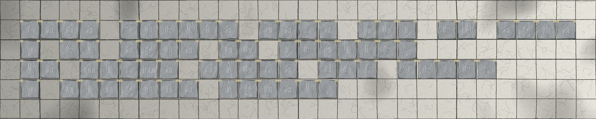

La séptima estrofa compuesta con placas vestidas: cada aparición de una letra es otra placa, así que ninguna se repite igual dentro de un verso.

## Una letra de punta a punta

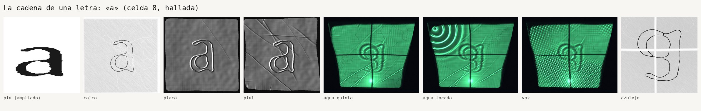

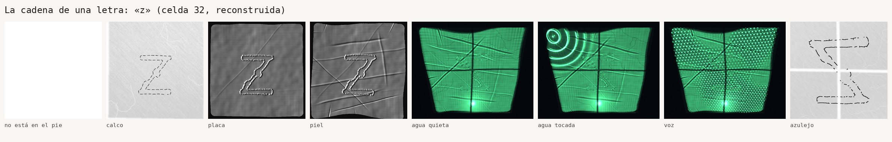

## Lo que la máquina no sabe

- **El libro:** qué letra tiene realmente el pie, ni cómo se imprimió.
- **La mano:** el temblor es ruido con un ritmo; no cansa, no duda, no se distrae.
- **El aluminio:** cómo se rompe de verdad. Aquí se rompe con una probabilidad.
- **El cuerpo:** los pliegues siguen un eje supuesto para cada parte.
- **La gelatina:** transfiere una fracción fija por copia, con presión irregular.
- **El agua:** un solo rebote, un eco desplazado y ninguna polarización.
- **La voz:** no es la tuya.

## Cómo confrontar

Cuando exista tu propuesta, conviene guardarla con los mismos nombres para compararlas placa por placa:

- **Fotos:** `tipografia/mano/<estado>/<celda>_<variante>.jpg`, con dos dígitos (`mano/placa/08_01.jpg`) y estas carpetas de estado: `calco`, `placa`, `piel`, `copia`, `agua`, `voz`, `azulejo`.
- **Fichas:** `tipografia/mano/fichas.json`, con los mismos campos que `salida/fichas_simuladas.json`.

**Qué se compara:**

1. **Forma:** la silueta de cada calco superpuesta a la de la máquina, en dos colores; qué testigo eligió cada una y cuánto opinó.
2. **Métricas:** la base y la altura de x que dio el libro contra las que dio el testigo sustituto.
3. **Reconstrucciones:** las 25 recetas de la máquina contra las tuyas. Es donde más van a diferir, y donde más interesa.
4. **Tiempo y roturas:** horas, intentos y roturas por placa.
5. **Hectógrafo:** la tirada, y qué signos se borran primero.
6. **Agua y pared:** si las reconstruidas también llegan más débiles, y cuántas juntas cortan cada letra.
